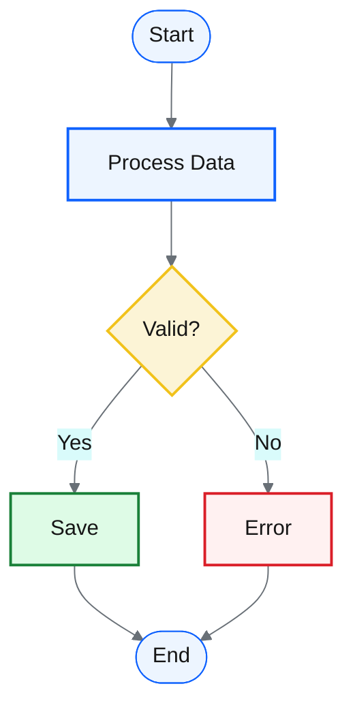
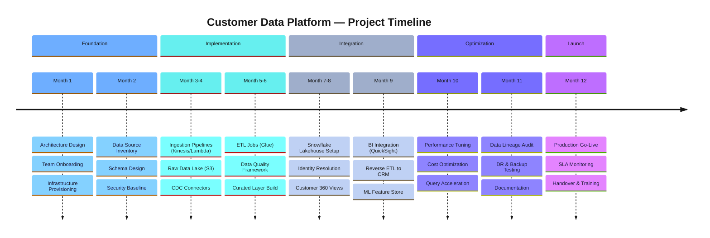
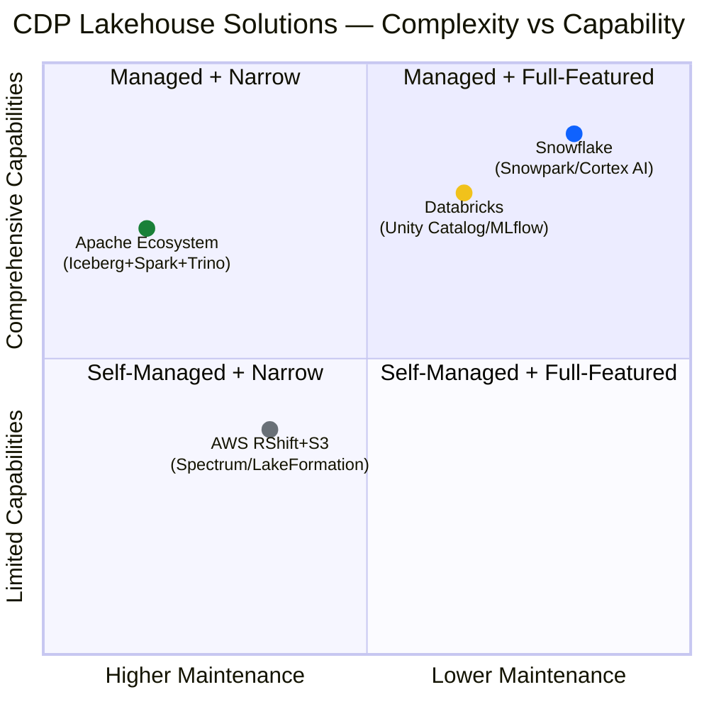
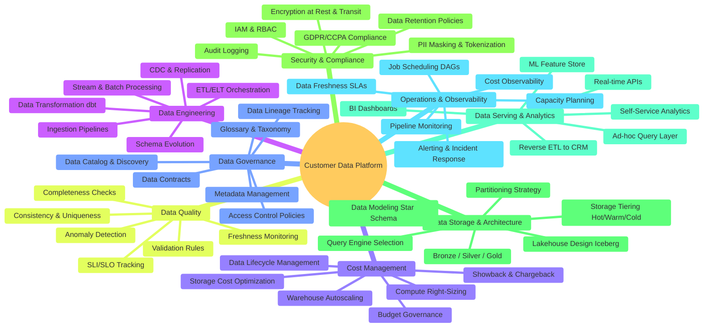
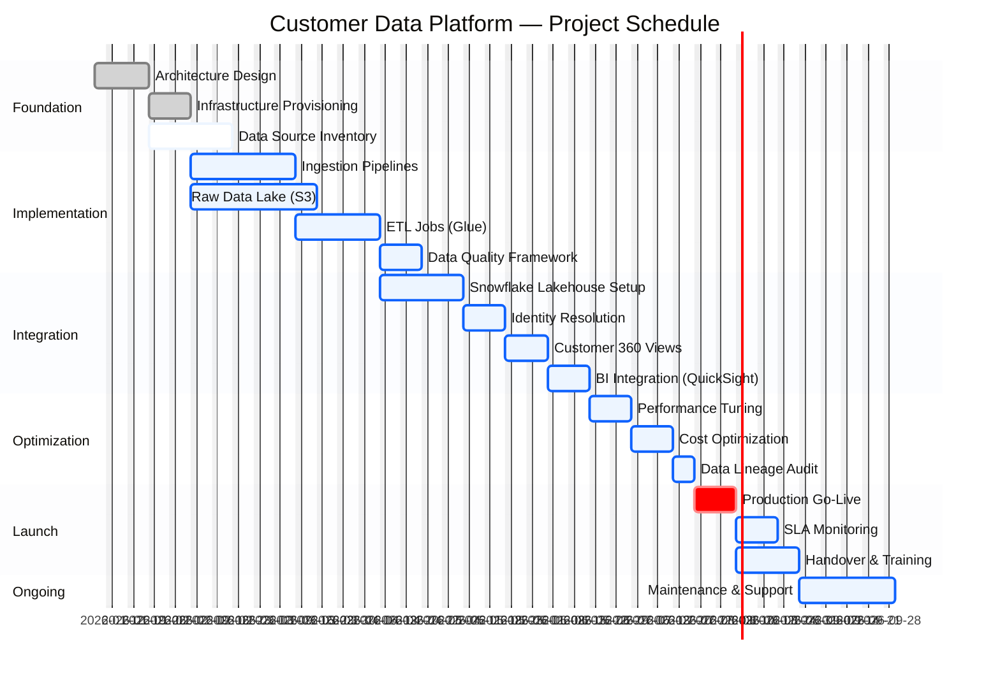
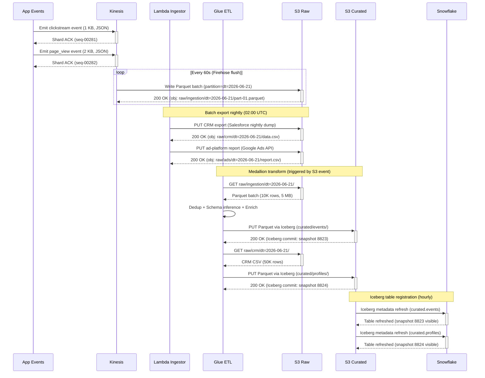

# Mermaid Illustrate

> **AI Agent Skill** — Professional Mermaid diagrams with the IBM Carbon Blueprint design system.

A comprehensive, production-grade skill for AI coding agents (Claude Code, ZCode, GitHub Copilot, Cursor, and more) to create 23 types of Mermaid diagrams with a unified, semantic, dark-mode-ready visual language based on IBM Carbon Design System v11.

---

## What This Skill Does

- Creates **23 types** of Mermaid diagrams: flowcharts, sequence diagrams, class diagrams, state machines, ER diagrams, user journeys, Gantt charts, pie charts, quadrant charts, requirement diagrams, Git graphs, C4 architecture diagrams, mindmaps, timelines, ZenUML, Sankey diagrams, XY charts, block diagrams, packet diagrams, Kanban boards, architecture diagrams, radar charts, and treemaps.
- Applies the **Blueprint design system** — semantic IBM Carbon v11 colors that carry meaning before labels are read.
- Supports **600+ icons** across 6 icon sets (logos, devicon, gcp, vscode-icons, codicon, skill-icons) with smart syntax selection.
- Handles **dark-mode** and **light-mode** automatically.
- Follows **progressive disclosure** — agents only load what's needed, keeping context windows lean.

---

## Design System: Blueprint

Built on **IBM Carbon v11** color tokens + **C4 model** layered thinking:

| Principle | Description |
|-----------|-------------|
| **Semantic Coloring** | Blue = processing, Teal = data, Amber = decision, Green = success, Red = error, Grey = external |
| **Restrained Palette** | 4–6 colors by default; add more only when semantic complexity demands it |
| **Hierarchy First** | Border weight and color intensity guide the reader's eye |
| **Dark-Mode Ready** | `themeVariables` and `classDef` styling renders on both light and dark backgrounds |
| **No Emoji** | Emoji strictly prohibited — use icons or semantic coloring instead |
| **Icon First** | Prefer icons from the 600+ icon catalog over text labels |

See [`examples/design-system.md`](examples/design-system.md) for the full specification.

---

## Supported Diagram Types

| Category | Diagram Types |
|----------|--------------|
| **Flow & Process** | Flowchart, Sequence, State, ZenUML |
| **Structure & Data** | Class, ER, Block, Packet, Treemap |
| **Architecture** | C4 (Context/Container/Component/Deployment), Architecture (beta) |
| **Project & Time** | Gantt, Timeline, Git Graph, Kanban |
| **User & Experience** | User Journey, Mindmap |
| **Charts & DataViz** | Pie, Quadrant, XY Chart, Radar, Sankey |
| **Requirements** | Requirement (SysML-style) |

---

## Installation

### Quick Install (ZCode / Claude Code)

```bash
# Clone directly into the skills directory
git clone https://github.com/zhiweio/mermaid-illustrate.git ~/.agents/skills/mermaid-illustrate
```

Or install per-project:

```bash
git clone https://github.com/zhiweio/mermaid-illustrate.git /path/to/your-project/.agents/skills/mermaid-illustrate
```

### Per-Agent Install Paths

| Agent | Global Path | Project Path |
|-------|------------|--------------|
| **Claude Code / ZCode** | `~/.agents/skills/mermaid-illustrate/` | `.agents/skills/mermaid-illustrate/` |
| **GitHub Copilot** | `~/.copilot/skills/mermaid-illustrate/` | `.github/skills/mermaid-illustrate/` |
| **Cursor** | `~/.cursor/skills/mermaid-illustrate/` | `.cursor/skills/mermaid-illustrate/` |
| **Codex CLI** | `~/.codex/skills/mermaid-illustrate/` | `.codex/skills/mermaid-illustrate/` |
| **Gemini CLI** | `~/.gemini/skills/mermaid-illustrate/` | `.gemini/skills/mermaid-illustrate/` |
| **Windsurf** | `~/.codeium/windsurf/skills/mermaid-illustrate/` | `.windsurf/skills/mermaid-illustrate/` |

### Using CLI Installers

```bash
# Vercel Skills CLI
npx skills add zhiweio/mermaid-illustrate

# vskill
npx vskill install zhiweio/mermaid-illustrate

# Skilz (Python)
pip install skilz
skilz install zhiweio/mermaid-illustrate
```

---

## Usage

### Triggering the Skill

Simply describe what you want to your agent. The skill activates automatically when you mention diagram-related terms:

**English triggers:**
- "Create a flowchart of the user login process"
- "Draw a sequence diagram showing the API authentication flow"
- "Make a C4 container diagram for our microservices architecture"
- "Generate a mindmap of the project structure"
- "Create a Gantt chart for the Q3 release plan"

**Chinese triggers:**
- "画一个用户登录的流程图"
- "创建一个微服务架构的时序图"
- "做一个数据库 ER 图"
- "生成项目甘特图"
- "绘制思维导图"

### What the Agent Does

1. Identifies the diagram type from your request
2. Loads the Blueprint design system and the relevant example file
3. Generates Mermaid code with IBM Carbon styling
4. Saves the diagram to `docs/diagrams/` in your project
5. Displays the rendered diagram

### Example Output



---

## Example Diagrams

Here are four real-world diagrams for a **Customer Data Platform (CDP)** — all following the Blueprint design system.

### 1. CDP Architecture — AWS + Snowflake Lakehouse

```mermaid
%%{init: {'theme':'base','themeVariables':{'primaryColor':'#edf5ff','primaryTextColor':'#161616','primaryBorderColor':'#0f62fe','lineColor':'#697077','secondaryColor':'#d9fbfb','tertiaryColor':'#f2f4f8'}}}%%
flowchart TD
    subgraph Sources["🔷 Data Sources"]
        App@{ img: "https://api.iconify.design/logos/aws.svg", label: "App Events", pos: "b", h: 44, constraint: "on" }
        CRM@{ img: "https://api.iconify.design/logos/google-cloud.svg", label: "CRM / Ads", pos: "b", h: 44, constraint: "on" }
        DB@{ img: "https://api.iconify.design/devicon/postgresql.svg", label: "RDBMS", pos: "b", h: 44, constraint: "on" }
        API3rd@{ img: "https://api.iconify.design/logos/aws.svg", label: "3rd-party APIs", pos: "b", h: 44, constraint: "on" }
    end

    subgraph Ingestion["🔷 Ingestion Layer"]
        Kinesis@{ img: "https://api.iconify.design/logos/aws-kinesis.svg", label: "Kinesis Streams", pos: "b", h: 44, constraint: "on" }
        Lambda@{ img: "https://api.iconify.design/logos/aws-lambda.svg", label: "Batch Ingestor", pos: "b", h: 44, constraint: "on" }
        Glue@{ img: "https://api.iconify.design/logos/aws-glue.svg", label: "Glue ETL", pos: "b", h: 44, constraint: "on" }
        Airflow@{ img: "https://api.iconify.design/logos/airflow-icon.svg", label: "Airflow DAGs", pos: "b", h: 44, constraint: "on" }
    end

    subgraph Lakehouse["🔷 Lakehouse Core"]
        S3R@{ img: "https://api.iconify.design/logos/aws-s3.svg", label: "S3 Raw Bronze", pos: "b", h: 44, constraint: "on" }
        S3C@{ img: "https://api.iconify.design/logos/aws-s3.svg", label: "S3 Curated Silver", pos: "b", h: 44, constraint: "on" }
        Snow@{ img: "https://api.iconify.design/logos/snowflake-icon.svg", label: "Snowflake Gold", pos: "b", h: 44, constraint: "on" }
    end

    subgraph Serving["🔷 Serving & Analytics"]
        RS@{ img: "https://api.iconify.design/logos/aws-redshift.svg", label: "Redshift", pos: "b", h: 44, constraint: "on" }
        QS@{ img: "https://api.iconify.design/logos/aws-quicksight.svg", label: "QuickSight BI", pos: "b", h: 44, constraint: "on" }
        ML@{ img: "https://api.iconify.design/logos/tensorflow.svg", label: "ML Pipeline", pos: "b", h: 44, constraint: "on" }
        R_ETL@{ img: "https://api.iconify.design/logos/aws-step-functions.svg", label: "Reverse ETL", pos: "b", h: 44, constraint: "on" }
    end

    subgraph Governance["🔷 Data Governance"]
        GCat@{ img: "https://api.iconify.design/logos/aws-athena.svg", label: "Data Catalog", pos: "b", h: 44, constraint: "on" }
        GLine@{ img: "https://api.iconify.design/logos/aws-lake-formation.svg", label: "Lake Formation", pos: "b", h: 44, constraint: "on" }
        GQual@{ img: "https://api.iconify.design/logos/aws-glue.svg", label: "Quality Checks", pos: "b", h: 44, constraint: "on" }
        GGloss@{ img: "https://api.iconify.design/logos/aws-dynamodb.svg", label: "Business Glossary", pos: "b", h: 44, constraint: "on" }
    end

    subgraph Security["🔷 Security & Compliance"]
        SecIAM@{ img: "https://api.iconify.design/logos/aws-iam.svg", label: "IAM & RBAC", pos: "b", h: 44, constraint: "on" }
        SecKMS@{ img: "https://api.iconify.design/logos/aws-kms.svg", label: "KMS Encryption", pos: "b", h: 44, constraint: "on" }
        SecAudit@{ img: "https://api.iconify.design/logos/aws-cloudtrail.svg", label: "CloudTrail Audit", pos: "b", h: 44, constraint: "on" }
    end

    subgraph Ops["🔷 Operations & Cost"]
        OpsIaC@{ img: "https://api.iconify.design/logos/terraform-icon.svg", label: "Terraform IaC", pos: "b", h: 44, constraint: "on" }
        OpsMon@{ img: "https://api.iconify.design/logos/aws-cloudwatch.svg", label: "Monitoring CW", pos: "b", h: 44, constraint: "on" }
        OpsDR@{ img: "https://api.iconify.design/logos/aws-backup.svg", label: "Backup & DR", pos: "b", h: 44, constraint: "on" }
    end

    %% ===== primary data flow =====
    App -->|Event Stream| Kinesis
    CRM -->|Batch Sync| Lambda
    DB -->|CDC Debezium| Glue
    API3rd -->|Poll| Lambda
    Kinesis --> S3R
    Lambda --> S3R
    Glue --> S3R
    Airflow -.->|Schedule| Glue
    Airflow -.->|Trigger| Lambda

    S3R -->|Transform| S3C
    S3C -->|Iceberg Load| Snow

    Snow --> R_ETL
    R_ETL -->|Sync| CRM
    Snow -->|Query| RS
    Snow -->|SPICE| QS
    Snow -->|Features| ML
    Snow -.->|Alerts| OpsMon

    %% ===== governance & quality (dashed) =====
    GCat -.->|Discover| S3R
    GCat -.->|Discover| S3C
    GCat -.->|Register| Snow
    GLine -.->|Track Lineage| Glue
    GLine -.->|Propagate Tags| S3C
    GQual -.->|Validate| S3C
    GQual -.->|SLI/SLO| Snow
    GGloss -.->|Annotate| GCat

    %% ===== security & compliance (dashed) =====
    SecIAM -->|AuthZ| Kinesis
    SecIAM -->|AuthZ| Lambda
    SecIAM -->|AuthZ| Glue
    SecIAM -->|AuthZ| Snow
    SecKMS -->|Encrypt| S3R
    SecKMS -->|Encrypt| S3C
    SecKMS -->|Encrypt| Snow
    SecAudit -.->|Log| Kinesis
    SecAudit -.->|Log| Lambda
    SecAudit -.->|Log| Glue

    %% ===== operations & cost (dashed) =====
    OpsIaC -.->|Provision| Kinesis
    OpsIaC -.->|Provision| Glue
    OpsIaC -.->|Provision| S3C
    OpsIaC -.->|Provision| Snow
    OpsMon -.->|Metrics| Kinesis
    OpsMon -.->|Metrics| Glue
    OpsMon -.->|Metrics| Snow
    OpsDR -.->|Snapshot| S3R
    OpsDR -.->|Snapshot| S3C
    OpsDR -.->|Snapshot| Snow

    classDef bpProcess fill:#edf5ff,stroke:#0f62fe,stroke-width:2px,color:#161616
    classDef bpData fill:#d9fbfb,stroke:#007d79,stroke-width:2px,color:#161616
    classDef bpExternal fill:#f2f4f8,stroke:#dde1e6,stroke-width:2px,color:#525252
    classDef bpInfo fill:#f6f2ff,stroke:#8a3ffc,stroke-width:2px,color:#161616
    classDef bpSuccess fill:#defbe6,stroke:#198038,stroke-width:2px,color:#161616
    classDef bpError fill:#fff1f1,stroke:#da1e28,stroke-width:2px,color:#161616
    classDef bpDecision fill:#fcf4d6,stroke:#f1c21b,stroke-width:2px,color:#161616

    class Kinesis,Lambda,Glue,Airflow,ML,R_ETL bpProcess
    class S3R,S3C,Snow,RS bpData
    class App,CRM,DB,API3rd,QS bpExternal
    class GCat,GLine,GQual,GGloss bpInfo
    class OpsIaC,OpsMon,OpsDR bpSuccess
    class SecIAM,SecKMS,SecAudit bpError

    linkStyle 0 stroke:#0f62fe,stroke-width:2px
    linkStyle 1 stroke:#0f62fe,stroke-width:2px
    linkStyle 2 stroke:#0f62fe,stroke-width:2px
    linkStyle 4 stroke:#007d79,stroke-width:2px,stroke-dasharray:5
    linkStyle 5 stroke:#007d79,stroke-width:2px,stroke-dasharray:5
    linkStyle 6 stroke:#007d79,stroke-width:2px,stroke-dasharray:5
    linkStyle 10 stroke:#0f62fe,stroke-width:2.5px
    linkStyle 11 stroke:#0f62fe,stroke-width:2.5px
    linkStyle 12 stroke:#198038,stroke-width:2px
```

### 2. CDP Project Timeline



### 3. CDP Solution Comparison — Quadrant Analysis



### 4. CDP Platform Focus Areas — Mindmap



### 5. CDP Lakehouse — C4 Container Diagram

```mermaid
%%{init: {"c4": {"c4ShapeMargin": 65, "c4ShapePadding": 20, "diagramMarginX": 80, "diagramMarginY": 15, "boxMargin": 14, "wrapPadding": 6, "containerFontSize": 10, "container_dbFontSize": 10, "external_systemFontSize": 10, "personFontSize": 12, "messageFontSize": 9}}}%%
C4Container
    title Customer Data Platform on AWS — Container Diagram

    Person(de, "Data Engineer", "Owns ingestion pipelines, ETL jobs, and data quality checks")
    Person(da, "Data Analyst", "Creates dashboards and runs ad-hoc SQL against the curated layer")
    Person(ds, "Data Scientist", "Trains ML models using feature stores and notebook experiments")

    System_Boundary(cdp, "Customer Data Platform (AWS)") {
        Container(kinesis, "Ingestion Stream", "Kinesis + Firehose", "Real-time events: 10 shards, 5 MB/s peak")
        Container(lambda, "Batch Ingestor", "Lambda + SQS", "CRM exports, ad-platform reports, and third-party API polling")
        Container(glue, "ETL Orchestrator", "Glue 4.0 + Spark", "Dedup, enrich, transform raw->curated via medallion")
        Container(s3raw, "Raw Data Lake", "S3 + Parquet", "Bronze zone: immutable append-only, 90d then IA")
        Container(s3curated, "Curated Data Lake", "S3 + Iceberg", "Silver zone: cleaned entities with schema evolution")
        Container(snowflake, "Lakehouse Engine", "Snowflake Enterprise", "Gold zone: 360 views, aggregates, dimensional models")
        Container(dbt, "Transformation", "dbt Core 1.8", "SQL models: staging->intermediate->marts in Snowflake")
        Container(quicksight, "BI & Analytics", "QuickSight Enterprise", "Dashboards, SPICE datasets, embedded analytics")
        Container(sagemaker, "ML Feature Store", "SageMaker", "Online/offline feature serving from gold layer")
    }

    System_Ext(crm, "CRM / Marketing", "Nightly CSV/JSON exports of profiles, campaigns, and segments")
    System_Ext(rdbms, "Transactional DB", "CDC via Debezium to S3 raw zone")
    System_Ext(apps, "App Events", "Real-time analytics stream via Amplitude/Segment")

    Rel(de, kinesis, "Configures streams", "Kinesis API")
    Rel(de, lambda, "Deploys functions", "Lambda Console")
    Rel(de, glue, "Authors ETL jobs", "Glue Studio")
    Rel(de, dbt, "Manages models", "dbt CLI")

    Rel(da, quicksight, "Builds dashboards", "QuickSight")
    Rel(da, snowflake, "Queries gold layer", "Snowflake SQL")

    Rel(ds, sagemaker, "Trains models", "SageMaker SDK")
    Rel(ds, snowflake, "Extracts datasets", "Data Wrangler")

    Rel(kinesis, s3raw, "Writes batches", "Firehose")
    Rel(lambda, s3raw, "Lands batches", "S3 PUT")
    Rel(glue, s3raw, "Reads raw data", "Spark")
    Rel(glue, s3curated, "Writes Iceberg", "S3 PUT")
    Rel(s3curated, snowflake, "Registers tables", "Iceberg Catalog")
    Rel(dbt, snowflake, "Executes models", "dbt adapter")
    Rel(snowflake, quicksight, "Feeds SPICE", "JDBC")
    Rel(snowflake, sagemaker, "Exports features", "COPY INTO")

    Rel_Back(crm, lambda, "Nightly export", "S3 Transfer")
    Rel_Back(rdbms, lambda, "CDC stream", "Debezium")
    Rel_Back(apps, kinesis, "Event stream", "HTTP API")

    UpdateElementStyle(de, $bgColor="#f2f4f8", $fontColor="#161616", $borderColor="#697077")
    UpdateElementStyle(da, $bgColor="#f2f4f8", $fontColor="#161616", $borderColor="#697077")
    UpdateElementStyle(ds, $bgColor="#f2f4f8", $fontColor="#161616", $borderColor="#697077")

    UpdateElementStyle(kinesis, $bgColor="#edf5ff", $fontColor="#161616", $borderColor="#0f62fe")
    UpdateElementStyle(lambda, $bgColor="#edf5ff", $fontColor="#161616", $borderColor="#0f62fe")
    UpdateElementStyle(glue, $bgColor="#edf5ff", $fontColor="#161616", $borderColor="#0f62fe")
    UpdateElementStyle(dbt, $bgColor="#edf5ff", $fontColor="#161616", $borderColor="#0f62fe")
    UpdateElementStyle(quicksight, $bgColor="#edf5ff", $fontColor="#161616", $borderColor="#0f62fe")
    UpdateElementStyle(sagemaker, $bgColor="#edf5ff", $fontColor="#161616", $borderColor="#0f62fe")

    UpdateElementStyle(s3raw, $bgColor="#d9fbfb", $fontColor="#161616", $borderColor="#007d79")
    UpdateElementStyle(s3curated, $bgColor="#d9fbfb", $fontColor="#161616", $borderColor="#007d79")
    UpdateElementStyle(snowflake, $bgColor="#d9fbfb", $fontColor="#161616", $borderColor="#007d79")

    UpdateElementStyle(crm, $bgColor="#f2f4f8", $fontColor="#697077", $borderColor="#dde1e6")
    UpdateElementStyle(rdbms, $bgColor="#f2f4f8", $fontColor="#697077", $borderColor="#dde1e6")
    UpdateElementStyle(apps, $bgColor="#f2f4f8", $fontColor="#697077", $borderColor="#dde1e6")

    UpdateRelStyle(glue, s3curated, $textColor="#007d79", $lineColor="#007d79")
    UpdateRelStyle(s3curated, snowflake, $textColor="#007d79", $lineColor="#007d79")
    UpdateRelStyle(dbt, snowflake, $textColor="#007d79", $lineColor="#007d79")
    UpdateRelStyle(snowflake, quicksight, $textColor="#0f62fe", $lineColor="#0f62fe")
    UpdateRelStyle(snowflake, sagemaker, $textColor="#8a3ffc", $lineColor="#8a3ffc")

    UpdateLayoutConfig($c4ShapeInRow="5", $c4BoundaryInRow="2")
```



### 6. CDP Project — Gantt Chart



### 7. CDP Ingestion Pipeline — Sequence Diagram



---

## Supported Agents / Platforms

| Agent | Status | Notes |
|-------|--------|-------|
| **Claude Code** | ✅ Full support | Native SKILL.md + frontmatter |
| **ZCode** | ✅ Full support | Native SKILL.md + frontmatter |
| **GitHub Copilot** | ✅ Supported | `.github/skills/` path |
| **Cursor** | ✅ Supported | `.cursor/skills/` or `.cursor/rules/` |
| **Codex CLI (OpenAI)** | ✅ Supported | Native skills support |
| **Gemini CLI** | ✅ Supported | `.gemini/skills/` path |
| **Windsurf** | ✅ Supported | `.codeium/windsurf/skills/` path |
| **JetBrains AI** | ✅ Supported | Skills directory |

---

## Project Structure

```
mermaid-illustrate/
├── SKILL.md                    # Main skill definition (frontmatter + instructions)
├── README.md                   # This file — human-facing documentation
├── AGENTS.md                   # Workspace instructions for agents contributing to this repo
├── LICENSE                     # MIT License
├── .gitignore
└── examples/                   # 25 reference files (loaded on demand, not pre-loaded)
    ├── design-system.md        # Blueprint palette, classDef templates, theme configs
    ├── icon-catalog.md         # 600+ icons across 13 categories, 6 icon sets
    ├── flowchart.md            # Flowcharts, process diagrams, microservice architectures
    ├── sequence.md             # Sequence diagrams for API flows and interactions
    ├── class.md                # Class diagrams and OO designs
    ├── state.md                # State machines and state diagrams
    ├── er.md                   # Entity relationship diagrams and DB schemas
    ├── journey.md              # User journey maps
    ├── gantt.md                # Gantt charts and project timelines
    ├── pie.md                  # Pie charts
    ├── quadrant.md             # Quadrant charts
    ├── requirement.md          # SysML-style requirement diagrams
    ├── gitgraph.md             # Git branching and commit history
    ├── c4.md                   # C4 architecture (Context, Container, Component, Deployment)
    ├── mindmap.md              # Mindmaps with Blueprint IBM Carbon theming
    ├── timeline.md             # Chronological event timelines
    ├── zenuml.md               # ZenUML sequence diagrams
    ├── sankey.md               # Sankey flow diagrams
    ├── xychart.md              # XY charts (bar, line, multi-series)
    ├── block.md                # Block diagrams with grid layout
    ├── packet.md               # Network protocol packet diagrams
    ├── kanban.md               # Kanban workflow boards
    ├── architecture.md         # Cloud/CI-CD architecture (3 approaches)
    ├── radar.md                # Radar/spider charts
    └── treemap.md              # Hierarchical treemap diagrams
```

### Progressive Disclosure (How Agents Load This)

| Level | What | Token Cost | When |
|-------|------|------------|------|
| **L1** | `name` + `description` from frontmatter | ~50 tokens | Always in context |
| **L2** | Full `SKILL.md` body (~290 lines) | ~3,500 tokens | On trigger (diagram request) |
| **L3** | `examples/*.md` reference files | ~1,000–2,000 each | Only when specific diagram type is needed |

---

## Contributing

Contributions are welcome! Areas where help is especially valuable:

- **New diagram examples** — Add more real-world usage patterns to `examples/`
- **Icon additions** — Expand the `examples/icon-catalog.md` with missing technologies
- **Testing** — Test the skill with different agent platforms and report issues
- **Documentation** — Improve clarity, add screenshots of rendered diagrams

### Guidelines

1. Follow the Blueprint design system (IBM Carbon v11 colors) consistently
2. Keep SKILL.md under 500 lines — push deep content to `examples/`
3. Match the existing code style and comment density
4. No emoji in any diagram content or labels

---

## License

MIT © [zhiweio](https://github.com/zhiweio)

---

## Related

- [Mermaid Documentation](https://mermaid.js.org/) — Official Mermaid syntax reference
- [IBM Carbon Design System](https://carbondesignsystem.com/) — Color tokens and design philosophy
- [C4 Model](https://c4model.com/) — Architecture visualization framework
- [Agent Skills Specification](https://agentskills.io) — Open standard for AI agent skills
- [Anthropic Agent Skills Guide](https://platform.claude.com/docs/en/agents-and-tools/agent-skills/best-practices)
