## Instructions

Architecture diagrams are used to show the relationship between services and resources commonly found within the Cloud or CI/CD deployments. In an architecture diagram, services (nodes) are connected by edges. Related services can be placed within groups to better illustrate how they are organized.

**⚠️ Important Compatibility Note**: `architecture-beta` requires Mermaid v11.1.0 or higher. If your rendering environment doesn't support this diagram type (you'll see "No diagram type detected" error), please use the **Flowchart alternatives** provided below each example, which are compatible with all Mermaid versions.

### Blueprint Styling

Architecture diagrams use icons and group/service definitions. Apply Blueprint semantics to service roles in the label text, and use flowchart alternatives with full `classDef` styling when precise color control is needed.

Three icon approaches are supported:

- **Bare (No Icons)**: Use only the 5 built-in icons (`cloud`, `database`, `disk`, `internet`, `server`) — works everywhere without any setup
- **With Icon Pack**: Register 200,000+ icons from iconify.design across 6 icon sets — requires `registerIconPacks()` (works in self-hosted/bundler environments, NOT on mermaid.live or GitHub)
- **Flowchart `@{ img: }`**: Use flowchart with `@{ img: "https://..." }` syntax — works everywhere, no setup needed (portable)

**Decision rule — pick by registration state:**
- **Icon packs registered** → use **Approach B** (`(pack:icon)` syntax). Preferred when supported.
- **Icon packs NOT registered** → use **Approach C** (flowchart `@{ img: }` remote URL). Portable fallback.
- **Approach A** (bare) = zero-icon fallback for no-icon environments.

Reference: `examples/design-system.md` for the complete Blueprint specification. For the full icon catalog, see `examples/icon-catalog.md` — 600+ pre-listed icons across 12 technology categories.

### Syntax

- Use `architecture-beta` keyword (requires Mermaid v11.1.0+)
- **If your environment doesn't support `architecture-beta`**: Each example below includes a flowchart alternative that works with all Mermaid versions
- Building blocks: `groups`, `services`, `edges`, and `junctions`
- Icons: Declared by surrounding the icon name with `()`
- Labels: Declared by surrounding the text with `[]`
- Groups: `group {group id}({icon name})[{title}] (in {parent id})?`
- Services: `service {service id}({icon name})[{title}] (in {parent id})?`
- Edges: `{serviceId}{{group}}?:{T|B|L|R} {<}?--{>}? {T|B|L|R}:{serviceId}{{group}}?` (use `--` not `-->`)
  - Direction: `:L` (left), `:R` (right), `:T` (top), `:B` (bottom)
  - Arrowheads: `<` on left side of `--`, `>` on right side
  - Group edges: Append `{group}` to service ID to connect at group boundary
- Junctions: `junction {junction id} (in {parent id})?`
- Default icons: `cloud`, `database`, `disk`, `internet`, `server`
- Custom icons: `packName:icon-name` (requires icon pack registration)
- Configuration (v11.14.0+): `%%{init: {"architecture": {...}}}%%`
  - `randomize` (`boolean`, default `false`) — randomize initial node positions
  - `nodeSeparation` (`number`, default `75`) — minimum pixel separation between sibling nodes in same group
  - `idealEdgeLengthMultiplier` (`number`, default `1.5`) — multiplier on iconSize for intra-group edge length
  - `edgeElasticity` (`number`, default `0.45`) — spring elasticity on same-group edges (0–1)
  - `numIter` (`number`, default `2500`) — maximum fcose iterations

Reference: [Mermaid Architecture Diagram Documentation](https://mermaid.js.org/syntax/architecture.html)

---

## Approach A: Bare Mode (Built-in Icons Only)

Uses only the 5 built-in icons. Works everywhere — mermaid.live, GitHub, VSCode, self-hosted.

### Example (Basic Architecture)

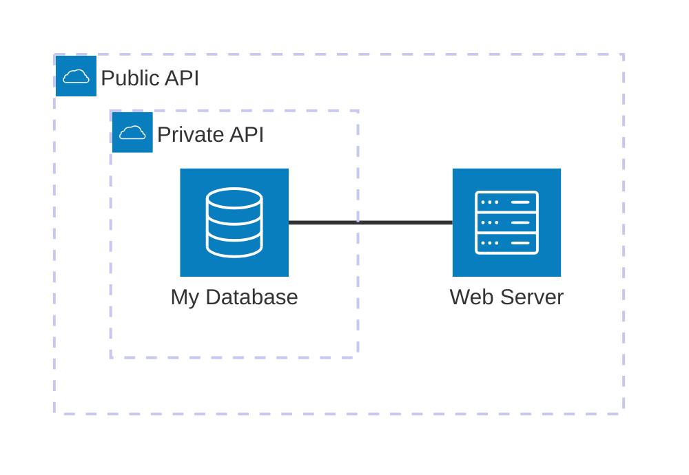

**Flowchart Alternative (Compatible with all versions):**

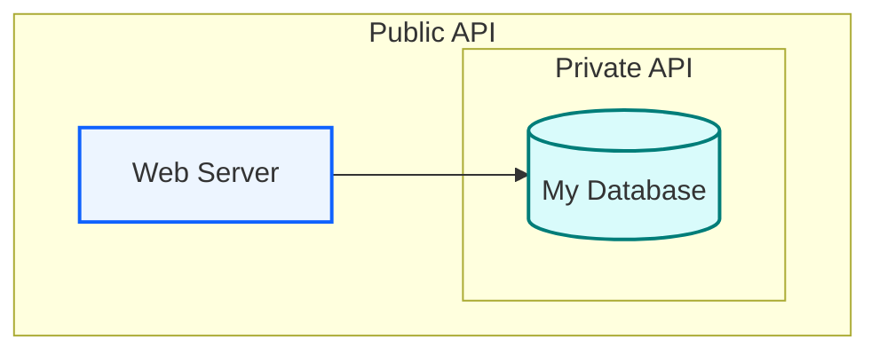

### Example (With Edges and Directions)

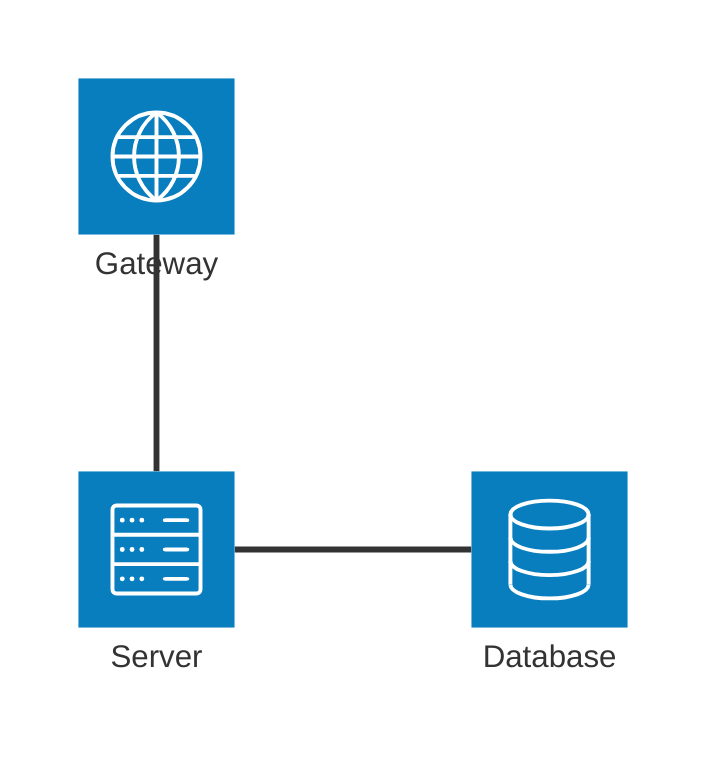

**Flowchart Alternative (Compatible with all versions):**

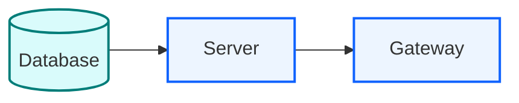

### Example (Groups and Nested Services)

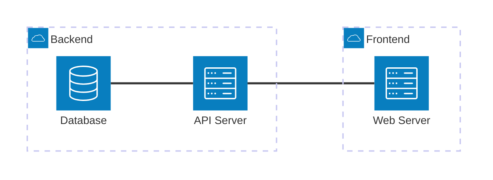

**Flowchart Alternative (Compatible with all versions):**

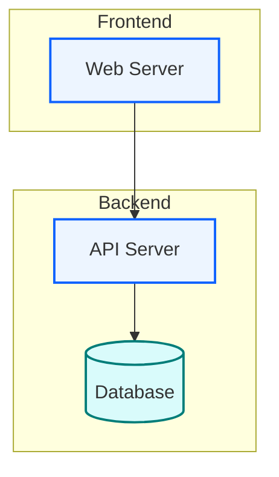

### Example (With Junctions)

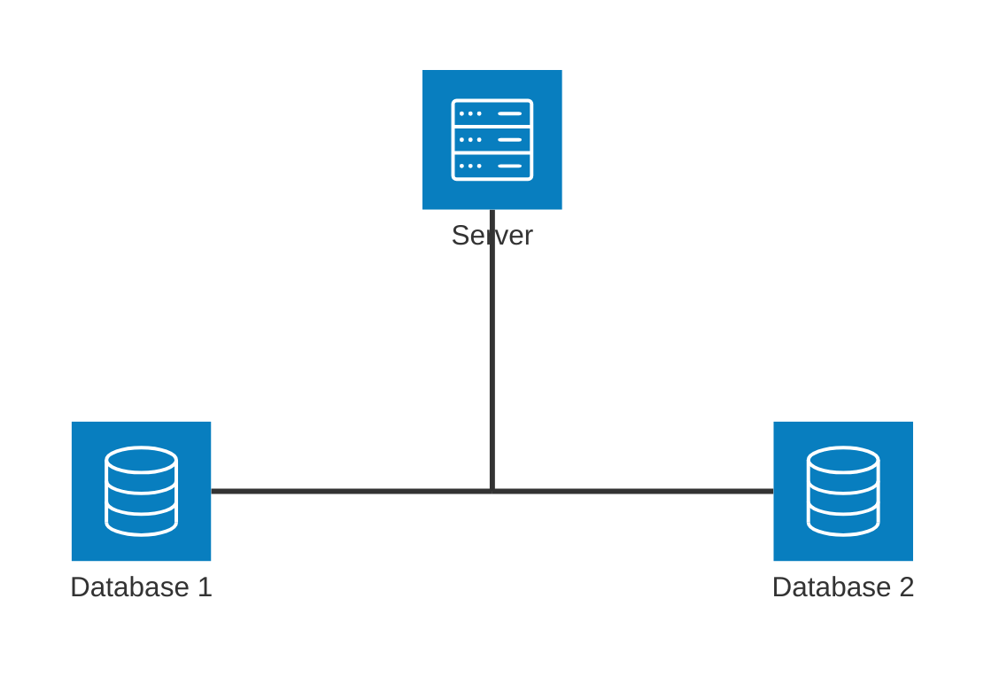

**Flowchart Alternative (Compatible with all versions):**

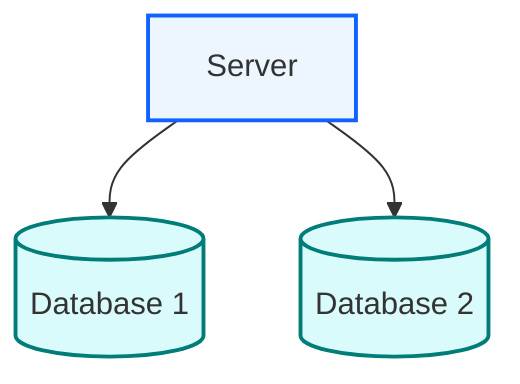

### Example (Edge from Group to Group)

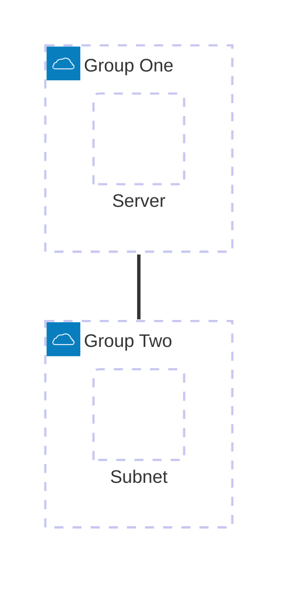

**Flowchart Alternative (Compatible with all versions):**

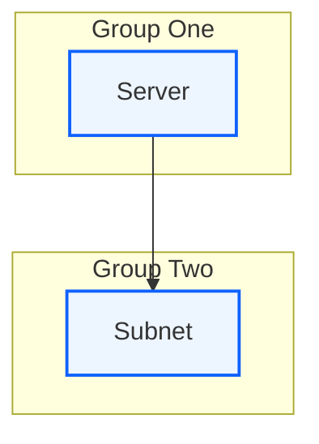

### Example (Complex Cloud Architecture — Bare)

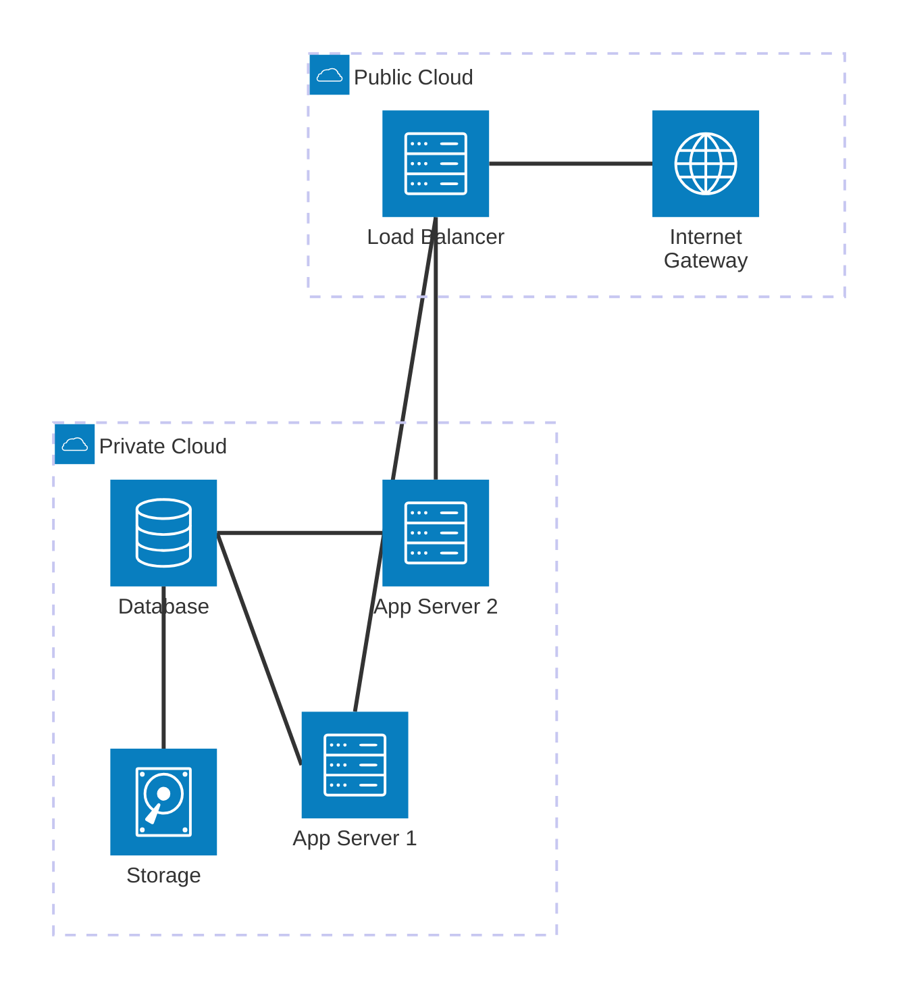

**Flowchart Alternative — Blueprint Style (Compatible with all versions):**

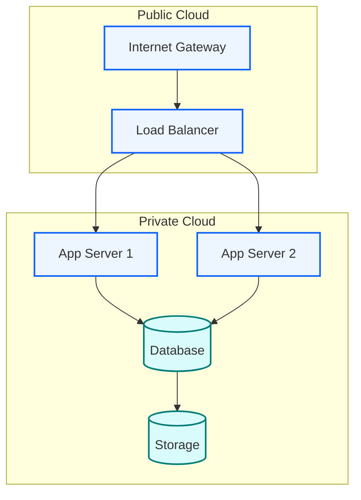

### Example (Hybrid Cloud Deployment — Bare)


**Flowchart Alternative (Compatible with all versions):**

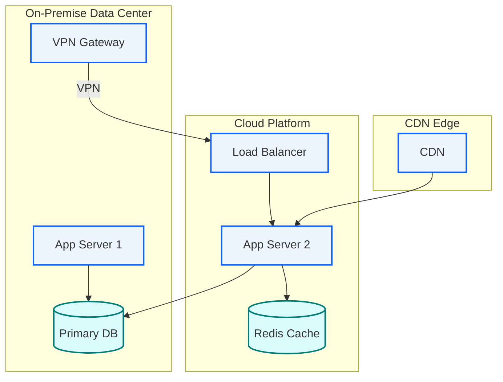

### Example (CDN + Multi-Region — Bare)

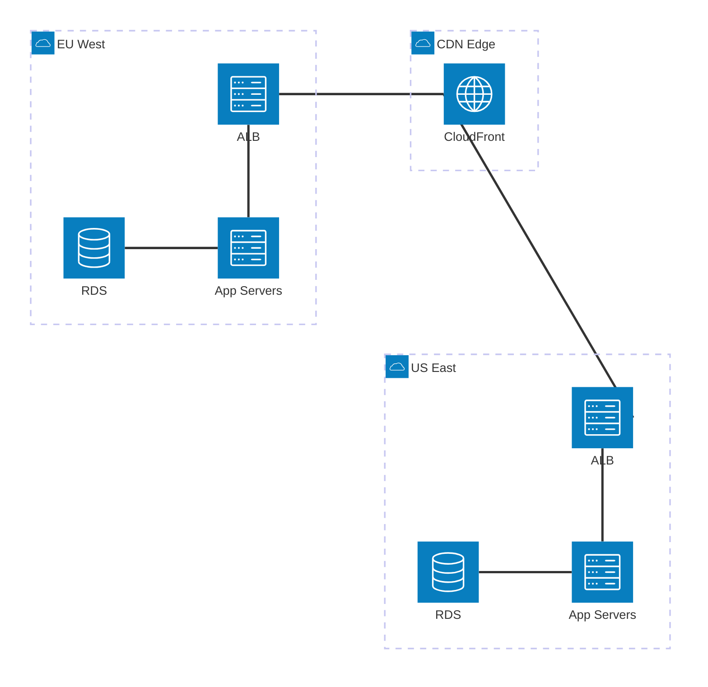

---

## Approach B: With Icon Packs (Requires Registration)

For environments that support `mermaid.registerIconPacks()` (self-hosted apps, bundlers, VSCode with plugin). **Does NOT work** on mermaid.live or GitHub Markdown.

### Registering Icon Packs

**When the user's environment supports icon packs**, instruct them to register icons before rendering. The canonical set is 6 packs: `logos`, `skill-icons`, `devicon`, `codicon`, `gcp`, `vscode-icons`.

#### Via CDN / mkdocs extra_javascript (recommended, no bundler):

```javascript
/**
 * Blueprint Design System — Icon Pack Registration for Mermaid
 *
 * Registers 6 icon packs (logos, skill-icons, devicon, codicon, gcp, vscode-icons)
 * for use in architecture-beta and flowchart @{ icon: } diagrams.
 * Loaded after Mermaid (v11.15.0+) from CDN.
 */
(function () {
  // Wait for mermaid to be available (CDN loads async)
  function registerIcons() {
    if (typeof mermaid === 'undefined') {
      setTimeout(registerIcons, 100);
      return;
    }

    var iconPacks = [
      'logos',
      'skill-icons',
      'devicon',
      'codicon',
      'gcp',
      'vscode-icons',
    ];

    try {
      mermaid.registerIconPacks(
        iconPacks.map(function (name) {
          return {
            name: name,
            loader: function () {
              return fetch(
                'https://unpkg.com/@iconify-json/' + name + '/icons.json'
              ).then(function (res) {
                return res.json();
              });
            },
          };
        })
      );
      console.log('[Blueprint] ' + iconPacks.length + ' icon packs registered successfully.');
    } catch (e) {
      console.warn('[Blueprint] Icon pack registration failed:', e.message);
    }
  }

  registerIcons();
})();
```

#### Via JavaScript module API:

```javascript
import mermaid from 'mermaid';

// Register 6 icon sets for full coverage:
//   logos         → cloud providers / product logos (AWS, GCP, Azure, K8s, Docker, etc.)
//   skill-icons   → programming skill icons (with light/dark variants)
//   devicon       → programming languages, frameworks, tools (Python, React, PostgreSQL, etc.)
//   codicon       → IDE/dev concepts (Git, terminal, debug, symbols)
//   gcp           → Google Cloud service icons (214 services)
//   vscode-icons  → file-type icons (1,513 icons: file-type-python, file-type-docker, etc.)

mermaid.registerIconPacks([
  {
    name: 'logos',
    loader: () =>/icons.json
      fetch('https://unpkg.com/@iconify-json/logos/icons.json')
        .then((res) => res.json()),
  },
  {
    name: 'skill-icons',
    loader: () =>/icons.json
      fetch('https://unpkg.com/@iconify-json/skill-icons/icons.json')
        .then((res) => res.json()),
  },
  {
    name: 'devicon',
    loader: () =>/icons.json
      fetch('https://unpkg.com/@iconify-json/devicon/icons.json')
        .then((res) => res.json()),
  },
  {
    name: 'codicon',
    loader: () =>/icons.json
      fetch('https://unpkg.com/@iconify-json/codicon/icons.json')
        .then((res) => res.json()),
  },
  {
    name: 'gcp',
    loader: () =>/icons.json
      fetch('https://unpkg.com/@iconify-json/gcp/icons.json')
        .then((res) => res.json()),
  },
  {
    name: 'vscode-icons',
    loader: () =>
      fetch('https://unpkg.com/@iconify-json/vscode-icons/icons.json')
        .then((res) => res.json()),
  },
]);

mermaid.initialize({ startOnLoad: true });
```

#### Via npm bundler (Webpack/Vite/Next.js):

```bash
npm install @iconify-json/logos @iconify-json/skill-icons @iconify-json/devicon @iconify-json/codicon @iconify-json/gcp @iconify-json/vscode-icons
```

```javascript
import mermaid from 'mermaid';
mermaid.registerIconPacks([
  { name: 'logos',        loader: () => import('@iconify-json/logos').then(m => m.icons) },
  { name: 'skill-icons',  loader: () => import('@iconify-json/skill-icons').then(m => m.icons) },
  { name: 'devicon',      loader: () => import('@iconify-json/devicon').then(m => m.icons) },
  { name: 'codicon',      loader: () => import('@iconify-json/codicon').then(m => m.icons) },
  { name: 'gcp',          loader: () => import('@iconify-json/gcp').then(m => m.icons) },
  { name: 'vscode-icons', loader: () => import('@iconify-json/vscode-icons').then(m => m.icons) },
]);
```

> **GCP icon overlap note**: The `logos` and `gcp` packs both cover Google Cloud. Prefer `gcp:` for service-level GCP icons (214 available, e.g. `gcp:cloud-run`, `gcp:bigquery`); use `logos:google-cloud` for the generic cloud mark.

#### Icon Naming Convention

After registration, use icons with `packName:icon-name`:
```
service ec2(logos:aws-ec2)[EC2]
service lambda(logos:aws-lambda)[Lambda]
service app(devicon:python)[Python Service]
service db(devicon:postgresql)[PostgreSQL]
service git(codicon:git-branch)[Git Branch]
service pyfile(vscode-icons:file-type-python)[Python File]
```

### Popular Icon Pack Icons

**Cloud & Infrastructure** (`logos`):

| Provider | Icon Reference |
|----------|---------------|
| AWS EC2 | `logos:aws-ec2` |
| AWS Lambda | `logos:aws-lambda` |
| AWS S3 | `logos:aws-s3` |
| AWS RDS | `logos:aws-rds` |
| AWS ELB | `logos:aws-elb` |
| AWS VPC | `logos:aws-vpc` |
| AWS DynamoDB | `logos:aws-dynamodb` |
| AWS ECS | `logos:aws-ecs` |
| AWS EKS | `logos:aws-eks` |
| Google Cloud | `logos:google-cloud` |
| GCP Cloud Run | `logos:google-cloud-run` |
| GKE | `logos:google-kubernetes-engine` |
| Azure | `logos:microsoft-azure` |
| Docker | `logos:docker-icon` |
| Kubernetes | `logos:kubernetes` |
| Terraform | `logos:terraform-icon` |

**Programming & Tools** (`devicon`):

| Technology | Icon Reference |
|-----------|---------------|
| Python | `devicon:python` |
| JavaScript | `devicon:javascript` |
| TypeScript | `devicon:typescript` |
| Go | `devicon:go` |
| Rust | `devicon:rust` |
| Java | `devicon:java` |
| React | `devicon:react` |
| Node.js | `devicon:nodejs` |
| PostgreSQL | `devicon:postgresql` |
| MongoDB | `devicon:mongodb` |
| Redis | `devicon:redis` |
| Docker | `devicon:docker` |
| Kubernetes | `devicon:kubernetes` |
| Git | `devicon:git` |
| GitHub | `devicon:github` |

**IDE/Dev Concepts** (`codicon`):

| Concept | Icon Reference |
|---------|---------------|
| Git Branch | `codicon:git-branch` |
| Git Merge | `codicon:git-merge` |
| Pull Request | `codicon:git-pull-request` |
| Terminal | `codicon:terminal` |
| Debug | `codicon:debug` |
| Database | `codicon:database` |
| Server | `codicon:server` |
| Cloud | `codicon:cloud` |

> **Tip**: Browse all available icons at [icones.js.org](https://icones.js.org/) — search for any icon across all icon sets. For a curated reference of 600+ commonly used icons organized by technology category, see `examples/icon-catalog.md`.

### Example (AWS Architecture — With Icon Pack)

**Prerequisites**: `mermaid.registerIconPacks([...])` must be called before rendering.

```mermaid
architecture-beta
    group vpc(logos:aws-vpc)[VPC]
    group public_subnet(cloud)[Public Subnet] in vpc
    group private_subnet(cloud)[Private Subnet] in vpc

    service igw(internet)[Internet Gateway] in public_subnet
    service alb(logos:aws-elb)[ALB] in public_subnet
    service ec2(logos:aws-ec2)[EC2] in private_subnet
    service rds(logos:aws-rds)[RDS] in private_subnet
    service s3(logos:aws-s3)[S3 Bucket]

    igw:L -- R:alb
    alb:B -- T:ec2
    ec2:L -- R:rds
    ec2:R -- L:s3
```

### Example (Multi-Cloud Deployment — With Icon Pack)

**Prerequisites**: `mermaid.registerIconPacks([...])` must be called before rendering.

```mermaid
architecture-beta
    group aws_cloud(logos:aws)[AWS Cloud]
    group gcp_cloud(logos:google-cloud)[GCP Cloud]

    service ec2(logos:aws-ec2)[EC2] in aws_cloud
    service rds(logos:aws-rds)[Aurora] in aws_cloud
    service gcr(logos:google-cloud-run)[Cloud Run] in gcp_cloud
    service gcs(disk)[Cloud Storage] in gcp_cloud

    ec2:L -- R:rds
    ec2:R -- L:gcr
    gcr:L -- R:gcs
```

### Example (Kubernetes Cluster — With Icon Pack)

**Prerequisites**: `mermaid.registerIconPacks([...])` must be called before rendering.

```mermaid
architecture-beta
    group cluster(cloud)[Kubernetes Cluster]
    group control(server)[Control Plane] in cluster
    group workers(server)[Workers] in cluster

    service api(server)[API Server] in control
    service etcd(database)[etcd] in control

    service ingress(logos:nginx)[Ingress] in workers
    service svc1(server)[Service A] in workers
    service svc2(server)[Service B] in workers

    ingress:L -- R:svc1
    ingress:L -- R:svc2
    api:L -- R:etcd
    api:B -- T:svc1
    api:B -- T:svc2
```

---

## Approach C: Flowchart with `@{ img: }` — Remote-URL Fallback

**Use this when icon packs are NOT registered** (mermaid.live, GitHub, no-config environments). It uses the flowchart `@{ img: }` syntax with the Iconify SVG API, which works everywhere with no setup. Use the Iconify SVG API to get icon URLs:

```
https://api.iconify.design/logos/aws-ec2.svg
```

### Example (AWS Architecture — Flowchart with Icons)

Works on mermaid.live, GitHub, and all Mermaid environments without any setup.

**Important: Prevent Icon Distortion** — only set `h` with `constraint: "on"`, never set both `w` and `h`:

```mermaid
flowchart TD
    subgraph VPC["AWS VPC"]
        ELB@{ img: "https://api.iconify.design/logos/aws-elb.svg", label: "ALB", pos: "b", h: 48, constraint: "on" }
        EC2@{ img: "https://api.iconify.design/logos/aws-ec2.svg", label: "EC2", pos: "b", h: 48, constraint: "on" }
        RDS@{ img: "https://api.iconify.design/logos/aws-rds.svg", label: "RDS", pos: "b", h: 48, constraint: "on" }
        S3@{ img: "https://api.iconify.design/logos/aws-s3.svg", label: "S3", pos: "b", h: 48, constraint: "on" }
    end

    ELB --> EC2
    EC2 --> RDS
    EC2 --> S3
```

### Example (Multi-Cloud — Flowchart with Icons)

```mermaid
flowchart LR
    AWS@{ img: "https://api.iconify.design/logos/aws.svg", label: "AWS", pos: "b", h: 48, constraint: "on" }
    GCP@{ img: "https://api.iconify.design/logos/google-cloud.svg", label: "GCP", pos: "b", h: 48, constraint: "on" }
    K8s@{ img: "https://api.iconify.design/logos/kubernetes.svg", label: "K8s", pos: "b", h: 48, constraint: "on" }

    AWS -->|Data Sync| GCP
    AWS --> K8s
    GCP --> K8s
```

### Common Iconify SVG URLs

This is a quick subset. For the full catalog (600+ icons across 12 categories), see `examples/icon-catalog.md`.

| Service | URL |
|---------|-----|
| AWS EC2 | `https://api.iconify.design/logos/aws-ec2.svg` |
| AWS Lambda | `https://api.iconify.design/logos/aws-lambda.svg` |
| AWS S3 | `https://api.iconify.design/logos/aws-s3.svg` |
| AWS RDS | `https://api.iconify.design/logos/aws-rds.svg` |
| AWS DynamoDB | `https://api.iconify.design/logos/aws-dynamodb.svg` |
| AWS ELB | `https://api.iconify.design/logos/aws-elb.svg` |
| Google Cloud | `https://api.iconify.design/logos/google-cloud.svg` |
| Cloud Run | `https://api.iconify.design/logos/google-cloud-run.svg` |
| Azure | `https://api.iconify.design/logos/microsoft-azure.svg` |
| Kubernetes | `https://api.iconify.design/logos/kubernetes.svg` |
| Docker | `https://api.iconify.design/logos/docker-icon.svg` |
| Nginx | `https://api.iconify.design/logos/nginx.svg` |
| Redis | `https://api.iconify.design/logos/redis.svg` |
| PostgreSQL | `https://api.iconify.design/logos/postgresql.svg` |
| MongoDB | `https://api.iconify.design/logos/mongodb-icon.svg` |
| Python | `https://api.iconify.design/devicon/python.svg` |
| Node.js | `https://api.iconify.design/devicon/nodejs.svg` |
| React | `https://api.iconify.design/devicon/react.svg` |
| Git | `https://api.iconify.design/devicon/git.svg` |
| GitHub | `https://api.iconify.design/devicon/github.svg` |

> **Tip**: Use `pos: "b"` to place labels below the icon, `w`/`h` for icon size. Pattern: `https://api.iconify.design/{pack}/{icon}.svg`.

---

## Architecture Configuration Options (v11.14.0+)

Fine-tune layout quality with the architecture config block:

```mermaid
%%{init: {"architecture": {"nodeSeparation": 100, "idealEdgeLengthMultiplier": 3, "edgeElasticity": 0.3, "numIter": 5000}}}%%
architecture-beta
    service a(server)[A]
    service b(server)[B]
    service c(server)[C]
    a:R --> L:b
    b:R --> L:c
```

| Option | Type | Default | Purpose |
|--------|------|---------|---------|
| `randomize` | boolean | `false` | Randomize initial positions for potentially better layout |
| `nodeSeparation` | number | `75` | Minimum pixel separation between sibling nodes |
| `idealEdgeLengthMultiplier` | number | `1.5` | Multiplier on `iconSize` for intra-group edge length — increase for breathing room |
| `edgeElasticity` | number | `0.45` | Spring elasticity (0–1) — higher pulls connected nodes closer |
| `numIter` | number | `2500` | Maximum fcose iterations — increase for large diagrams |

---

## Decision Guide: Which Approach to Use

Primary trigger — **are icon packs registered?**

| Icon packs registered? | Recommended approach | Typical environments |
|-----------------------|----------------------|----------------------|
| Yes | **B** (Icon Pack — `(pack:icon)` syntax) | Self-hosted app with bundler, VSCode with Mermaid plugin, internal team docs |
| No, portable render needed | **C** (Flowchart + `@{ img: }` remote URL) | mermaid.live, GitHub Markdown, static docs / Docusaurus |
| No, want zero-icon simplicity | **A** (Bare — built-in icons only) | Any environment, minimal diagrams |

> **Rule of thumb**: if the rendering environment calls `mermaid.registerIconPacks([...])`, use **Approach B**; otherwise use **Approach C** for icons or **Approach A** for bare diagrams.
