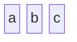
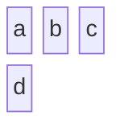
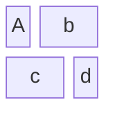
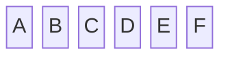
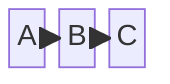
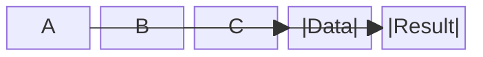
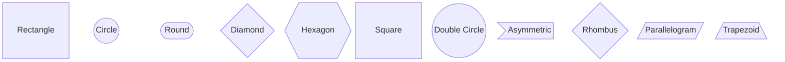
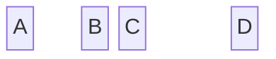
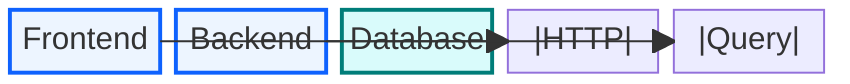

## Instructions

Block diagrams are an intuitive way to represent complex systems, processes, or architectures visually. Unlike flowcharts, block diagrams give the author full control over where shapes are positioned.

### Blueprint Styling

Block diagrams use `style` and the standard Blueprint classDef equivalent inline:

```
style BlockName fill:#edf5ff,stroke:#0f62fe,stroke-width:2px
```

See `examples/design-system.md` for the canonical palette, classDef templates, and themeVariables.

### Syntax

- Use `block-beta` keyword
- Basic blocks: `block BlockName` or just `BlockName`
- Columns: Specify number of columns to organize blocks
- Block width: Blocks can span multiple columns
- Composite blocks: Nested blocks within parent blocks
- Connections: `Block1 --> Block2` or `Block1 --- Block2`
- Labels: `Block1 -->|Label| Block2`
- Block shapes: rectangle (default), circle, round, diamond, hexagon, square, double-circle, asymmetric, rhombus, parallelogram, trapezoid
- Space blocks: `space` or `space:num` for intentional spacing
- Styling: `style BlockName fill:#color,stroke:#color,stroke-width:2px`

Reference: [Mermaid Block Diagram Documentation](https://mermaid.ai/open-source/syntax/block.html)

### Example (Simple Block Diagram)



### Example (Multi-Column Layout)



### Example (Block Spanning Multiple Columns)



### Example (Composite Blocks - Nested)



### Example (Basic Connections)



### Example (Connections with Labels)



### Example (Different Block Shapes)



### Example (Space Blocks)



### Example (System Architecture with Blueprint Styling)



### Example (Business Process Flow)

```mermaid
block-beta
    Start{"Start"}
    Process1["Process 1"]
    Decision{"Decision?"}
    Process2["Process 2"]
    End["End"]

    Start --> Process1
    Process1 --> Decision
    Decision -->|Yes| Process2
    Decision -->|No| End
    Process2 --> End

    style Start fill:#defbe6,stroke:#198038,stroke-width:2px
    style Process1,Process2 fill:#edf5ff,stroke:#0f62fe,stroke-width:2px
    style Decision fill:#fcf4d6,stroke:#f1c21b,stroke-width:2px
    style End fill:#defbe6,stroke:#198038,stroke-width:2px
```

### Example (Microservice Architecture)

```mermaid
block-beta columns 3
    space Client["Web Client"] space
    space Gateway["API Gateway"] space
    Auth["Auth Service"] User["User Service"] Order["Order Service"]
    space Database(("Database")) space

    Client --> Gateway
    Gateway --> Auth
    Gateway --> User
    Gateway --> Order
    Auth --> Database
    User --> Database
    Order --> Database

    style Client fill:#edf5ff,stroke:#0f62fe,stroke-width:2px
    style Gateway fill:#edf5ff,stroke:#0f62fe,stroke-width:2px
    style Auth,User,Order fill:#edf5ff,stroke:#0f62fe,stroke-width:2px
    style Database fill:#d9fbfb,stroke:#007d79,stroke-width:2px
```
