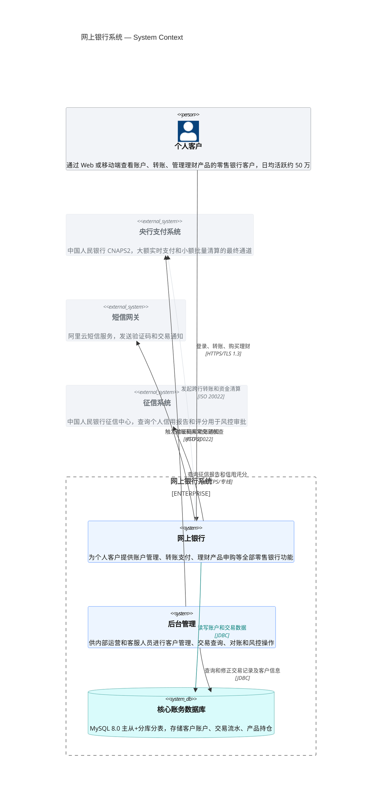
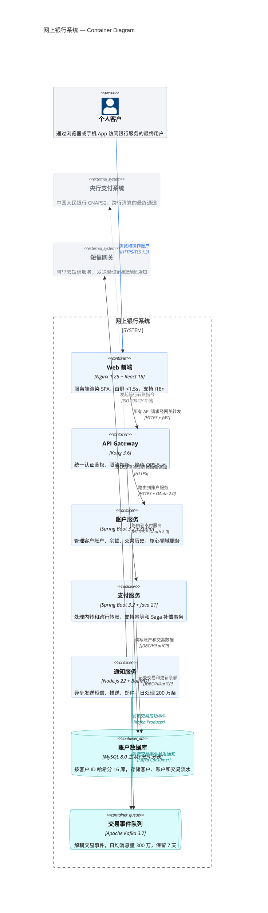
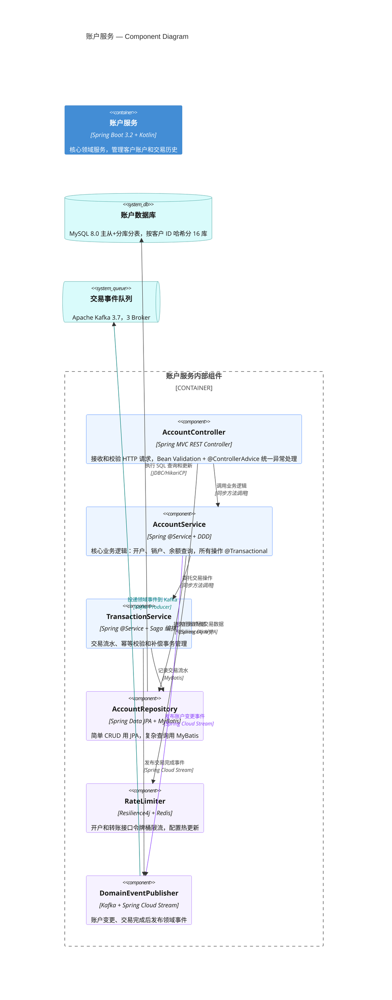
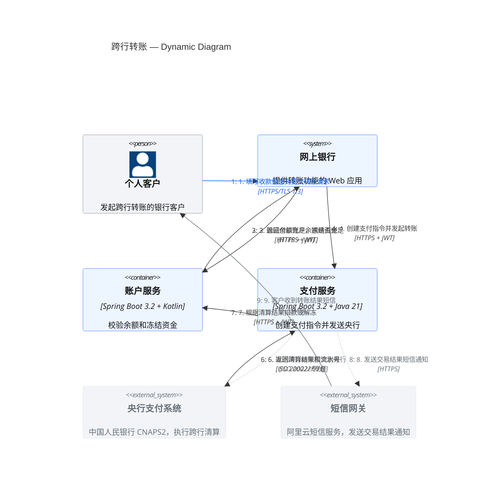
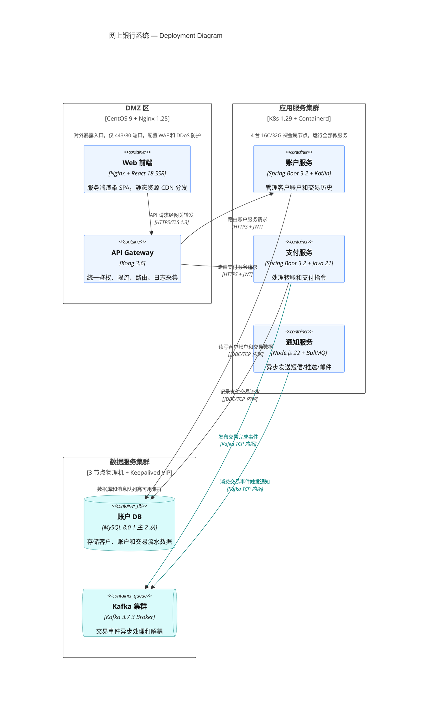
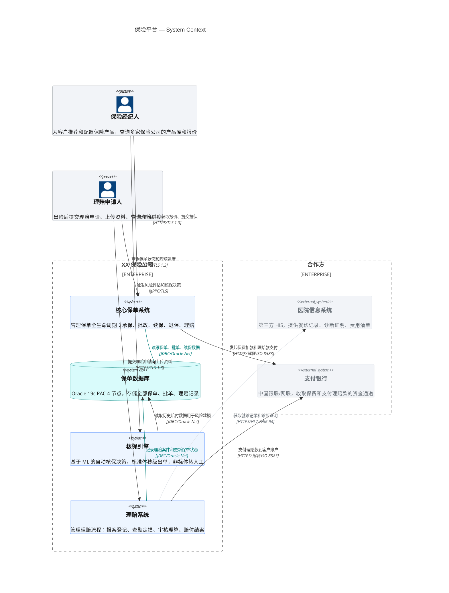
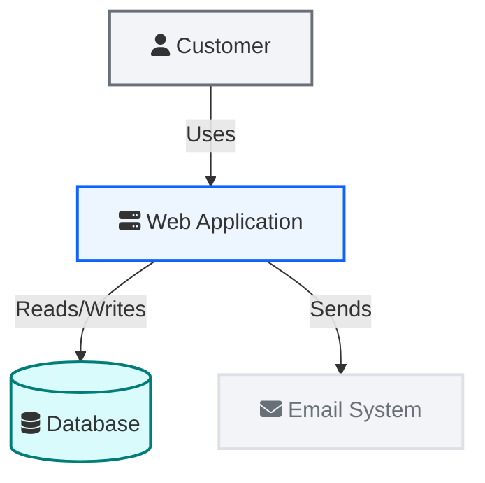

## Instructions

C4 图（Context、Container、Component、Dynamic、Deployment）通过四级抽象对软件架构建模，从系统上下文到组件细节。Mermaid 的 C4 语法与 PlantUML 兼容。

**注意**：C4 是实验性图表类型。语法和属性在未来的版本中可能会发生变化。C4 图使用固定样式——不同皮肤下的 CSS 不会变化，需要使用 `UpdateElementStyle` 和 `UpdateRelStyle` 来覆写样式。

---

### 核心语法速查

#### 元素签名（按图表级别）

**C4Context（系统上下文）**：

| 元素 | 签名 | 参数说明 |
| --- | --- | --- |
| Person | `Person(alias, label, ?descr)` | 别名, "角色名", "描述" |
| Person_Ext | `Person_Ext(alias, label, ?descr)` | 外部人员 |
| System | `System(alias, label, ?descr)` | 别名, "系统名", "描述" |
| SystemDb | `SystemDb(alias, label, ?descr)` | 别名, "数据库名", "描述" |
| SystemQueue | `SystemQueue(alias, label, ?descr)` | 别名, "队列名", "描述" |
| System_Ext | `System_Ext(alias, label, ?descr)` | 外部系统 |
| SystemDb_Ext | `SystemDb_Ext(alias, label, ?descr)` | 外部数据库 |
| SystemQueue_Ext | `SystemQueue_Ext(alias, label, ?descr)` | 外部队列 |
| Boundary | `Boundary(alias, label, ?type)` | 通用边界 |
| Enterprise_Boundary | `Enterprise_Boundary(alias, label)` | 企业边界 |
| System_Boundary | `System_Boundary(alias, label)` | 系统边界 |

**C4Container（容器）**：

| 元素 | 签名 | 参数说明 |
| --- | --- | --- |
| Container | `Container(alias, label, ?techn, ?descr)` | 别名, "容器名", "技术栈", "描述" |
| ContainerDb | `ContainerDb(alias, label, ?techn, ?descr)` | 数据库容器 |
| ContainerQueue | `ContainerQueue(alias, label, ?techn, ?descr)` | 队列容器 |
| Container_Ext | `Container_Ext(alias, label, ?techn, ?descr)` | 外部容器 |
| ContainerDb_Ext | `ContainerDb_Ext(alias, label, ?techn, ?descr)` | 外部数据库容器 |
| ContainerQueue_Ext | `ContainerQueue_Ext(alias, label, ?techn, ?descr)` | 外部队列容器 |
| Container_Boundary | `Container_Boundary(alias, label)` | 容器边界 |

**C4Component（组件）**：

| 元素 | 签名 | 参数说明 |
| --- | --- | --- |
| Component | `Component(alias, label, ?techn, ?descr)` | 别名, "组件名", "技术", "描述" |
| ComponentDb | `ComponentDb(alias, label, ?techn, ?descr)` | 数据组件 |
| ComponentQueue | `ComponentQueue(alias, label, ?techn, ?descr)` | 队列组件 |
| Component_Ext | `Component_Ext(alias, label, ?techn, ?descr)` | 外部组件 |

**C4Deployment（部署）**：

| 元素 | 签名 | 参数说明 |
| --- | --- | --- |
| Deployment_Node | `Deployment_Node(alias, label, ?type, ?descr)` | 别名, "节点名", "OS+规格", "描述" |

#### 关系

```
Rel(from, to, label, ?techn, ?descr)
BiRel(from, to, label, ?techn, ?descr)
Rel_U / Rel_D / Rel_L / Rel_R(from, to, label, ?techn, ?descr)
Rel_Back(from, to, label, ?techn, ?descr)
RelIndex(index, from, to, label, ?techn, ?descr)
```

**重要**：`RelIndex` 的 `index` 参数在 Mermaid 中被忽略——序号由 `RelIndex` 语句的书写顺序决定。C4Dynamic 中每个步骤用一条 `RelIndex` 表示。

#### 样式覆写

```
UpdateElementStyle(elementName, ?bgColor, ?fontColor, ?borderColor, ?shadowing, ?shape, ?sprite, ?techn, ?legendText, ?legendSprite)
UpdateRelStyle(from, to, ?textColor, ?lineColor, ?offsetX, ?offsetY)
UpdateLayoutConfig(?c4ShapeInRow, ?c4BoundaryInRow)
```

**关键**：
- `UpdateElementStyle` 参数顺序：**bgColor → fontColor → borderColor**（先背景、再字体、再边框）
- `UpdateRelStyle` 参数顺序：**textColor → lineColor → offsetX → offsetY**
- 支持命名参数（`$` 前缀）：`$bgColor="#edf5ff"` — 命名参数可以任意顺序，只更新指定的属性
- `UpdateLayoutConfig` 默认值：c4ShapeInRow=4, c4BoundaryInRow=2

#### 不支持的特性

Mermaid C4 目前不支持：Sprites 图标、Tags 标签系统、Links 超链接、Legend 图例、`Lay_U/D/L/R` 布局指令。

---

### 强硬规则：AI 生成 C4 图必须遵守

1. **信息密度**：每个元素必须填写全部有意义的参数，描述要包含"做什么、怎么做、为什么"
2. **关系线必须写协议**：`Rel(a, b, "动作", "协议")`——第 4 参数非空
3. **样式覆写必须**：每个图必须包含 `UpdateElementStyle`（Blueprint 配色）+ `UpdateRelStyle`（关键关系）
4. **元素 > 8 时用 `UpdateLayoutConfig`** 控制布局

### Carbon 配色映射

| 语义角色 | bgColor | fontColor | borderColor |
| --- | --- | --- | --- |
| 内部人员 (Person) | `#f2f4f8` | `#161616` | `#697077` |
| 内部系统 (System) | `#edf5ff` | `#161616` | `#0f62fe` |
| 内部数据库 (SystemDb) | `#d9fbfb` | `#161616` | `#007d79` |
| 内部队列 (SystemQueue) | `#d9fbfb` | `#161616` | `#007d79` |
| 容器 (Container) | `#edf5ff` | `#161616` | `#0f62fe` |
| 数据库容器 (ContainerDb) | `#d9fbfb` | `#161616` | `#007d79` |
| 组件 (Component) | `#edf5ff` | `#161616` | `#0f62fe` |
| 外部系统 (System_Ext) | `#f2f4f8` | `#697077` | `#dde1e6` |
| 外部人员 (Person_Ext) | `#f2f4f8` | `#697077` | `#dde1e6` |
| 部署节点 | `#ffffff` | `#161616` | `#393939` |

参考：`examples/design-system.md`

---

### 示例 1：C4Context — 系统上下文图



### 示例 2：C4Container — 容器图



### 示例 3：C4Component — 组件图



### 示例 4：C4Dynamic — 动态图



### 示例 5：C4Deployment — 部署图



### 示例 6：带多个企业边界的上下文图



---

### AI 生成自检清单

- [ ] C4Context 中 Person 用 3 参数、System 用 3 参数、SystemDb 用 3 参数？
- [ ] C4Container 中 Container 用 4 参数（含 technology）？
- [ ] C4Component 中 Component 用 4 参数（含 technology）？
- [ ] C4Deployment 中 Deployment_Node 用 4 参数（含 type）？
- [ ] 外部系统使用 `System_Ext`、外部人员使用 `Person_Ext`？
- [ ] 每条 Rel 都写了协议（第 4 参数）？
- [ ] `UpdateElementStyle` 参数顺序正确（bgColor → fontColor → borderColor）？
- [ ] `UpdateRelStyle` 参数顺序正确（textColor → lineColor → offsetX → offsetY）？
- [ ] 元素 > 8 时使用了 `UpdateLayoutConfig($c4ShapeInRow=..., $c4BoundaryInRow=...)`？
- [ ] 没有使用 Mermaid 不支持的特性（sprites、tags、links、Lay_U/D/L/R）？
- [ ] `RelIndex` 的 index 值按书写顺序递增？
- [ ] C4Dynamic 中每个步骤用独立的 `RelIndex`？

### 备选方案（Flowchart — 兼容所有 Mermaid 版本）


