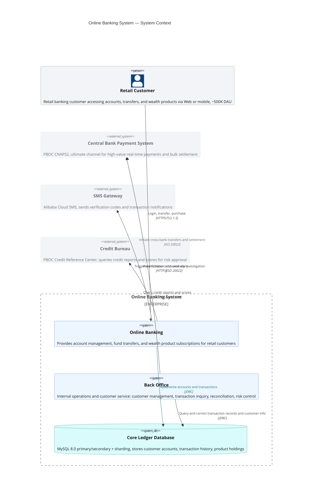
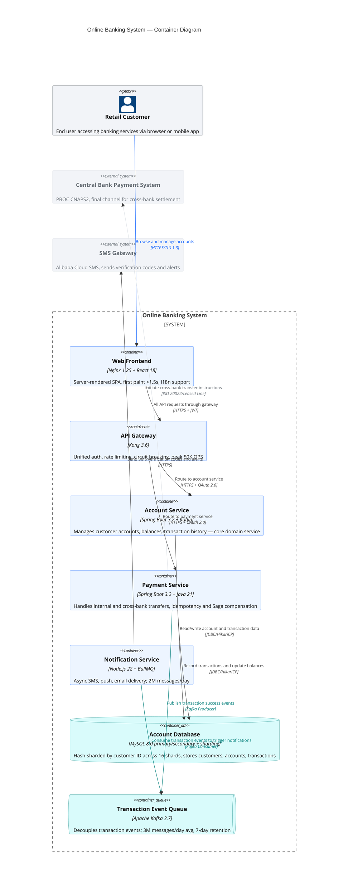
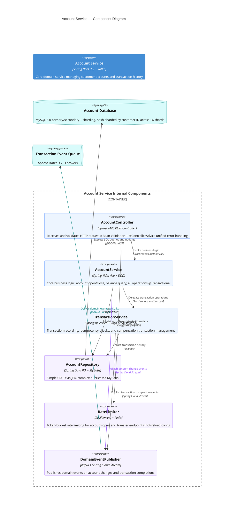
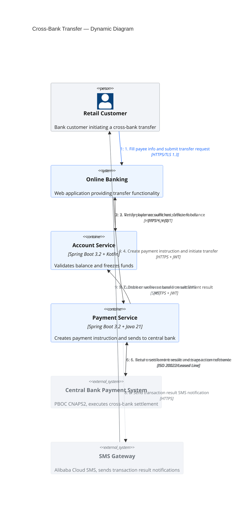
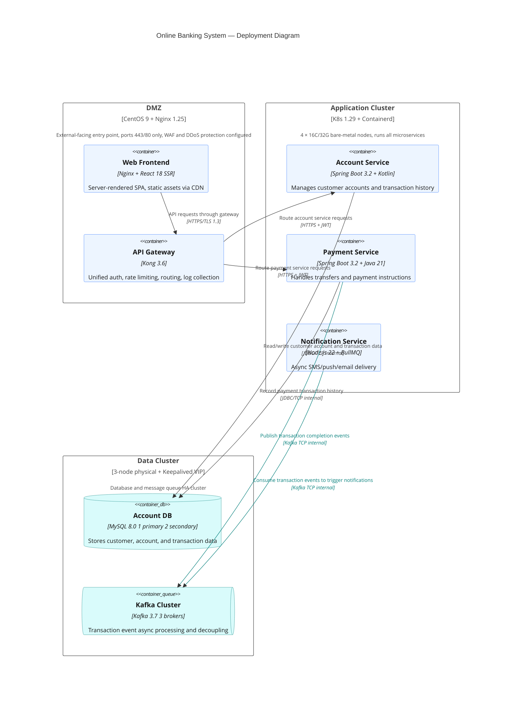
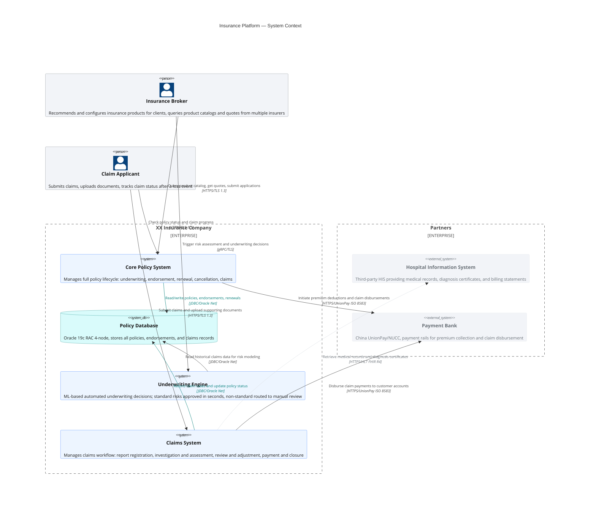
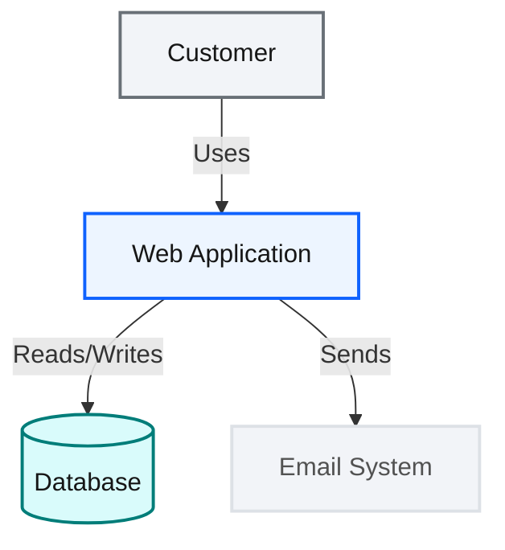

## Instructions

C4 diagrams (Context, Container, Component, Dynamic, Deployment) model software architecture through four levels of abstraction, from system context down to component detail. Mermaid's C4 syntax is PlantUML-compatible.

**Note**: C4 is an experimental diagram type. Syntax and properties may change in future releases. C4 diagrams use fixed styles — CSS does not vary across skins; use `UpdateElementStyle` and `UpdateRelStyle` to override styling.

---

### Core syntax reference

#### Element signatures (by diagram level)

**C4Context (system context)**:

| Element | Signature | Parameters |
| --- | --- | --- |
| Person | `Person(alias, label, ?descr)` | alias, "role name", "description" |
| Person_Ext | `Person_Ext(alias, label, ?descr)` | External person |
| System | `System(alias, label, ?descr)` | alias, "system name", "description" |
| SystemDb | `SystemDb(alias, label, ?descr)` | alias, "database name", "description" |
| SystemQueue | `SystemQueue(alias, label, ?descr)` | alias, "queue name", "description" |
| System_Ext | `System_Ext(alias, label, ?descr)` | External system |
| SystemDb_Ext | `SystemDb_Ext(alias, label, ?descr)` | External database |
| SystemQueue_Ext | `SystemQueue_Ext(alias, label, ?descr)` | External queue |
| Boundary | `Boundary(alias, label, ?type)` | Generic boundary |
| Enterprise_Boundary | `Enterprise_Boundary(alias, label)` | Enterprise boundary |
| System_Boundary | `System_Boundary(alias, label)` | System boundary |

**C4Container**:

| Element | Signature | Parameters |
| --- | --- | --- |
| Container | `Container(alias, label, ?techn, ?descr)` | alias, "container name", "tech stack", "description" |
| ContainerDb | `ContainerDb(alias, label, ?techn, ?descr)` | Database container |
| ContainerQueue | `ContainerQueue(alias, label, ?techn, ?descr)` | Queue container |
| Container_Ext | `Container_Ext(alias, label, ?techn, ?descr)` | External container |
| ContainerDb_Ext | `ContainerDb_Ext(alias, label, ?techn, ?descr)` | External database container |
| ContainerQueue_Ext | `ContainerQueue_Ext(alias, label, ?techn, ?descr)` | External queue container |
| Container_Boundary | `Container_Boundary(alias, label)` | Container boundary |

**C4Component**:

| Element | Signature | Parameters |
| --- | --- | --- |
| Component | `Component(alias, label, ?techn, ?descr)` | alias, "component name", "tech", "description" |
| ComponentDb | `ComponentDb(alias, label, ?techn, ?descr)` | Data component |
| ComponentQueue | `ComponentQueue(alias, label, ?techn, ?descr)` | Queue component |
| Component_Ext | `Component_Ext(alias, label, ?techn, ?descr)` | External component |

**C4Deployment**:

| Element | Signature | Parameters |
| --- | --- | --- |
| Deployment_Node | `Deployment_Node(alias, label, ?type, ?descr)` | alias, "node name", "OS+specs", "description" |

#### Relationships

```
Rel(from, to, label, ?techn, ?descr)
BiRel(from, to, label, ?techn, ?descr)
Rel_U / Rel_D / Rel_L / Rel_R(from, to, label, ?techn, ?descr)
Rel_Back(from, to, label, ?techn, ?descr)
RelIndex(index, from, to, label, ?techn, ?descr)
```

**Important**: `RelIndex`'s `index` parameter is ignored in Mermaid — the sequence is determined by the declaration order of `RelIndex` statements. In C4Dynamic, each step maps to one `RelIndex`.

#### Style overrides

```
UpdateElementStyle(elementName, ?bgColor, ?fontColor, ?borderColor, ?shadowing, ?shape, ?sprite, ?techn, ?legendText, ?legendSprite)
UpdateRelStyle(from, to, ?textColor, ?lineColor, ?offsetX, ?offsetY)
UpdateLayoutConfig(?c4ShapeInRow, ?c4BoundaryInRow)
```

**Key points**:
- `UpdateElementStyle` parameter order: **bgColor → fontColor → borderColor**
- `UpdateRelStyle` parameter order: **textColor → lineColor → offsetX → offsetY**
- Named parameters (`$` prefix) are supported: `$bgColor="#edf5ff"` — arbitrary order, only specified attributes change
- `UpdateLayoutConfig` defaults: c4ShapeInRow=4, c4BoundaryInRow=2

#### Unsupported features

Mermaid C4 currently does not support: sprites, tags, links, legend, or `Lay_U/D/L/R` layout directives.

---

### Hard rules: AI-generated C4 diagrams must follow

1. **Information density**: every element must fill all meaningful parameters; descriptions must cover "what, how, why"
2. **Relationships must include protocol**: `Rel(a, b, "action", "protocol")` — parameter 4 must be non-empty
3. **Style overrides are mandatory**: every diagram must include `UpdateElementStyle` (Blueprint colors) + `UpdateRelStyle` (key relationships)
4. **Use `UpdateLayoutConfig` when element count > 8** to control layout

### Carbon color mapping

| Semantic role | bgColor | fontColor | borderColor |
| --- | --- | --- | --- |
| Internal person (Person) | `#f2f4f8` | `#161616` | `#697077` |
| Internal system (System) | `#edf5ff` | `#161616` | `#0f62fe` |
| Internal database (SystemDb) | `#d9fbfb` | `#161616` | `#007d79` |
| Internal queue (SystemQueue) | `#d9fbfb` | `#161616` | `#007d79` |
| Container | `#edf5ff` | `#161616` | `#0f62fe` |
| Database container (ContainerDb) | `#d9fbfb` | `#161616` | `#007d79` |
| Component | `#edf5ff` | `#161616` | `#0f62fe` |
| External system (System_Ext) | `#f2f4f8` | `#697077` | `#dde1e6` |
| External person (Person_Ext) | `#f2f4f8` | `#697077` | `#dde1e6` |
| Deployment node | `#ffffff` | `#161616` | `#393939` |

See `examples/design-system.md` for the canonical palette, classDef templates, and themeVariables.

### Anti-overlap methodology for complex C4 diagrams

Mermaid C4's layout engine is **not** fully automatic fcose — it uses a manual grid layout based on element declaration order and row limits, with **no** `Lay_U/D/L/R` directives.

**Core tension**: `c4ShapeMargin` is the only direct knob for node spacing — increasing it resolves overlap but spreads the diagram, decreasing it tightens but causes label collision. The real solution is **two-way balance**: slim the boxes first (trim descriptions + reduce font size) to make them smaller, then use moderate spacing to pull them back together.

The following is a layered prevention system, organized by **effectiveness**:

---

#### Layer 0 (strongest): `%%{init: {"c4": {...}}}%%` — global spacing config

This is the **primary control surface** for C4 diagrams. Mermaid C4 exposes a config object that directly adjusts node spacing, canvas margins, and text-area padding.

**Complete available properties (from `C4DiagramConfig` schema)**:

| Property | Default | Effect | Bidirectional nature |
|----------|---------|--------|----------------------|
| `c4ShapeMargin` | `50` | **Outer margin between shapes** | Increase to push nodes apart; decrease to pull tighter |
| `c4ShapePadding` | `20` | Shape internal padding | Controls text breathing room inside boxes |
| `diagramMarginX` | `50` | Canvas left/right margin | Too large → diagram floats in the middle, wasting width |
| `diagramMarginY` | `10` | Canvas top/bottom margin | Generally doesn't need large adjustments |
| `boxMargin` | `10` | Container box outer margin | Increase to give Boundary extra internal space |
| `nextLinePaddingX` | `0` | Horizontal padding for next row | Prevents horizontal overlap between multi-line text |
| `wrapPadding` | `10` | Text-wrap side padding | Prevents overflow; micro-adjust in the 6–12 range |

**Syntax** (place after `C4Container` and before element declarations):

```mermaid
%%{init: {"c4": {"c4ShapeMargin": 65, "c4ShapePadding": 20, "diagramMarginX": 80, "boxMargin": 14}}}%%
```

**c4ShapeMargin bidirectional tuning rules**:

| Problem | c4ShapeMargin direction | Companion measures |
|---------|:---:|------|
| Labels severely overlapping (clustered) | Increase to 70–100 | Check description length first (Layer 4); don't crank aggressively |
| Diagram too loose, large gaps between boxes | Decrease to 55–65 | Ensure descriptions are trimmed + font size reduced |
| Large blank space at bottom or right | **Don't increase** — decrease diagramMarginX/Y instead | Canvas whitespace = margin too large, not shapeMargin too small |
| System boundary interior crowded | Increase `boxMargin` | Don't change global shapeMargin; only add space inside Boundary |

> **Key insight**: `c4ShapeMargin`'s sweet spot is dominated by box size itself. **The shorter the descriptions and smaller the fonts, the lower the required c4ShapeMargin — compact and overlap-free**. Conversely, a diagram with 100+ char descriptions at 14px will still look ugly at c4ShapeMargin=120. Slenderize first (Layer 4), space second (this layer).

**Recommended values (only after Layer 4 optimization)**:

| Diagram complexity | c4ShapeMargin | c4ShapePadding | diagramMarginX | diagramMarginY |
|--------------------|:---:|:---:|:---:|:---:|
| Simple (≤8 elements) | 50 (default) | 20 (default) | 50 (default) | 10 (default) |
| Medium (9–14 elements) | 55–70 | 18–22 | 60–90 | 10–20 |
| Complex (15–20 elements) | 60–80 | 18–24 | 70–100 | 15–25 |
| Large (21+ elements) | 75–100 | 20–25 | 90–130 | 20–30 |

---

#### Layer 1: `UpdateLayoutConfig` — grid density control

**Symptom**: all rectangles crammed into a few rows, connections crossing like spaghetti.

**Core principle**: `c4ShapeInRow` is the max shapes per row (default 4); `c4BoundaryInRow` is the max boundaries per row (default 2). Increasing them = horizontal expansion.

```mermaid
UpdateLayoutConfig($c4ShapeInRow="6", $c4BoundaryInRow="3")
```

| Element count | c4ShapeInRow | c4BoundaryInRow | Notes |
|---------------|:---:|:---:|------|
| ≤8 | 3–4 | 1–2 | Default is enough |
| 9–14 | 5–6 | 2 | Critical: prevents boundary interior congestion |
| 15–20 | 6–8 | 2–3 | Needs wider canvas (pair with larger diagramMarginX) |
| 21+ | 8+ | 3+ | Consider element culling at high counts |

> **`c4ShapeInRow` affects elements both inside and outside boundaries**. When a boundary has many internal elements, increase `c4BoundaryInRow` to spread boundaries horizontally, avoiding boundary stacking.

**Reverse operation — when the diagram is too spread out**:

| Symptom | Action | Result |
|---------|--------|--------|
| Only 1–2 elements per row, lots of blank space | **Decrease** c4ShapeInRow to 3–4 | Forces more elements per row, reduces horizontal waste |
| Excessive gap between boundaries | **Decrease** c4BoundaryInRow to 1–2 | Boundaries pack more densely |
| Too much blank space on the right | **Decrease** diagramMarginX to 40–60 | Elements use full canvas width |
| Too much blank space top/bottom | **Decrease** diagramMarginY to 5–10 | Compresses vertical whitespace |

Typical "over-spread" fix — a 13-element C4Container:

```
Problem: c4ShapeInRow=8, diagramMarginX=170, only 2–3 elements per row, vast blank space
Fix: c4ShapeInRow=5, diagramMarginX=80, 4–5 elements per row, compact and overlap-free
```

---

#### Layer 2: `UpdateRelStyle` — per-relationship label micro-adjustment

**Symptom**: global spacing is tuned, but 2–3 adjacent edge labels still collide.

**Solution**: use `$offsetX` (horizontal) and `$offsetY` (vertical) to push text labels apart. Note: **only moves text, not the connection path**.

```mermaid
%% Basic: auto-centered label
Rel(a, b, "action", "HTTPS")

%% Micro-adjust: push labels to the side
UpdateRelStyle(a, b, $offsetX="40")
UpdateRelStyle(a, b, $offsetY="-30")
UpdateRelStyle(a, b, $offsetX="-50", $offsetY="20")
```

**Empirical values**:

| Symptom | Typical value | Effect |
|---------|---------------|--------|
| Two labels colliding horizontally | ±`(30~60)` offsetX each | Push left label left, right label right |
| Multiple labels stacked vertically | Staggered `offsetY="-30"/"0"/"+30"` | Stagger vertical positions |
| Label crossing dense area | `$offsetX="-60"` | Push label to side blank area |
| Extreme case | ±`80` ~ ±`120` | Large push, but label drifts from line |

> **Note**: repeated `UpdateRelStyle(a, b, ...)` calls — **the last one wins**. Offsets for the same key don't accumulate.

**Bidirectional judgment**: offset is not a one-way "push and forget." If diagramMarginX is adequate and there's no crowding, but one edge label still overlaps a nearby element, decide between offsetting the label or increasing c4ShapeMargin — **offset is the last resort, not for widespread use**. Widespread offsetX/offsetY means Layer 0/1 spacing wasn't dialed in.

---

#### Layer 3: Declaration order control + element culling — architecture-level optimization

**Declaration order affects layout**: Mermaid C4 lays out elements row by row in declaration order. Declare first → placed in earlier rows:

```mermaid
%% Correct order: Person first → they go in early rows → naturally placed to the edge
Person(de, "...")
Person(da, "...")

%% Core containers in the middle
System_Boundary(main, "...") { ... }

%% External systems last → auto-placed to the opposite side
System_Ext(apps, "...")
```

**Culling decisions**: diagrams with 20+ elements will overlap even with maxed-out config. The C4 methodology itself is multi-level abstraction — drill dense levels into finer-grained diagrams:

| Current diagram | Limit | When exceeded |
|-----------------|-------|---------------|
| C4Context | 15 | Split into multiple Enterprise_Boundary |
| C4Container | 18 | Drill dense container clusters into C4Component |
| C4Component | 12 | Expand single Service into internal components |
| C4Deployment | 15 | Split Deployment_Node by region |

---

#### Layer 4: Box slimming — shorter descriptions, leaner labels, smaller fonts

**This is the most overlooked root cause**. C4 element parameter 4 (description) wraps inside the box. Longer description → taller box → less edge space for text. Descriptions exceeding 100 characters turn boxes into 6–7 line "skyscrapers" that consume all horizontal space.

**Symptom**: labels still overlap even with `c4ShapeMargin=150` and "all edges have offsets," because the boxes themselves occupy most of the canvas.

**Three-pronged approach**:

```mermaid
%% 1. Reduce container font sizes via %%{init}%%
%%{init: {"c4": {"containerFontSize": 10, "container_dbFontSize": 10, "messageFontSize": 9, "c4ShapeMargin": 130}}}%%

%% 2. Trim descriptions to essentials (≤60 characters)
Container(s3raw, "Raw Data Lake", "S3 + Parquet", "Bronze: immutable landing, 90d lifecycle")
%%                                                   ^^^^^^^^^^^^^^^^^^^^^^^^^^^^^^^^
%%                                                   Compact, single line: box is half the height

%% 3. Shorten Rel labels (≤15 characters)
Rel(de, kinesis, "Configures", "Kinesis API")
%%                  ^^^^^^^^^^  short verb + tech
Rel(kinesis, s3raw, "Writes", "Firehose")
```

**Approximate relationship between description length and box height** (default wrap=true, font 11px, width ~216px ≈ ~35 chars/line):

| Description length | ~Lines | Box height (est.) | Edge space pressure |
|--------------------|:---:|:---:|:---:|
| ≤ 30 chars | 1 | Narrow | None |
| 30–60 chars | 1–2 | Medium | Low |
| 60–100 chars | 2–4 | Wide | Medium |
| 100–140 chars | 4–6 | Very wide | High |
| > 140 chars | 6+ | Extreme | Extreme |

> **Rule of thumb**: if you cannot write a description in fewer characters, consider whether this container should be drilled down into its own C4Component diagram.

**Font-size property reference** (all `*FontSize` are configurable via `%%{init}%%`):

| Property | Default | Target | Recommended (complex) |
|----------|---------|--------|:---:|
| `containerFontSize` | 14 | Container tech/description text | 10 |
| `container_dbFontSize` | 14 | Container DB tech/description text | 10 |
| `systemFontSize` | 14 | System description text | 11 |
| `external_systemFontSize` | 14 | External system description text | 10 |
| `personFontSize` | 14 | Person description text | 12 |
| `messageFontSize` | 12 | **Relationship labels!** | 8 or 9 |
| `boundaryFontSize` | 14 | Boundary title | 11 |

> **`messageFontSize` is a unique advantage**: it directly reduces all edge-label font sizes, making labels shorter and less prone to overlap without adjusting offsets. 8–9 works best in complex diagrams.

---

#### Self-check decision tree (by effectiveness)

```
Start with Layer 0 — increase c4ShapeMargin!
  Try c4ShapeMargin from 50 → 80, 100, 120, 150 incrementally
  ├── Still not enough?
  │   ├── Increase diagramMarginX (add canvas width) and c4ShapePadding
  │   ├── Increase boxMargin (add Boundary interior space)
  │   └── Increase c4ShapeInRow (horizontal spread) and c4BoundaryInRow
  │
  ├── Still have local overlaps? → Layer 2: offsetX/offsetY for dense relationships
  │   ├── Multiple lines on same side → different offsetY to stagger vertically
  │   ├── Crossing dense areas → offsetX to push to side blank area
  │   └── Simple clear lines → no offset needed
  │
  └── Still not enough? → Layer 3: cull elements (drill down to C4Component)
```

```
Core reminders:
1. Layer 0 (c4ShapeMargin/diagramMarginX) solves 60% of problems — tune it first
2. Layer 4 (description trimming + font-size) solves 20% — edge-label overlap from fat boxes
3. Layer 2 (offsetX/offsetY) solves the remaining 20%
4. For the same (from, to) pair, UpdateRelStyle's last call wins
5. Declare Rel_Back last to help external systems land on the opposite side
6. c4ShapeInRow and c4BoundaryInRow may behave oddly above ~10; reasonable cap is ~8
```

---

### Example 1: C4Context — System Context



### Example 2: C4Container — Container Diagram



### Example 3: C4Component — Component Diagram



### Example 4: C4Dynamic — Dynamic Diagram



### Example 5: C4Deployment — Deployment Diagram



### Example 6: Multi-Boundary Context Diagram



---

### AI generation self-check

- [ ] C4Context: Person uses 3 params, System uses 3 params, SystemDb uses 3 params?
- [ ] C4Container: Container uses 4 params (including technology)?
- [ ] C4Component: Component uses 4 params (including technology)?
- [ ] C4Deployment: Deployment_Node uses 4 params (including type)?
- [ ] External systems use `System_Ext`, external persons use `Person_Ext`?
- [ ] Every Rel includes protocol (parameter 4)?
- [ ] `UpdateElementStyle` parameter order correct (bgColor → fontColor → borderColor)?
- [ ] `UpdateRelStyle` parameter order correct (textColor → lineColor → offsetX → offsetY)?
- [ ] Element count > 8: used `UpdateLayoutConfig($c4ShapeInRow=..., $c4BoundaryInRow=...)`?
- [ ] No use of unsupported features (sprites, tags, links, Lay_U/D/L/R)?
- [ ] `RelIndex` index values ascending by declaration order?
- [ ] C4Dynamic: each step is a separate `RelIndex`?
- [ ] Element count > 10: configured `%%{init: {"c4": {...}}}%%` global spacing?
- [ ] Container descriptions trimmed to ≤60 chars (prevent fat boxes)?
- [ ] `messageFontSize` reduced to 8–9, `containerFontSize` to 10?
- [ ] If diagram is too spread out: inversely decreased c4ShapeInRow, diagramMarginX?
- [ ] Key dense relationships: applied `offsetX/offsetY` to prevent local label overlap?
- [ ] Widespread offset usage: checked Layer 0/1 spacing is dialed in first?

### Alternative (Flowchart)


