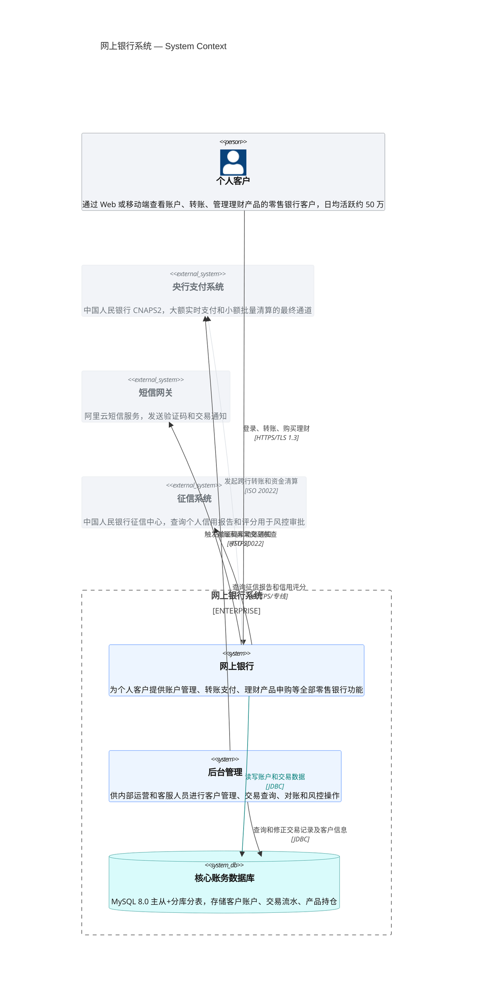
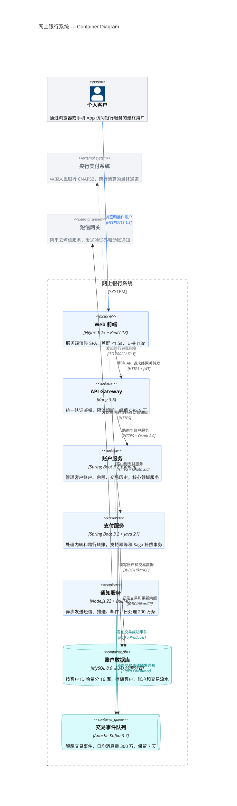
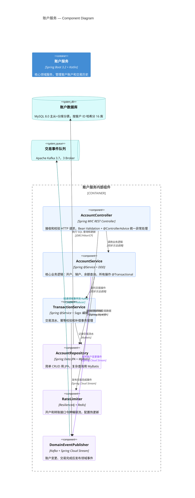
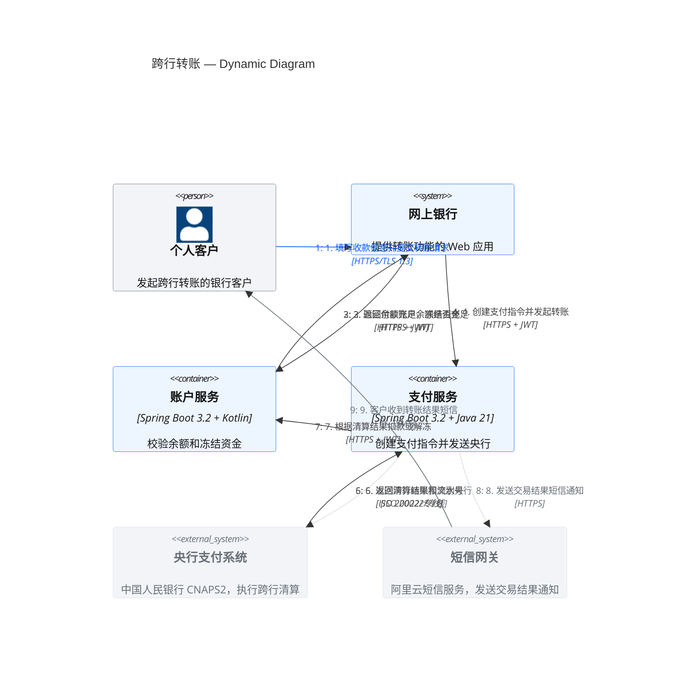
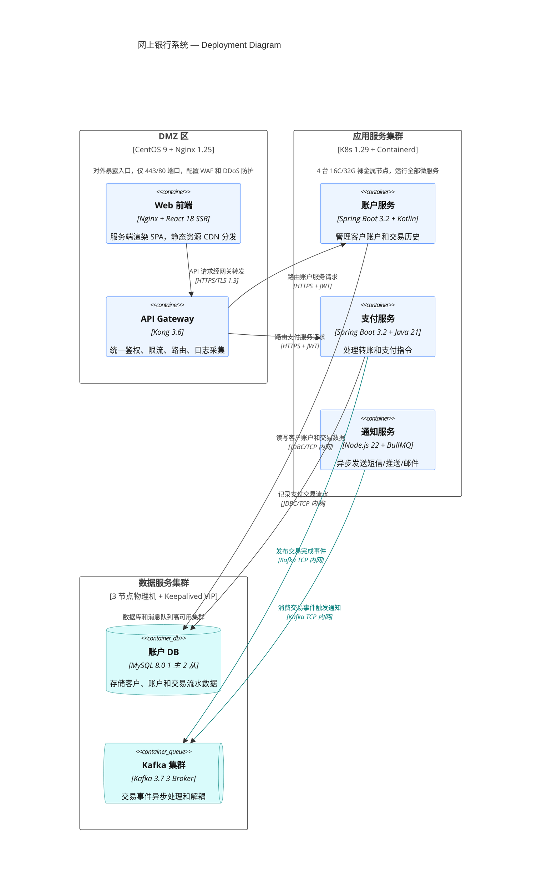
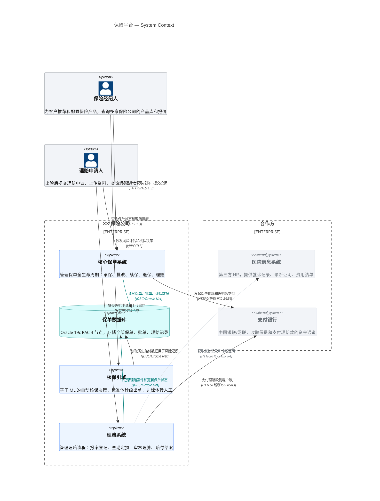
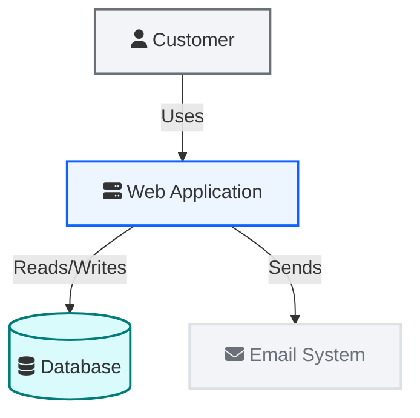

## Instructions

C4 图（Context、Container、Component、Dynamic、Deployment）通过四级抽象对软件架构建模，从系统上下文到组件细节。Mermaid 的 C4 语法与 PlantUML 兼容。

**注意**：C4 是实验性图表类型。语法和属性在未来的版本中可能会发生变化。C4 图使用固定样式——不同皮肤下的 CSS 不会变化，需要使用 `UpdateElementStyle` 和 `UpdateRelStyle` 来覆写样式。

---

### 核心语法速查

#### 元素签名（按图表级别）

**C4Context（系统上下文）**：

| 元素 | 签名 | 参数说明 |
| --- | --- | --- |
| Person | `Person(alias, label, ?descr)` | 别名, "角色名", "描述" |
| Person_Ext | `Person_Ext(alias, label, ?descr)` | 外部人员 |
| System | `System(alias, label, ?descr)` | 别名, "系统名", "描述" |
| SystemDb | `SystemDb(alias, label, ?descr)` | 别名, "数据库名", "描述" |
| SystemQueue | `SystemQueue(alias, label, ?descr)` | 别名, "队列名", "描述" |
| System_Ext | `System_Ext(alias, label, ?descr)` | 外部系统 |
| SystemDb_Ext | `SystemDb_Ext(alias, label, ?descr)` | 外部数据库 |
| SystemQueue_Ext | `SystemQueue_Ext(alias, label, ?descr)` | 外部队列 |
| Boundary | `Boundary(alias, label, ?type)` | 通用边界 |
| Enterprise_Boundary | `Enterprise_Boundary(alias, label)` | 企业边界 |
| System_Boundary | `System_Boundary(alias, label)` | 系统边界 |

**C4Container（容器）**：

| 元素 | 签名 | 参数说明 |
| --- | --- | --- |
| Container | `Container(alias, label, ?techn, ?descr)` | 别名, "容器名", "技术栈", "描述" |
| ContainerDb | `ContainerDb(alias, label, ?techn, ?descr)` | 数据库容器 |
| ContainerQueue | `ContainerQueue(alias, label, ?techn, ?descr)` | 队列容器 |
| Container_Ext | `Container_Ext(alias, label, ?techn, ?descr)` | 外部容器 |
| ContainerDb_Ext | `ContainerDb_Ext(alias, label, ?techn, ?descr)` | 外部数据库容器 |
| ContainerQueue_Ext | `ContainerQueue_Ext(alias, label, ?techn, ?descr)` | 外部队列容器 |
| Container_Boundary | `Container_Boundary(alias, label)` | 容器边界 |

**C4Component（组件）**：

| 元素 | 签名 | 参数说明 |
| --- | --- | --- |
| Component | `Component(alias, label, ?techn, ?descr)` | 别名, "组件名", "技术", "描述" |
| ComponentDb | `ComponentDb(alias, label, ?techn, ?descr)` | 数据组件 |
| ComponentQueue | `ComponentQueue(alias, label, ?techn, ?descr)` | 队列组件 |
| Component_Ext | `Component_Ext(alias, label, ?techn, ?descr)` | 外部组件 |

**C4Deployment（部署）**：

| 元素 | 签名 | 参数说明 |
| --- | --- | --- |
| Deployment_Node | `Deployment_Node(alias, label, ?type, ?descr)` | 别名, "节点名", "OS+规格", "描述" |

#### 关系

```
Rel(from, to, label, ?techn, ?descr)
BiRel(from, to, label, ?techn, ?descr)
Rel_U / Rel_D / Rel_L / Rel_R(from, to, label, ?techn, ?descr)
Rel_Back(from, to, label, ?techn, ?descr)
RelIndex(index, from, to, label, ?techn, ?descr)
```

**重要**：`RelIndex` 的 `index` 参数在 Mermaid 中被忽略——序号由 `RelIndex` 语句的书写顺序决定。C4Dynamic 中每个步骤用一条 `RelIndex` 表示。

#### 样式覆写

```
UpdateElementStyle(elementName, ?bgColor, ?fontColor, ?borderColor, ?shadowing, ?shape, ?sprite, ?techn, ?legendText, ?legendSprite)
UpdateRelStyle(from, to, ?textColor, ?lineColor, ?offsetX, ?offsetY)
UpdateLayoutConfig(?c4ShapeInRow, ?c4BoundaryInRow)
```

**关键**：
- `UpdateElementStyle` 参数顺序：**bgColor → fontColor → borderColor**（先背景、再字体、再边框）
- `UpdateRelStyle` 参数顺序：**textColor → lineColor → offsetX → offsetY**
- 支持命名参数（`$` 前缀）：`$bgColor="#edf5ff"` — 命名参数可以任意顺序，只更新指定的属性
- `UpdateLayoutConfig` 默认值：c4ShapeInRow=4, c4BoundaryInRow=2

#### 不支持的特性

Mermaid C4 目前不支持：Sprites 图标、Tags 标签系统、Links 超链接、Legend 图例、`Lay_U/D/L/R` 布局指令。

---

### 强硬规则：AI 生成 C4 图必须遵守

1. **信息密度**：每个元素必须填写全部有意义的参数，描述要包含"做什么、怎么做、为什么"
2. **关系线必须写协议**：`Rel(a, b, "动作", "协议")`——第 4 参数非空
3. **样式覆写必须**：每个图必须包含 `UpdateElementStyle`（Blueprint 配色）+ `UpdateRelStyle`（关键关系）
4. **元素 > 8 时用 `UpdateLayoutConfig`** 控制布局

### Carbon 配色映射

| 语义角色 | bgColor | fontColor | borderColor |
| --- | --- | --- | --- |
| 内部人员 (Person) | `#f2f4f8` | `#161616` | `#697077` |
| 内部系统 (System) | `#edf5ff` | `#161616` | `#0f62fe` |
| 内部数据库 (SystemDb) | `#d9fbfb` | `#161616` | `#007d79` |
| 内部队列 (SystemQueue) | `#d9fbfb` | `#161616` | `#007d79` |
| 容器 (Container) | `#edf5ff` | `#161616` | `#0f62fe` |
| 数据库容器 (ContainerDb) | `#d9fbfb` | `#161616` | `#007d79` |
| 组件 (Component) | `#edf5ff` | `#161616` | `#0f62fe` |
| 外部系统 (System_Ext) | `#f2f4f8` | `#697077` | `#dde1e6` |
| 外部人员 (Person_Ext) | `#f2f4f8` | `#697077` | `#dde1e6` |
| 部署节点 | `#ffffff` | `#161616` | `#393939` |

参考：`examples/design-system.md`

### C4 复杂图抗重叠方法论

Mermaid C4 的布局引擎 **不是** 全自动 fcose——它基于元素声明顺序和行数限制做手工式栅格排布，**没有** `Lay_U/D/L/R` 指令。

**核心矛盾**：`c4ShapeMargin` 是唯一直接控制节点间距的 knob——调大了解决重叠但图变散沙，调小了紧凑但标签挤在一起。真正的解法不是单挑一个维度，而是**双向平衡**：先用瘦身手段（精简描述 + 降字号）让盒子变小，再用适中的间距把它拉回紧凑。

以下是按 **生效强度** 分层的系统化防治方案。

---

#### 第零层（最强）：`%%{init: {"c4": {...}}}%%` — 全局间距配置

这是 C4 图的**核心控制面**。Mermaid C4 暴露了一个配置对象，可直接调节点间距、画布边距和文本区 padding。

**完整可用属性（来自 `C4DiagramConfig` schema）**：

| 属性 | 默认值 | 作用 | 双向特性 |
|------|--------|------|----------|
| `c4ShapeMargin` | `50` | **形状之间的外边距** | 调大推开所有节点、调小拉回紧凑 |
| `c4ShapePadding` | `20` | 形状内部 padding | 控制盒子内文本的呼吸空间 |
| `diagramMarginX` | `50` | 画布左右边距 | 过大导致图悬在中间，浪费宽度 |
| `diagramMarginY` | `10` | 画布上下边距 | 一般不需要大幅调 |
| `boxMargin` | `10` | 包围盒外边距 | 调大给 Boundary 内部额外空间 |
| `nextLinePaddingX` | `0` | 下一行的水平填充 | 防止多行文本间横向重叠 |
| `wrapPadding` | `10` | 文本换行两侧 padding | 防溢出，一般在 6-12 之间微调 |

**语法**（放在 `C4Container` 之后、元素声明之前）：

```mermaid
%%{init: {"c4": {"c4ShapeMargin": 65, "c4ShapePadding": 20, "diagramMarginX": 80, "boxMargin": 14}}}%%
```

**c4ShapeMargin 双向调优法则**：

| 问题症状 | c4ShapeMargin 方向 | 配合措施 |
|---------|:---:|------|
| 标签严重重叠（挤作一团） | 上调至 70–100 | 先检查描述长度（第四层），不要一上来就猛增 |
| 图太松散、盒子间有大片空白 | 下调至 55–65 | 确保描述已精简 + 字号已降低 |
| 底部或右侧大片空白 | **不应调大**，应该调 **小** diagramMarginX/Y | canvas 空白 = margin 太大而非 shapeMargin 太小 |
| 系统边界内部挤 | 调大 `boxMargin` | 不改 shapeMargin 全局值，只给 Boundary 内部加空间 |

> **关键洞察**：`c4ShapeMargin` 的 sweet-spot 受盒子本身大小支配。**描述越短、字号越小的图，所需 c4ShapeMargin 越低，紧凑且不重叠**。反过来——描述 100+ 字符、字号 14px 的图，c4ShapeMargin 调到 120 仍然丑。先瘦身（第四层）、后间距（本层），才是正确顺序。

**取值指南**（仅当第四层也优化后的推荐值）：

| 图复杂度 | c4ShapeMargin | c4ShapePadding | diagramMarginX | diagramMarginY |
|---------|:---:|:---:|:---:|:---:|
| 简单（≤8 元素） | 50（默认） | 20（默认） | 50（默认） | 10（默认） |
| 中等（9–14 元素） | 55–70 | 18–22 | 60–90 | 10–20 |
| 复杂（15–20 元素） | 60–80 | 18–24 | 70–100 | 15–25 |
| 超大（21+ 元素） | 75–100 | 20–25 | 90–130 | 20–30 |

> **为什么是"第四层优化后的推荐值"而不是"第四层后的推荐值"**：第四层——瘦身——必须先做。如果描述太长、没有降字号，上表的值仍然无法同时满足"紧凑 + 无重叠"。

---

#### 第一层：`UpdateLayoutConfig` — 栅格密度控制

**违规现象**：所有矩形挤在少数几行内，连线像意大利面交叉。

**核心原理**：`c4ShapeInRow` 是每行最多形状数（默认 4），`c4BoundaryInRow` 是每行最多边界数（默认 2）。调大它们 = 横向展开。

```mermaid
UpdateLayoutConfig($c4ShapeInRow="6", $c4BoundaryInRow="3")
```

| 元素数 | c4ShapeInRow | c4BoundaryInRow | 说明 |
|-------|:---:|:---:|------|
| ≤8 | 3–4 | 1–2 | 默认够用 |
| 9–14 | 5–6 | 2 | 关键：防止边界内挤成一团 |
| 15–20 | 6–8 | 2–3 | 需要更宽的画布（配套调大 diagramMarginX） |
| 21+ | 8+ | 3+ | 大数下考虑元素裁剪 |

> **`c4ShapeInRow` 对 Boundary 内外的元素同时生效**。当 Boundary 内元素多时，调大 `c4BoundaryInRow` 让多个边界也横向排列，避免边界堆叠。

---

#### 第二层：`UpdateRelStyle` — 每条关系线的标签微调

**违规现象**：全局间距调好了，但某 2–3 条相邻线的文字标签仍然贴在一起。

**解法**：用 `$offsetX`（左右移动）和 `$offsetY`（上下移动）推开文字标签。注意 **只移动文字，不改变连线路径**。

```mermaid
%% 基础：标签自动居中
Rel(a, b, "动作", "HTTPS")

%% 微调：把标签推到侧面
UpdateRelStyle(a, b, $offsetX="40")
UpdateRelStyle(a, b, $offsetY="-30")
UpdateRelStyle(a, b, $offsetX="-50", $offsetY="20")
```

**经验取值**：

| 现象 | 典型值 | 效果 |
|------|--------|------|
| 两标签左右碰撞 | 各 ±`(30~60)` offsetX | 左标签左推，右标签右推 |
| 多标签垂直堆叠 | 递增 `offsetY="-30"/"0"/"+30"` | 错开垂直位置 |
| 穿越密集区 | `$offsetX="-60"` | 把标签推到侧面空白 |
| 极端情况 | `±80` ~ `±120` | 大幅推开，但标签离连线较远 |

> **注意**：重复调用 `UpdateRelStyle(a, b, ...)` 时，**最后一次生效**。同名偏移不累积。

---

#### 第三层：声明顺序调控 + 元素裁剪 — 架构级优化

**声明顺序影响布局**：Mermaid C4 按声明顺序逐行排布元素。先声明的放前面行：

```mermaid
%% 正确顺序：Person 先 → 它们在前面行 → 自然排到边上去
Person(de, "...")
Person(da, "...")

%% 核心容器在中间
System_Boundary(main, "...") { ... }

%% 外部系统最后 → 自动排到对侧
System_Ext(apps, "...")
```

**裁剪决策**：超过 20 个元素即使配置调满也会重叠。C4 方法论本身就是多层抽象——把密集层下钻到更细粒度的图：

| 当前图 | 上限 | 超出时 |
|-------|------|--------|
| C4Context | 15 | 拆成多个 Enterprise_Boundary |
| C4Container | 18 | 密集容器簇下钻到 C4Component |
| C4Component | 12 | 单个 Service 展开内部组件 |
| C4Deployment | 15 | 按区域拆 Deployment_Node |

---

#### 第四层：盒子瘦身 — 缩短描述、精简标签、调小字号

**这是被忽视的最大根因**。C4 每个元素的第 4 参数（描述）会在盒内换行。描述越长 → 盒子越胖 → 边缘文本空间越小。超过 100 个字符的描述会让盒子变成 6-7 行的"摩天大楼"，吞掉所有水平空间。

**违规现象**：即使 `c4ShapeMargin=150`、"所有边都有偏移"，标签仍然重叠，因为盒子本身占据了大部分画布。

**三管齐下**：

```mermaid
%% 1. 用 %%{init}%% 配置减小容器字号
%%{init: {"c4": {"containerFontSize": 10, "container_dbFontSize": 10, "messageFontSize": 9, "c4ShapeMargin": 130}}}%%

%% 2. 描述精简为核心（≤60 个字符）
Container(s3raw, "Raw Data Lake", "S3 + Parquet", "Bronze: immutable landing, 90d lifecycle")
%%                                                   ^^^^^^^^^^^^^^^^^^^^^^^^^^^^^^^^
%%                                                   紧凑，单行：盒子矮一半

%% 3. Rel 标签缩短（≤15 个字符）
Rel(de, kinesis, "Configures", "Kinesis API")
%%                  ^^^^^^^^^^ 简短动词 + 技术栈
Rel(kinesis, s3raw, "Writes", "Firehose")
```

**描述长度与盒子高度的近似关系**（默认 wrap=true、字体 11px、宽度 ~216px ≈ 每行 ~35 个字符）：

| 描述长度 | 大约行数 | 盒子高度（估） | 边缘空间压力 |
|---------|:---:|:---:|:---:|
| ≤ 30 字符 | 1 | 窄 | 无 |
| 30–60 字符 | 1–2 | 中等 | 低 |
| 60–100 字符 | 2–4 | 宽 | 中等 |
| 100–140 字符 | 4–6 | 非常宽 | 高 |
| > 140 字符 | 6+ | 极大 | 极高 |

> **经验法则**：如果无法用更少的字符编写描述，请考虑是否这个容器实际上应该下钻到自己的 C4Component 图中。

**字体大小属性速查**（所有 `*FontSize` 均可通过 `%%{init}%%` 配置）：

| 属性 | 默认值 | 作用对象 | 建议（复杂图） |
|------|--------|---------|:---:|
| `containerFontSize` | 14 | 容器科技/描述文本 | 10 |
| `container_dbFontSize` | 14 | 容器 DB 科技/描述文本 | 10 |
| `systemFontSize` | 14 | 系统描述文本 | 11 |
| `external_systemFontSize` | 14 | 外部系统描述文本 | 10 |
| `personFontSize` | 14 | 角色描述文本 | 12 |
| `messageFontSize` | 12 | **关系标签！** | 8 或 9 |
| `boundaryFontSize` | 14 | 边界标题 | 11 |

> **`messageFontSize` 是独特的优势**：直接减小所有边缘标签的字体大小，在不调整偏移量的情况下，使标签更短、更不易重叠。8–9 在复杂图中效果最好。

---

#### 自检决策树（按生效强度排序）

```
先试第零层 —— 调大 c4ShapeMargin！
  c4ShapeMargin 从 50 → 80、100、120、150 逐级试
  ├── 还不够？
  │   ├── 调大 diagramMarginX (加画布宽度) 和 c4ShapePadding
  │   ├── 调大 boxMargin (给 Boundary 内空间)
  │   └── 调大 c4ShapeInRow (横向展开) 和 c4BoundaryInRow
  │
  ├── 仍有局部重叠？→ 第二层：对密集关系加 offsetX/offsetY
  │   ├── 同侧多条线 → 不同 offsetY 垂直错开
  │   ├── 穿越密集区 → offsetX 推向侧面空白
  │   └── 单一清晰线 → 不需要偏移
  │
  └── 仍然不够？→ 第三层：裁剪元素（下钻到 C4Component）
```

```
核心备忘:
1. 第零层（c4ShapeMargin/diagramMarginX）解决 60% 的问题，先调它
2. 第四层（description trimming + font-size）解决 20%——盒子胖带来的边缘标签重叠
3. 第二层（offsetX/offsetY）解决剩下的 20%
4. 同一个 (from, to) 对的 UpdateRelStyle，最后一次调用生效
5. Rel_Back 放在最后声明，帮助外部系统排到对侧
6. c4ShapeInRow 和 c4BoundaryInRow 过大（>10）时布局可能异常，合理上限 ~8
```

---

### 示例 1：C4Context — 系统上下文图



### 示例 2：C4Container — 容器图



### 示例 3：C4Component — 组件图



### 示例 4：C4Dynamic — 动态图



### 示例 5：C4Deployment — 部署图



### 示例 6：带多个企业边界的上下文图



---

### AI 生成自检清单

- [ ] C4Context 中 Person 用 3 参数、System 用 3 参数、SystemDb 用 3 参数？
- [ ] C4Container 中 Container 用 4 参数（含 technology）？
- [ ] C4Component 中 Component 用 4 参数（含 technology）？
- [ ] C4Deployment 中 Deployment_Node 用 4 参数（含 type）？
- [ ] 外部系统使用 `System_Ext`、外部人员使用 `Person_Ext`？
- [ ] 每条 Rel 都写了协议（第 4 参数）？
- [ ] `UpdateElementStyle` 参数顺序正确（bgColor → fontColor → borderColor）？
- [ ] `UpdateRelStyle` 参数顺序正确（textColor → lineColor → offsetX → offsetY）？
- [ ] 元素 > 8 时使用了 `UpdateLayoutConfig($c4ShapeInRow=..., $c4BoundaryInRow=...)`？
- [ ] 没有使用 Mermaid 不支持的特性（sprites、tags、links、Lay_U/D/L/R）？
- [ ] `RelIndex` 的 index 值按书写顺序递增？
- [ ] C4Dynamic 中每个步骤用独立的 `RelIndex`？
- [ ] **元素 > 10 时，是否配置了 `%%{init: {"c4": {...}}}%%` 全局间距？**
- [ ] **container 描述是否精简到 ≤60 字符（避免盒子过胖）？**
- [ ] **`messageFontSize` 是否降到 8–9、`containerFontSize` 降到 10？**
- [ ] **关键密集关系是否应用了 `offsetX/offsetY` 防止局部标签重叠？**

### 备选方案（Flowchart — 兼容所有 Mermaid 版本）


