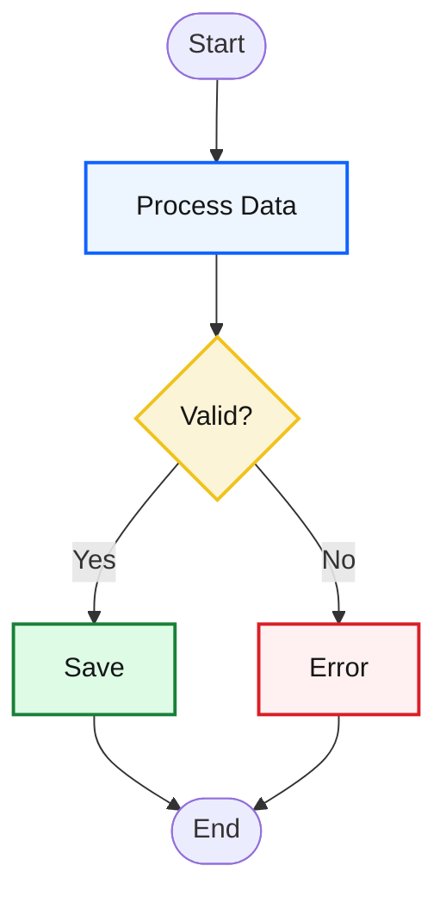
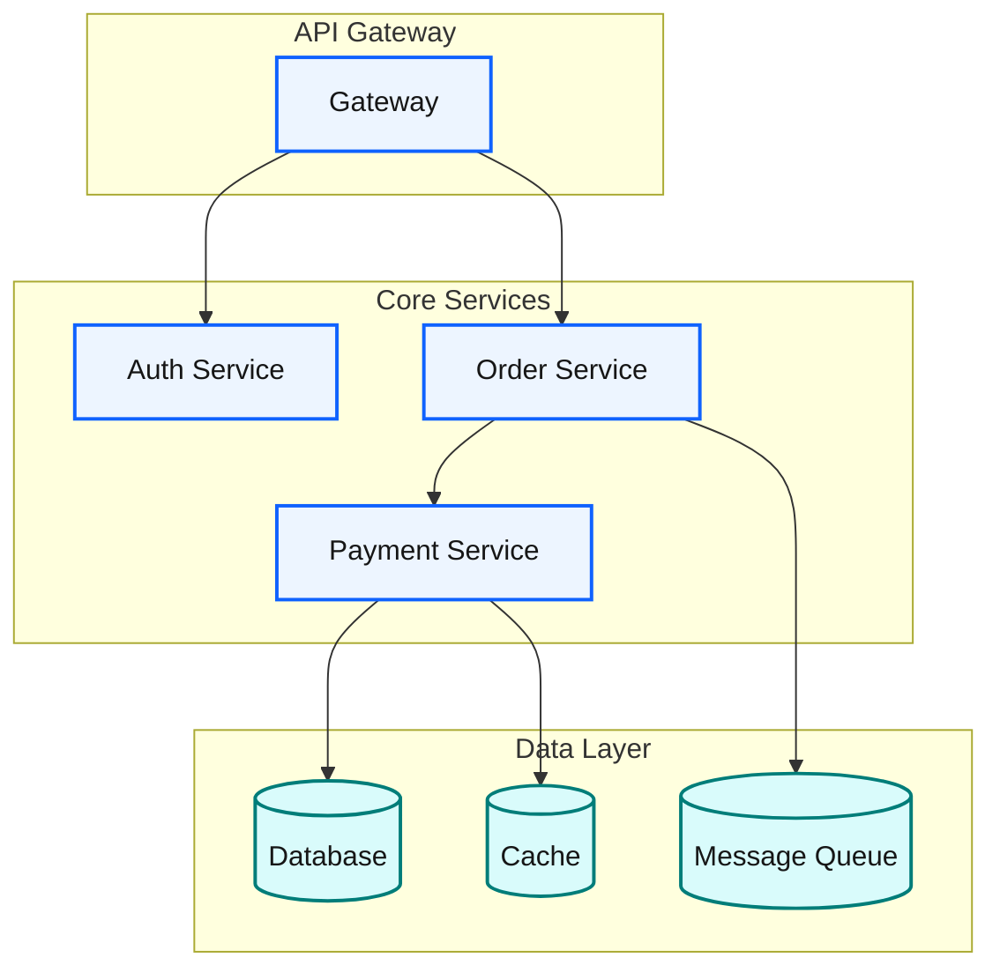
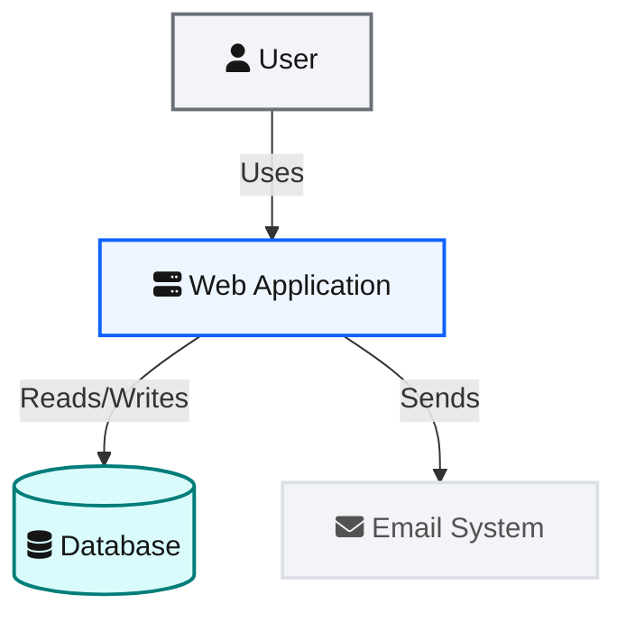
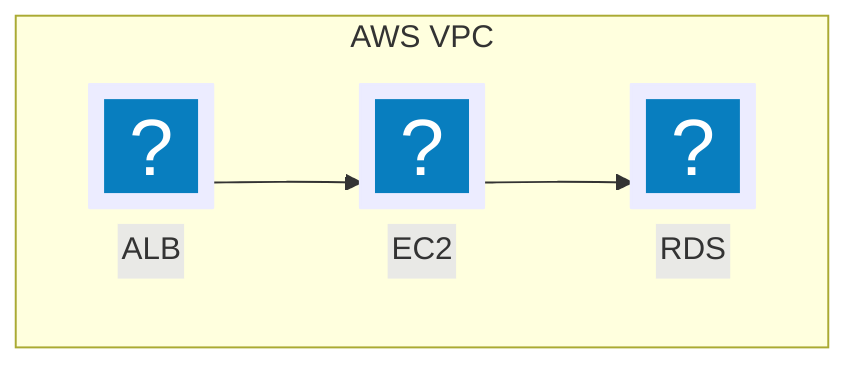
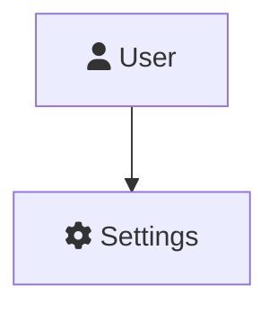

## Blueprint 设计系统 (IBM Carbon · C4)

所有 Mermaid 图表的统一设计标准。基于 **IBM Carbon Design System v11** 色彩令牌 + **C4 模型**分层思维，为技术书籍提供克制、语义化、暗色友好的视觉语言。

---

### 核心原则

1. **语义着色** — 颜色即含义：蓝=处理、青=数据、黄=决策、绿=成功、红=错误、灰=外部
2. **克制配色** — 默认 4–6 色，按需扩展，每色须有理由
3. **层次优先** — 边框粗细 / 色块强度 / 分组引导阅读路径
4. **暗色友好** — 通过 `themeVariables`/`classDef` 兼容亮/暗主题
5. **禁止 Emoji** — 所有图表严禁 emoji；用图标（见 `icon-catalog.md`）或语义着色替代
6. **图标优先** — 需视觉标记时优先用图标；已注册图标包用 `@{ icon: }` / `(pack:icon)`，未注册用 `@{ img: }` 远程 URL 兜底

### 色板（IBM Carbon v11 令牌）

```
核心色 (Core):
  Blue 60  #0f62fe  interactive01 — 系统/服务/处理
  Teal 60  #007d79  数据/存储/数据库
  Cool Gray 60 #697077  外部/用户/连线

语义色 (Semantic):
  Green 60  #198038  success — 成功/完成
  Yellow 30 #f1c21b  warning — 决策/警告
  Red 60   #da1e28   error — 错误/失败
  Purple 60 #8a3ffc  info — 高亮/元数据

浅色背景 (Surface):
  Blue 10  #edf5ff   处理节点填充
  Teal 10  #d9fbfb   数据节点填充
  Yellow 10 #fcf4d6  决策节点填充
  Red 10   #fff1f1   错误节点填充
  Green 10 #defbe6   成功节点填充
  Purple 10 #f6f2ff  信息节点填充
  Cool Gray 10 #f2f4f8  容器/分组/外部填充

基础色 (Foundation):
  White    #ffffff   画布/边界填充
  Gray 100 #161616   主文字 (text01)
  Gray 70  #525252   次要文字 (text02)
  Gray 80  #393939   边界文字/slate
  Cool Gray 20 #dde1e6  默认边框
```

### 语义色映射表

| 语义角色 | 填充色 | 边框色 | 文字色 | 适用场景 |
|---------|--------|--------|--------|---------|
| 系统/服务 | `#edf5ff` | `#0f62fe` | `#161616` | 微服务、API、后端 |
| 数据/存储 | `#d9fbfb` | `#007d79` | `#161616` | 数据库、缓存、队列 |
| 外部系统 | `#f2f4f8` | `#dde1e6` | `#525252` | 第三方、外部依赖 |
| 用户/角色 | `#f2f4f8` | `#697077` | `#161616` | Actor、Person |
| 决策/分支 | `#fcf4d6` | `#f1c21b` | `#161616` | 条件判断、分支 |
| 成功/完成 | `#defbe6` | `#198038` | `#161616` | 终态、成功路径 |
| 错误/失败 | `#fff1f1` | `#da1e28` | `#161616` | 异常、错误路径 |
| 高亮/重要 | `#f6f2ff` | `#8a3ffc` | `#161616` | 关键节点、强调 |
| 分组/容器 | `#f2f4f8` | `#dde1e6` | `#393939` | subgraph、box |
| 边界/域 | `#ffffff` | `#393939` | `#393939` | Enterprise Boundary |

### Theme Variables 配置

#### 亮色主题（默认）

```mermaid
%%{init: {
  'theme': 'base',
  'themeVariables': {
    'primaryColor': '#edf5ff',
    'primaryTextColor': '#161616',
    'primaryBorderColor': '#0f62fe',
    'lineColor': '#697077',
    'secondaryColor': '#d9fbfb',
    'tertiaryColor': '#f2f4f8',
    'textColor': '#161616',
    'fontSize': '14px'
  }
}}%%
```

#### 暗色主题

```mermaid
%%{init: {
  'theme': 'dark',
  'themeVariables': {
    'primaryColor': '#0f62fe',
    'primaryTextColor': '#f4f4f4',
    'primaryBorderColor': '#4589ff',
    'lineColor': '#878d96',
    'secondaryColor': '#007d79',
    'tertiaryColor': '#393939',
    'textColor': '#f4f4f4',
    'fontSize': '14px'
  }
}}%%
```

### Mindmap 专属变量

Mindmap 图使用专属 `themeVariables`（需设置 `'theme': 'base'`），通用变量（如 `primaryColor`）对 mindmap 无效。

#### 标准主题（推荐）

```mermaid
%%{init: {
  'theme': 'base',
  'themeVariables': {
    'mindmapRootColor': '#0f62fe',
    'mindmapTextColor': '#ffffff',
    'mindmapMainColor': '#1d3649',
    'mindmapSecondaryColor': '#393939',
    'mindmapLineColor': '#697077'
  }
}}%%
```

| 变量 | 值 | Carbon Token | 作用 |
|------|-----|-------------|------|
| `mindmapRootColor` | `#0f62fe` | Blue 60 | 根节点背景 |
| `mindmapTextColor` | `#ffffff` | White | 全局文字色 |
| `mindmapMainColor` | `#1d3649` | Blue 80 | 一级分支背景 |
| `mindmapSecondaryColor` | `#393939` | Gray 80 | 二级分支背景 |
| `mindmapLineColor` | `#697077` | Cool Gray 60 | 连线色 |

> **设计决策**：`mindmapTextColor` 是全局的（所有节点同一文字色）。标准主题采用深色背景 + 白色文字，层次愈深颜色愈深（根 → 一级 → 二级），视觉引导清晰。

#### 暗色主题

```mermaid
%%{init: {
  'theme': 'base',
  'themeVariables': {
    'mindmapRootColor': '#4589ff',
    'mindmapTextColor': '#f4f4f4',
    'mindmapMainColor': '#0f62fe',
    'mindmapSecondaryColor': '#525252',
    'mindmapLineColor': '#878d96'
  }
}}%%
```

### classDef 标准模板

所有 Blueprint 图表统一使用以下命名（仅 hex 为 IBM Carbon 值，名称不变）：

```
classDef bpProcess  fill:#edf5ff,stroke:#0f62fe,stroke-width:2px,color:#161616
classDef bpData     fill:#d9fbfb,stroke:#007d79,stroke-width:2px,color:#161616
classDef bpDecision fill:#fcf4d6,stroke:#f1c21b,stroke-width:2px,color:#161616
classDef bpSuccess  fill:#defbe6,stroke:#198038,stroke-width:2px,color:#161616
classDef bpError    fill:#fff1f1,stroke:#da1e28,stroke-width:2px,color:#161616
classDef bpExternal fill:#f2f4f8,stroke:#dde1e6,stroke-width:2px,color:#525252
classDef bpUser     fill:#f2f4f8,stroke:#697077,stroke-width:2px,color:#161616
classDef bpInfo     fill:#f6f2ff,stroke:#8a3ffc,stroke-width:2px,color:#161616
classDef bpGroup    fill:#f2f4f8,stroke:#dde1e6,stroke-width:1px,color:#393939
classDef bpBoundary fill:#ffffff,stroke:#393939,stroke-width:2px,color:#393939
```

### 连线样式规范

```
linkStyle default stroke:#697077,stroke-width:1.5px
linkStyle 0 stroke:#0f62fe,stroke-width:2.5px                       // 强调连线
linkStyle 1 stroke:#007d79,stroke-width:2px,stroke-dasharray:5      // 数据流
linkStyle 2 stroke:#da1e28,stroke-width:2px                         // 错误流
```

### 常见模式

#### 模式 1: 简单流程图



#### 模式 2: 微服务架构



#### 模式 3: C4 Context（用 flowchart 表达）



#### 模式 4: Cloud Architecture with Icons（图标语法按注册状态选择）

**核心决策规则**：根据渲染环境是否已注册图标包选择语法。**同一张图中不要混用两种语法。**

> 📖 **图标速查**: 完整 600+ 图标目录见 `examples/icon-catalog.md`，按 12 个技术领域分类，包含正确的 SVG URL 和 icon pack 引用格式。

- **已注册图标包**（自托管/打包器/mkdocs 环境）→ 使用 **icon-pack 语法**（`@{ icon: }` / `(pack:icon)`）。
- **未注册图标包**（mermaid.live / GitHub / 无配置环境）→ 使用 **远程 URL 兜底**（`@{ img: "https://api.iconify.design/..." }`），无需配置。

##### 方式 A：已注册图标包 → `@{ icon: }` 语法（推荐）

先注册 6 个图标包（logos, skill-icons, devicon, codicon, gcp, vscode-icons），再用 `@{ icon: "pack:icon-name" }` 引用。architecture-beta 则用 `(pack:icon-name)` 语法（详见 `architecture.md`）。

```javascript
// 注册 6 个图标包（自托管/mkdocs/打包器环境）
(function () {
  function registerIcons() {
    if (typeof mermaid === 'undefined') { setTimeout(registerIcons, 100); return; }
    var iconPacks = ['logos', 'skill-icons', 'devicon', 'codicon', 'gcp', 'vscode-icons'];
    try {
      mermaid.registerIconPacks(iconPacks.map(function (name) {
        return { name: name, loader: function () {
          return fetch('https://unpkg.com/@iconify-json/' + name + '/icons.json').then(function (res) { return res.json(); });
        }};
      }));
    } catch (e) { console.warn('Icon pack registration failed:', e.message); }
  }
  registerIcons();
})();
```

注册后使用（flowchart `@{ icon: }`）：



**`@{ icon: }` 参数**（v11.3.0+，需已注册图标包）：

| 参数 | 说明 | 默认值 | 正确用法 |
|------|------|--------|---------|
| `icon` | 已注册图标名（如 `logos:aws-ec2`、`gcp:cloud-run`、`codicon:git-branch`） | 必填 | `pack:icon-name` |
| `form` | 背景形状 | — | `"square"`、`"circle"`、`"rounded"` |
| `label` | 图标旁文字 | 无 | 任意字符串 |
| `pos` | 文字位置 | `"b"` | `"t"` / `"b"` |
| `h` | 图标高度（px） | 48 | **只设 h**（最小 48），不设 w |

##### 方式 B：未注册图标包 → `@{ img: }` 远程 URL 兜底

mermaid.live / GitHub / 无配置环境中，用 Iconify SVG API 远程 URL，无需注册。

**避免图标变形** ☠️ 禁止同时设 `w` 和 `h`，会强制拉伸。正确做法：只设 `h`，开 `constraint: "on"`，宽度自动按宽高比计算。

```mermaid
flowchart TD
    subgraph VPC["AWS VPC"]
        ELB@{ img: "https://api.iconify.design/logos/aws-elb.svg", label: "ALB", pos: "b", h: 48, constraint: "on" }
        EC2@{ img: "https://api.iconify.design/logos/aws-ec2.svg", label: "EC2", pos: "b", h: 48, constraint: "on" }
        RDS@{ img: "https://api.iconify.design/logos/aws-rds.svg", label: "RDS", pos: "b", h: 48, constraint: "on" }
    end

    ELB --> EC2
    EC2 --> RDS
```

**`@{ img: }` 参数**：

| 参数 | 说明 | 默认值 | 正确用法 |
|------|------|--------|---------|
| `img` | 图片 URL（SVG/PNG/JPG） | 必填 | 完整 URL |
| `label` | 图标旁文字 | 无 | 任意字符串 |
| `pos` | 文字位置 | `"b"` | `"t"` / `"b"` |
| `h` | 高度（px） | 原始高度 | **只设 h，不设 w** — 配合 `constraint: "on"` |
| `w` | 宽度（px） | 自动计算 | ☠️ 单独设 w 会强制宽度导致拉伸 |
| `constraint` | 保持原始宽高比 | `"off"` | **设为 `"on"`** — 宽度随 h 等比缩放 |

**Iconify SVG API 地址模式**：`https://api.iconify.design/{prefix}/{icon-name}.svg`

可用 icon set 前缀：`logos` | `devicon` | `gcp` | `vscode-icons` | `skill-icons` | `codicon`

**常用云服务图标 URL 及宽高比**：

| 服务 | URL | 宽高比 |
| --- | --- | --- |
| AWS EC2 | `https://api.iconify.design/logos/aws-ec2.svg` | 1:1 |
| AWS Lambda | `https://api.iconify.design/logos/aws-lambda.svg` | 1:1 |
| AWS S3 | `https://api.iconify.design/logos/aws-s3.svg` | 1:1 |
| AWS RDS | `https://api.iconify.design/logos/aws-rds.svg` | 1:1 |
| Google Cloud | `https://api.iconify.design/logos/google-cloud.svg` | 1:1 |
| Azure | `https://api.iconify.design/logos/azure.svg` | 1:1 |
| Kubernetes | `https://api.iconify.design/logos/kubernetes.svg` | ~1.1:1 |
| Docker | `https://api.iconify.design/logos/docker-icon.svg` | ~1.25:1 |
| Nginx | `https://api.iconify.design/logos/nginx.svg` | ~3.5:1 ⚠️ |
| Redis | `https://api.iconify.design/logos/redis.svg` | ~3.2:1 ⚠️ |
| PostgreSQL | `https://api.iconify.design/logos/postgresql.svg` | 1:1 |
| MongoDB | `https://api.iconify.design/logos/mongodb-icon.svg` | 1:1 |

> ⚠️ **宽高比非 1:1 的图标（Nginx 3.5:1、Redis 3.2:1）**：务必用 `h` + `constraint: "on"`，不要设 `w`。

> **注意**: `@{ img: }` 和 `@{ icon: }` 仅 flowchart 支持。architecture-beta 用 `registerIconPacks()` + `(packName:iconName)` 语法，详见 `architecture.md`。

**FontAwesome 图标**（可选第 6 个图标包，仅当需要 FontAwesome 专属图标时注册）：

```
// 注册可选的 FontAwesome 图标包（无 CSS 依赖）
mermaid.registerIconPacks([
  { name: 'fa', loader: () => fetch('https://unpkg.com/@iconify-json/fa6-solid/icons.json').then(r => r.json()) }
]);
// 或引入 FontAwesome CSS（兼容旧方式）
// <link href="https://cdnjs.cloudflare.com/ajax/libs/font-awesome/6.5.1/css/all.min.css" rel="stylesheet" />
```

注册后用 `fa:fa-name` 语法；未注册 `fa` 包时优先改用 `codicon`/`devicon` 等价图标或 `@{ img: }` 远程 URL：



### 配色速查卡

| 需要表达... | classDef | 视觉 |
|------------|----------|------|
| 正在处理/运行 | `bpProcess` | 蓝底蓝边 |
| 数据/持久化 | `bpData` | 青底青边 |
| 外部依赖 | `bpExternal` | 灰底灰边 |
| 需要决策 | `bpDecision` | 黄底黄边 |
| 完成/成功 | `bpSuccess` | 绿底绿边 |
| 异常/失败 | `bpError` | 红底红边 |
| 重要信息 | `bpInfo` | 紫底紫边 |
| 用户/Actor | `bpUser` | 白底灰边 |
| 分组/容器 | `bpGroup` | 灰底淡边 |
| 边界/域 | `bpBoundary` | 白底深边 |
