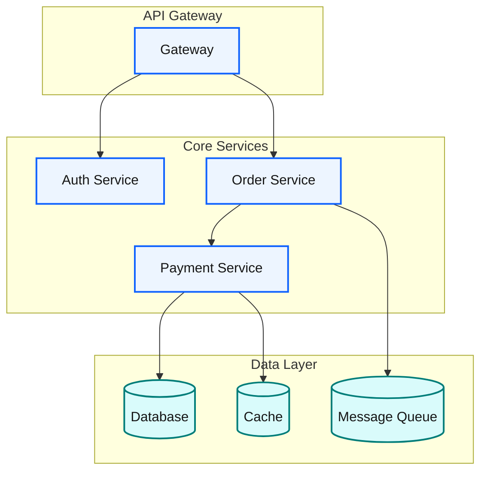
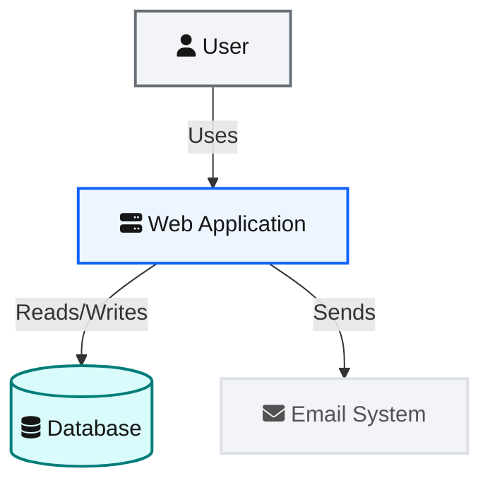
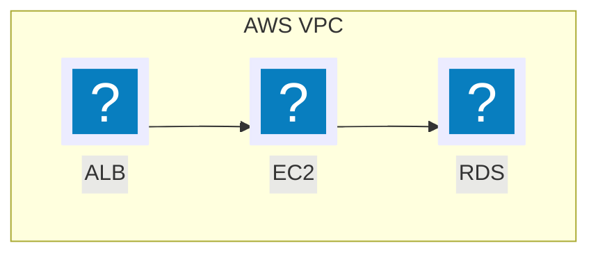
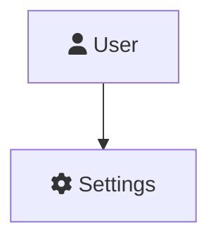

## Blueprint Design System (IBM Carbon · C4)

The unified design standard for all Mermaid diagrams. Built on **IBM Carbon Design System v11** color tokens + **C4 model** layered thinking, providing a restrained, semantic, dark-mode-ready visual language.

This is the **single source of truth** for the Blueprint palette, `classDef` templates, and `themeVariables`. Do not duplicate these definitions in other files — reference this one instead.

---

### Core principles

1. **Semantic coloring** — color is meaning: blue = processing, teal = data, amber = decision, green = success, red = error, grey = external.
2. **Restrained palette** — default to 4–6 colors, extend on demand, each color justified.
3. **Hierarchy first** — border weight, fill intensity, and grouping guide the reading path.
4. **Dark-mode friendly** — use `themeVariables`/`classDef` that render on both light and dark backgrounds.
5. **No emoji** — emoji is strictly prohibited in all diagrams; use icons (see `icon-catalog.md`) or semantic coloring instead.
6. **Icon first** — prefer icons for visual markers; use `@{ icon: }` / `(pack:icon)` when icon packs are registered, otherwise fall back to `@{ img: }` remote URLs.

### Palette (IBM Carbon v11 tokens)

```
Core colors:
  Blue 60  #0f62fe  interactive01 — system / service / processing
  Teal 60  #007d79  data / storage / database
  Cool Gray 60 #697077  external / user / line

Semantic colors:
  Green 60  #198038  success — complete / OK
  Yellow 30 #f1c21b  warning — decision / warning
  Red 60   #da1e28   error — failure / exception
  Purple 60 #8a3ffc  info — highlight / metadata

Surface (light fills):
  Blue 10  #edf5ff   process node fill
  Teal 10  #d9fbfb   data node fill
  Yellow 10 #fcf4d6  decision node fill
  Red 10   #fff1f1   error node fill
  Green 10 #defbe6   success node fill
  Purple 10 #f6f2ff  info node fill
  Cool Gray 10 #f2f4f8  container / group / external fill

Foundation:
  White    #ffffff   canvas / boundary fill
  Gray 100 #161616   primary text (text01)
  Gray 70  #525252   secondary text (text02)
  Gray 80  #393939   boundary text / slate
  Cool Gray 20 #dde1e6  default border
```

### Semantic color mapping

| Semantic role | Fill | Stroke | Text color | Use case |
|---------------|------|--------|------------|----------|
| System / service | `#edf5ff` | `#0f62fe` | `#161616` | Microservices, APIs, backend |
| Data / storage | `#d9fbfb` | `#007d79` | `#161616` | Databases, caches, queues |
| External system | `#f2f4f8` | `#dde1e6` | `#525252` | Third-party, external deps |
| User / actor | `#f2f4f8` | `#697077` | `#161616` | Actor, person |
| Decision / branch | `#fcf4d6` | `#f1c21b` | `#161616` | Conditionals, branching |
| Warning / caution | `#fcf4d6` | `#f1c21b` | `#161616` | Warning states, caution paths |
| Success / complete | `#defbe6` | `#198038` | `#161616` | Terminal, success path |
| Error / failure | `#fff1f1` | `#da1e28` | `#161616` | Exception, error path |
| Highlight / key | `#f6f2ff` | `#8a3ffc` | `#161616` | Key node, emphasis |
| Group / container | `#f2f4f8` | `#dde1e6` | `#393939` | subgraph, box |
| Boundary / domain | `#ffffff` | `#393939` | `#393939` | Enterprise boundary |

### Theme Variables

#### Light theme (default)

```mermaid
%%{init: {
  'theme': 'base',
  'themeVariables': {
    'primaryColor': '#edf5ff',
    'primaryTextColor': '#161616',
    'primaryBorderColor': '#0f62fe',
    'lineColor': '#697077',
    'secondaryColor': '#d9fbfb',
    'tertiaryColor': '#f2f4f8',
    'textColor': '#161616',
    'fontSize': '14px'
  }
}}%%
```

#### Dark theme

```mermaid
%%{init: {
  'theme': 'dark',
  'themeVariables': {
    'primaryColor': '#0f62fe',
    'primaryTextColor': '#f4f4f4',
    'primaryBorderColor': '#4589ff',
    'lineColor': '#878d96',
    'secondaryColor': '#007d79',
    'tertiaryColor': '#393939',
    'textColor': '#f4f4f4',
    'fontSize': '14px'
  }
}}%%
```

### Mindmap-specific variables

Mindmaps use their own `themeVariables` (requires `'theme': 'base'`); general variables such as `primaryColor` have no effect on mindmaps.

#### Standard theme (recommended)

```mermaid
%%{init: {
  'theme': 'base',
  'themeVariables': {
    'mindmapRootColor': '#0f62fe',
    'mindmapTextColor': '#ffffff',
    'mindmapMainColor': '#1d3649',
    'mindmapSecondaryColor': '#393939',
    'mindmapLineColor': '#697077'
  }
}}%%
```

| Variable | Value | Carbon token | Effect |
|----------|-------|--------------|--------|
| `mindmapRootColor` | `#0f62fe` | Blue 60 | Root node background |
| `mindmapTextColor` | `#ffffff` | White | Global text color |
| `mindmapMainColor` | `#1d3649` | Blue 80 | First-level branch background |
| `mindmapSecondaryColor` | `#393939` | Gray 80 | Second-level branch background |
| `mindmapLineColor` | `#697077` | Cool Gray 60 | Connecting line color |

> **Design decision**: `mindmapTextColor` is global (one color for all nodes). The standard theme uses deep backgrounds with white text; color deepens with hierarchy (root → first → second level) for clear visual guidance.

#### Dark theme

```mermaid
%%{init: {
  'theme': 'base',
  'themeVariables': {
    'mindmapRootColor': '#4589ff',
    'mindmapTextColor': '#f4f4f4',
    'mindmapMainColor': '#0f62fe',
    'mindmapSecondaryColor': '#525252',
    'mindmapLineColor': '#878d96'
  }
}}%%
```

### classDef standard templates

All Blueprint diagrams use the following names (hex values are IBM Carbon tokens; names are fixed):

```
classDef bpProcess  fill:#edf5ff,stroke:#0f62fe,stroke-width:2px,color:#161616
classDef bpData     fill:#d9fbfb,stroke:#007d79,stroke-width:2px,color:#161616
classDef bpDecision fill:#fcf4d6,stroke:#f1c21b,stroke-width:2px,color:#161616
classDef bpWarning  fill:#fcf4d6,stroke:#f1c21b,stroke-width:2px,color:#161616
classDef bpSuccess  fill:#defbe6,stroke:#198038,stroke-width:2px,color:#161616
classDef bpError    fill:#fff1f1,stroke:#da1e28,stroke-width:2px,color:#161616
classDef bpExternal fill:#f2f4f8,stroke:#dde1e6,stroke-width:2px,color:#525252
classDef bpUser     fill:#f2f4f8,stroke:#697077,stroke-width:2px,color:#161616
classDef bpInfo     fill:#f6f2ff,stroke:#8a3ffc,stroke-width:2px,color:#161616
classDef bpGroup    fill:#f2f4f8,stroke:#dde1e6,stroke-width:1px,color:#393939
classDef bpBoundary fill:#ffffff,stroke:#393939,stroke-width:2px,color:#393939
```

### Line style conventions

```
linkStyle default stroke:#697077,stroke-width:1.5px
linkStyle 0 stroke:#0f62fe,stroke-width:2.5px                       // emphasis
linkStyle 1 stroke:#007d79,stroke-width:2px,stroke-dasharray:5      // data flow
linkStyle 2 stroke:#da1e28,stroke-width:2px                         // error flow
```

### Common patterns

#### Pattern 1: simple flowchart


#### Pattern 2: microservice architecture



#### Pattern 3: C4 Context (expressed with flowchart)



#### Pattern 4: cloud architecture with icons (syntax by registration state)

**Core decision rule**: choose syntax by whether the render environment has registered icon packs. **Do not mix the two syntaxes in one diagram.**

> **Icon reference**: the full 600+ icon catalog is in `examples/icon-catalog.md`, organized by 12 technology categories, with correct SVG URLs and icon-pack references.

- **Icon packs registered** (self-hosted / bundler / mkdocs) → use **icon-pack syntax** (`@{ icon: }` / `(pack:icon)`).
- **Icon packs NOT registered** (mermaid.live / GitHub / no-config) → use **remote-URL fallback** (`@{ img: "https://api.iconify.design/..." }`), no setup needed.

##### Option A: icon packs registered → `@{ icon: }` syntax (recommended)

Register the 6 icon packs (logos, skill-icons, devicon, codicon, gcp, vscode-icons) first — see the canonical registration snippet in `examples/icon-catalog.md` — then reference icons with `@{ icon: "pack:icon-name" }`. For architecture-beta, use the `(pack:icon-name)` syntax (see `architecture.md`).



**`@{ icon: }` parameters** (v11.3.0+, requires registered icon packs):

| Parameter | Description | Default | Correct usage |
|-----------|-------------|---------|---------------|
| `icon` | Registered icon name (e.g. `logos:aws-ec2`, `gcp:cloud-run`, `codicon:git-branch`) | required | `pack:icon-name` |
| `form` | Background shape | — | `"square"`, `"circle"`, `"rounded"` |
| `label` | Text beside the icon | none | any string |
| `pos` | Text position | `"b"` | `"t"` / `"b"` |
| `h` | Icon height (px) | 48 | **set only h** (minimum 48), not w |

##### Option B: icon packs NOT registered → `@{ img: }` remote-URL fallback

In mermaid.live / GitHub / no-config environments, use the Iconify SVG API remote URL — no registration needed.

**Avoid distortion** — never set both `w` and `h` simultaneously; it forces stretching. Correct practice: set only `h`, enable `constraint: "on"`, and width is calculated automatically by aspect ratio.

```mermaid
flowchart TD
    subgraph VPC["AWS VPC"]
        ELB@{ img: "https://api.iconify.design/logos/aws-elb.svg", label: "ALB", pos: "b", h: 48, constraint: "on" }
        EC2@{ img: "https://api.iconify.design/logos/aws-ec2.svg", label: "EC2", pos: "b", h: 48, constraint: "on" }
        RDS@{ img: "https://api.iconify.design/logos/aws-rds.svg", label: "RDS", pos: "b", h: 48, constraint: "on" }
    end

    ELB --> EC2
    EC2 --> RDS
```

**`@{ img: }` parameters**:

| Parameter | Description | Default | Correct usage |
|-----------|-------------|---------|---------------|
| `img` | Image URL (SVG/PNG/JPG) | required | full URL |
| `label` | Text beside the icon | none | any string |
| `pos` | Text position | `"b"` | `"t"` / `"b"` |
| `h` | Height (px) | native | **set only h, not w** — pair with `constraint: "on"` |
| `w` | Width (px) | auto-calculated | setting w alone forces width and distorts |
| `constraint` | Preserve original aspect ratio | `"off"` | **set to `"on"`** — width scales with h |

**Iconify SVG API URL pattern**: `https://api.iconify.design/{prefix}/{icon-name}.svg`

Available icon-set prefixes: `logos` | `devicon` | `gcp` | `vscode-icons` | `skill-icons` | `codicon`

**Common cloud-service icon URLs and aspect ratios**:

| Service | URL | Aspect ratio |
| --- | --- | --- |
| AWS EC2 | `https://api.iconify.design/logos/aws-ec2.svg` | 1:1 |
| AWS Lambda | `https://api.iconify.design/logos/aws-lambda.svg` | 1:1 |
| AWS S3 | `https://api.iconify.design/logos/aws-s3.svg` | 1:1 |
| AWS RDS | `https://api.iconify.design/logos/aws-rds.svg` | 1:1 |
| Google Cloud | `https://api.iconify.design/logos/google-cloud.svg` | 1:1 |
| Azure | `https://api.iconify.design/logos/azure.svg` | 1:1 |
| Kubernetes | `https://api.iconify.design/logos/kubernetes.svg` | ~1.1:1 |
| Docker | `https://api.iconify.design/logos/docker-icon.svg` | ~1.25:1 |
| Nginx | `https://api.iconify.design/logos/nginx.svg` | ~3.5:1 (non-square) |
| Redis | `https://api.iconify.design/logos/redis.svg` | ~3.2:1 (non-square) |
| PostgreSQL | `https://api.iconify.design/logos/postgresql.svg` | 1:1 |
| MongoDB | `https://api.iconify.design/logos/mongodb-icon.svg` | 1:1 |

> **Note — non-square icons (Nginx 3.5:1, Redis 3.2:1)**: always use `h` + `constraint: "on"`; never set `w`.

> **Note**: `@{ img: }` and `@{ icon: }` are flowchart-only. architecture-beta uses `registerIconPacks()` + `(packName:iconName)` syntax — see `architecture.md`.

**FontAwesome icons** (optional 7th pack, register only when a FontAwesome-specific icon is needed):

```
// Register the optional FontAwesome icon pack (no CSS dependency)
mermaid.registerIconPacks([
  { name: 'fa', loader: () => fetch('https://unpkg.com/@iconify-json/fa6-solid/icons.json').then(r => r.json()) }
]);
// Or load FontAwesome CSS (legacy)
// <link href="https://cdnjs.cloudflare.com/ajax/libs/font-awesome/6.5.1/css/all.min.css" rel="stylesheet" />
```

After registering, use `fa:fa-name` syntax; when the `fa` pack is not registered, prefer an equivalent `codicon`/`devicon` icon or the `@{ img: }` remote URL:



### Color quick-reference card

| To express... | classDef | Visual |
|---------------|----------|--------|
| Processing / running | `bpProcess` | blue fill, blue border |
| Data / persistence | `bpData` | teal fill, teal border |
| External dependency | `bpExternal` | grey fill, grey border |
| Decision needed | `bpDecision` | amber fill, amber border |
| Warning / caution | `bpWarning` | amber fill, amber border |
| Complete / success | `bpSuccess` | green fill, green border |
| Exception / failure | `bpError` | red fill, red border |
| Key information | `bpInfo` | purple fill, purple border |
| User / actor | `bpUser` | white fill, grey border |
| Group / container | `bpGroup` | grey fill, faint border |
| Boundary / domain | `bpBoundary` | white fill, dark border |
