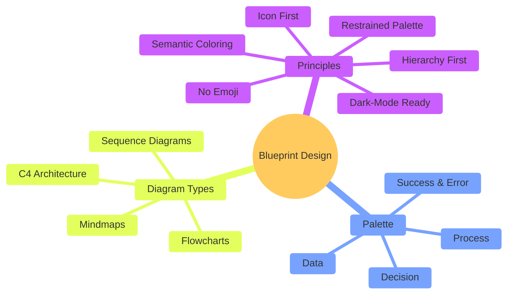
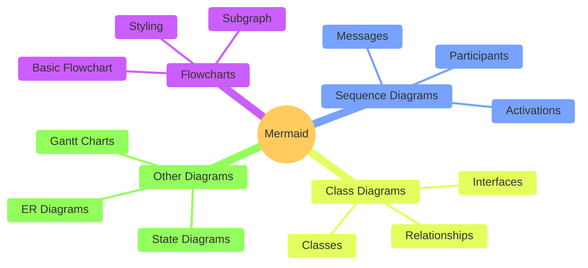
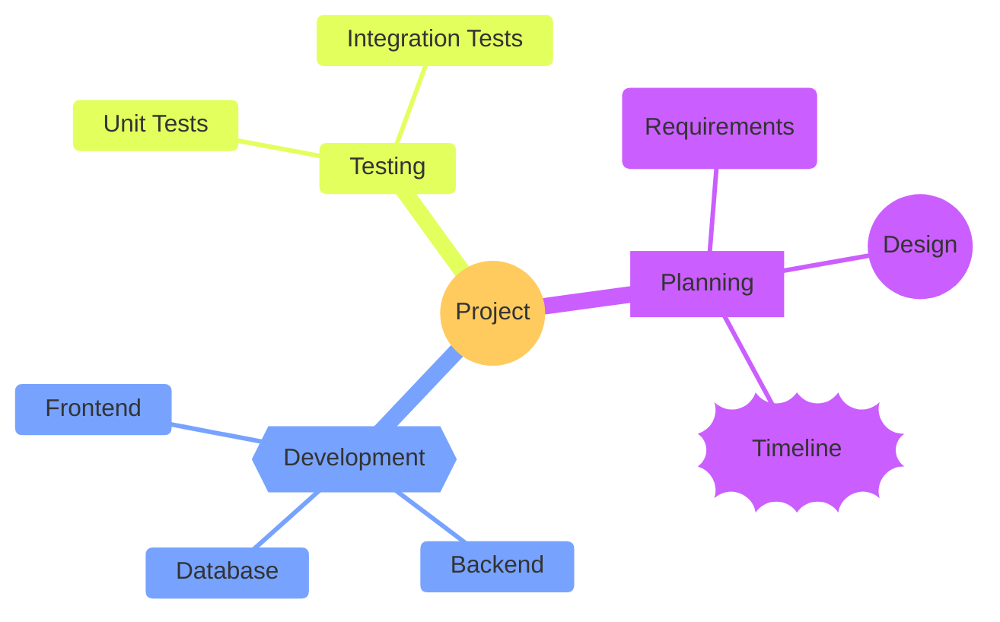
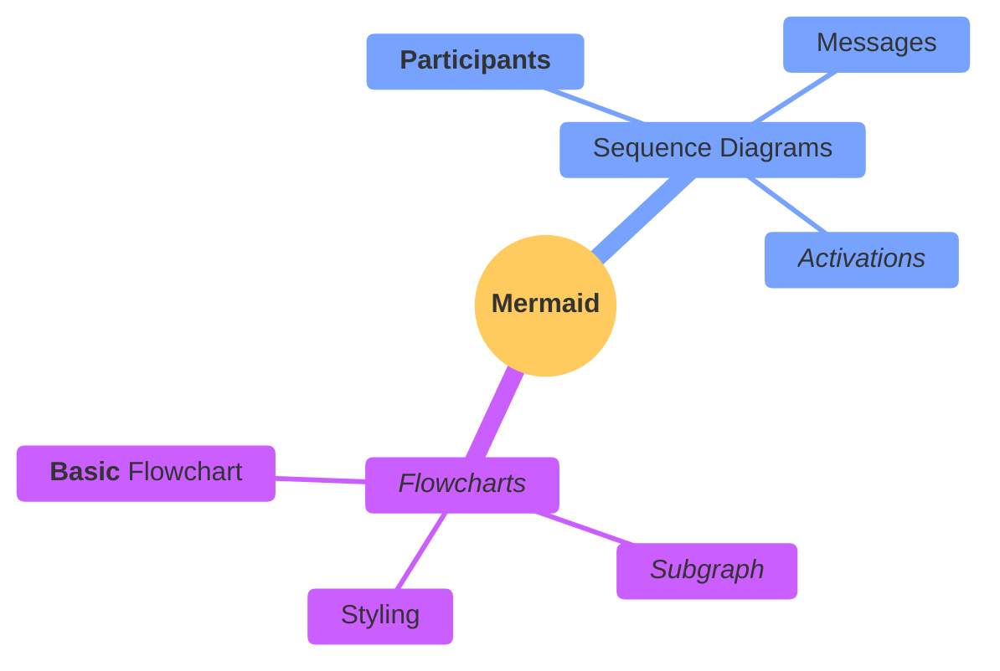
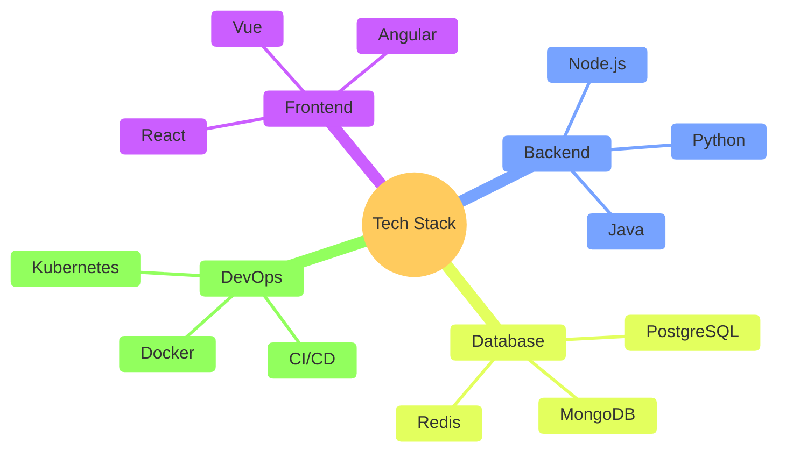
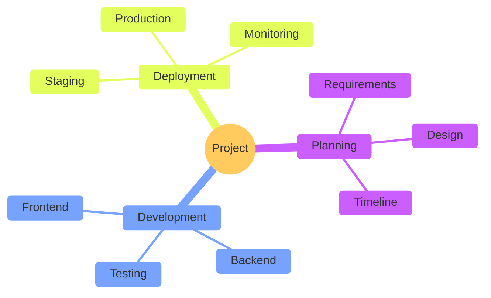
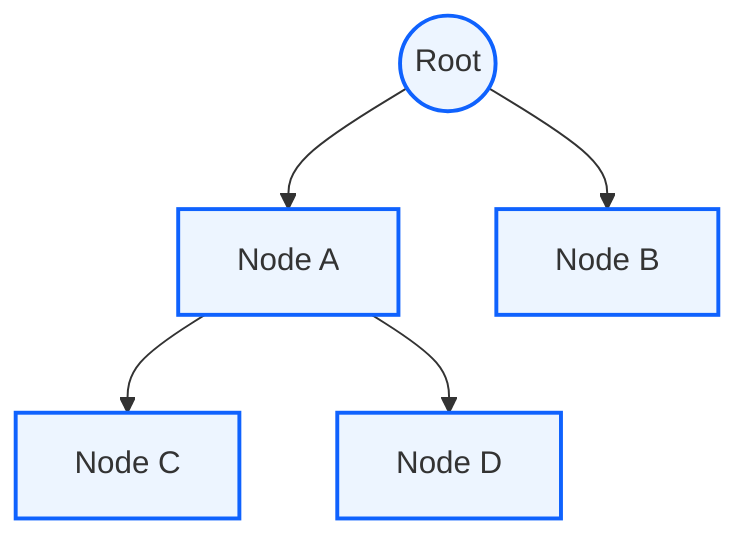

## Instructions

Mindmaps visualize hierarchical information, showing relationships between concepts in a tree-like structure.

**Note**: This is an experimental diagram type. The syntax and properties can change in future releases. The syntax is stable except for the icon integration which is the experimental part.

### Blueprint Styling

Mindmaps use `%%{init}%%` with mindmap-specific `themeVariables` for IBM Carbon theming. Unlike flowcharts, mindmap does NOT support `classDef`/`class` or `style` directives. Instead, configure colors via `%%{init}%%` at the top of the diagram.

**Available mindmap-specific variables** (all require `'theme': 'base'`):

| Variable | Controls | IBM Carbon (Standard) | IBM Carbon (Dark) |
|----------|----------|----------------------|-------------------|
| `mindmapRootColor` | Root node background | `#0f62fe` (Blue 60) | `#4589ff` (Blue 50) |
| `mindmapTextColor` | Global text color | `#ffffff` | `#f4f4f4` |
| `mindmapMainColor` | First-level branch background | `#1d3649` (Blue 80) | `#0f62fe` (Blue 60) |
| `mindmapSecondaryColor` | Second-level branch background | `#393939` (Gray 80) | `#525252` (Gray 70) |
| `mindmapLineColor` | Connecting lines | `#697077` (Cool Gray 60) | `#878d96` |

> **Note**: `mindmapTextColor` is global — one color for ALL nodes. The Standard theme uses deep backgrounds with white text for strong hierarchy and readability.

### IBM Blueprint Theme Configuration

#### Standard Theme (recommended)

```mermaid
%%{init: {'theme': 'base', 'themeVariables': {
  'mindmapRootColor': '#0f62fe',
  'mindmapTextColor': '#ffffff',
  'mindmapMainColor': '#1d3649',
  'mindmapSecondaryColor': '#393939',
  'mindmapLineColor': '#697077'
}}}%%
```

#### Dark Theme

```mermaid
%%{init: {'theme': 'base', 'themeVariables': {
  'mindmapRootColor': '#4589ff',
  'mindmapTextColor': '#f4f4f4',
  'mindmapMainColor': '#0f62fe',
  'mindmapSecondaryColor': '#525252',
  'mindmapLineColor': '#878d96'
}}}%%
```

### Syntax

- Use `mindmap` keyword
- Root: `root((Root Node))` or just `Root` (text at root level)
- Nodes: Defined by indentation (spaces or tabs determine hierarchy)
- Shapes: Similar to flowchart nodes:
  - Square: `id["Label"]`
  - Rounded square: `id("Label")`
  - Circle: `id(("Label"))`
  - Bang: `id))Label((`
  - Cloud: `id))Label(("
  - Hexagon: `id{{"Label"}}`
  - Default: Just text (no shape delimiters)
- Icons: `::icon(fa:fa-icon-name)` (experimental, requires icon fonts)
- Classes: `:::class1 class2` (triple colon followed by CSS classes)
- Markdown strings: Supports **bold** and *italics*, auto-wraps text

Reference: [Mermaid Mindmap Documentation](https://mermaid.ai/open-source/syntax/mindmap.html)

### Example (IBM Blueprint Mindmap — Standard Theme)



### Example (Basic Mindmap)



### Example (With Different Shapes)



### Example (With Markdown Formatting)



### Example (Technology Stack)



### Example (Project Planning)



### Alternative (Flowchart - compatible with all Mermaid versions)

If mindmap diagrams are not supported, use this flowchart alternative:


