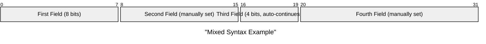
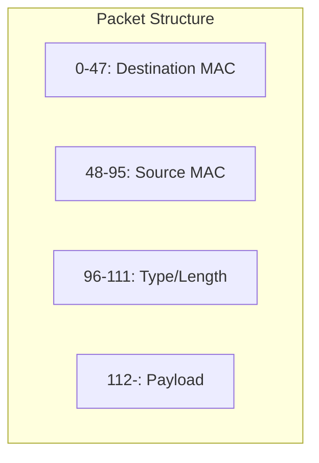

## Instructions

Packet diagrams are visual representations used to illustrate the structure and contents of a network packet.

### Blueprint Styling

Packet diagrams use built-in coloring. Blueprint semantics apply through the structure and labeling conventions (e.g., headers in Blue, payload in Teal).

### Syntax

- Use `packet` keyword (requires Mermaid v11.0.0+)
- Title: `title "Packet Title"` (optional)
- Fields:
  - `start-end: "Field Description"` - Multi-bit blocks (e.g., `0-15: "Field Name"`)
  - `start: "Field Description"` - Single-bit block (e.g., `0: "Flag"`)
- Bit Syntax (v11.7.0+): Use `+<count>` to set the number of bits, which starts from the end of the previous field automatically
  - `+1: "Block name"` - Single-bit block
  - `+8: "Block name"` - 8-bit block
  - You can mix and match: `9-15: "Manually set start and end"`
- Ranges: Each line after the title represents a different field in the packet. The range (e.g., `0-15`) indicates the bit positions in the packet.
- Field Description: A brief description of what the field represents, enclosed in quotes.

Reference: [Mermaid Packet Diagram Documentation](https://mermaid.ai/open-source/syntax/packet.html)

### Example (Ethernet Frame - Basic Syntax)


### Example (IPv4 Header - Basic Syntax)


### Example (Using Bit Count Syntax - v11.7.0+)

```mermaid
packet
    title "TCP Header"
    +4: "Source Port"
    +4: "Destination Port"
    +8: "Sequence Number"
    +8: "Acknowledgment Number"
    32-35: "Data Offset"
    +4: "Reserved"
    +6: "Flags"
    +16: "Window Size"
    +16: "Checksum"
    +16: "Urgent Pointer"
```

### Example (Mixed Syntax)



### Alternative (Flowchart - compatible with all Mermaid versions)

If packet diagrams are not supported, use this flowchart alternative:


