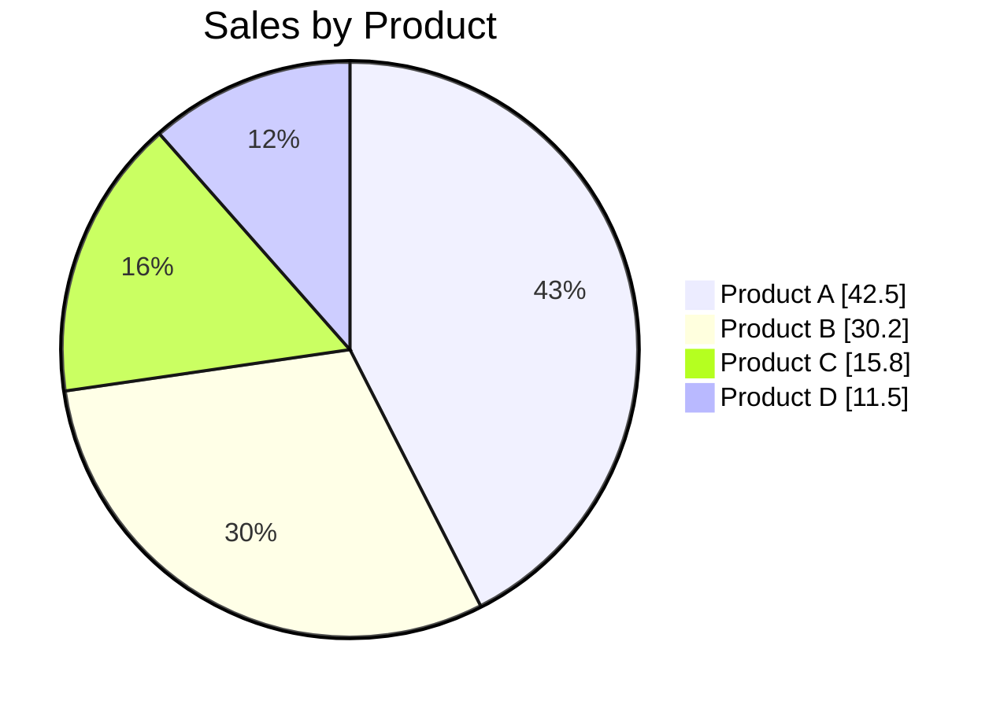
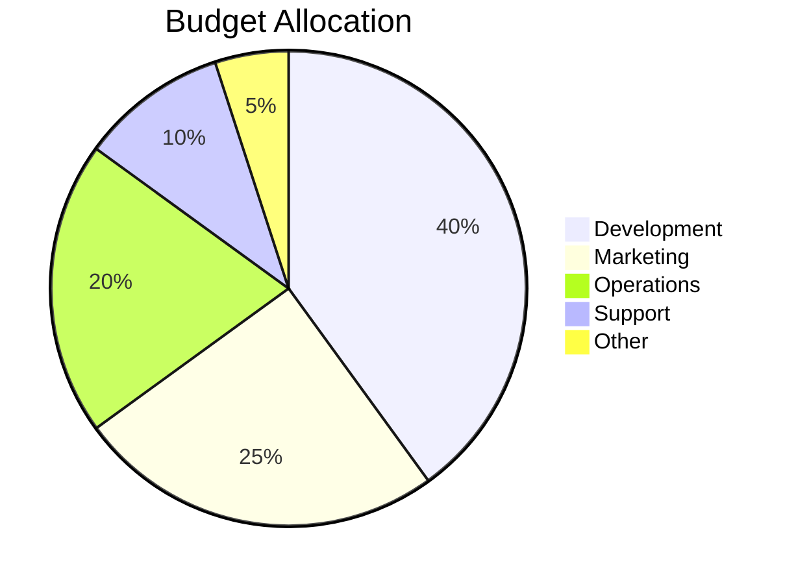
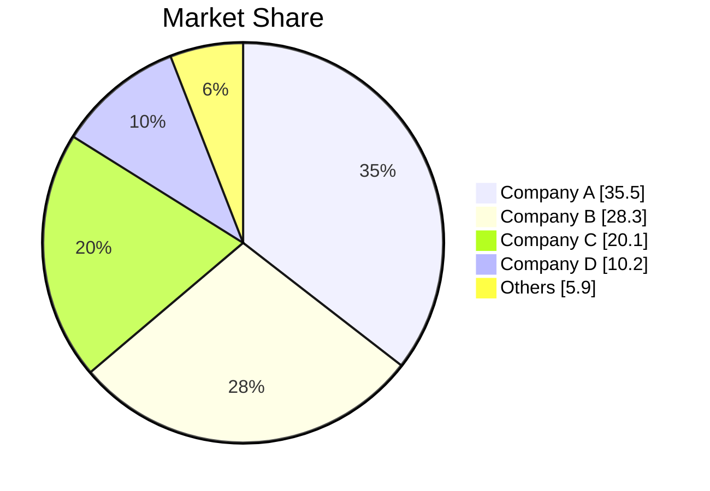
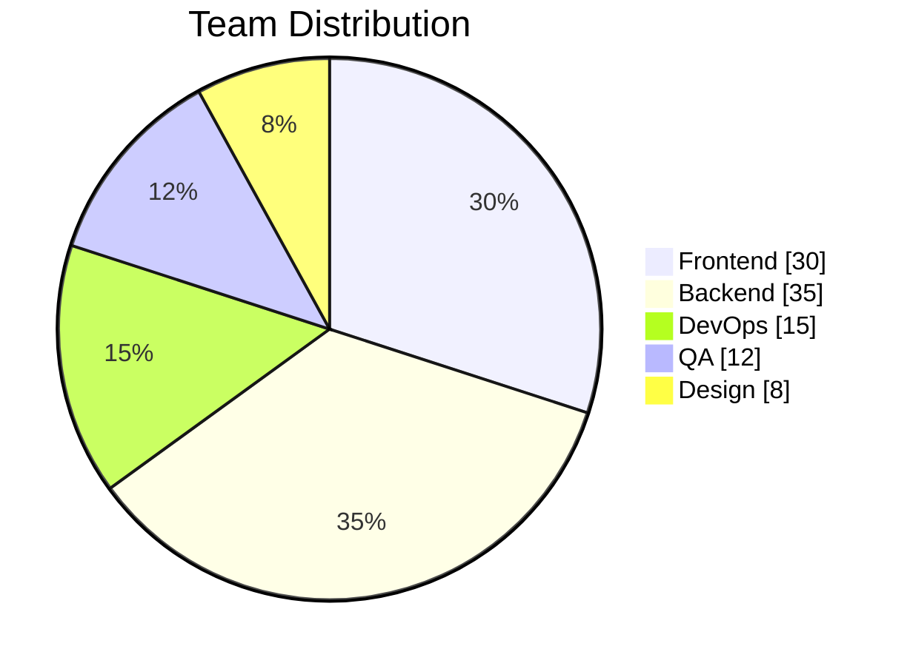
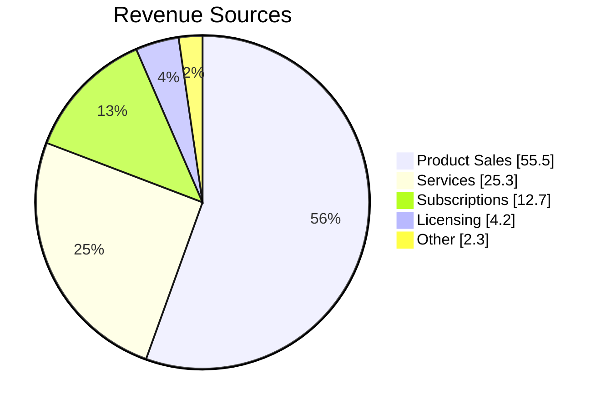
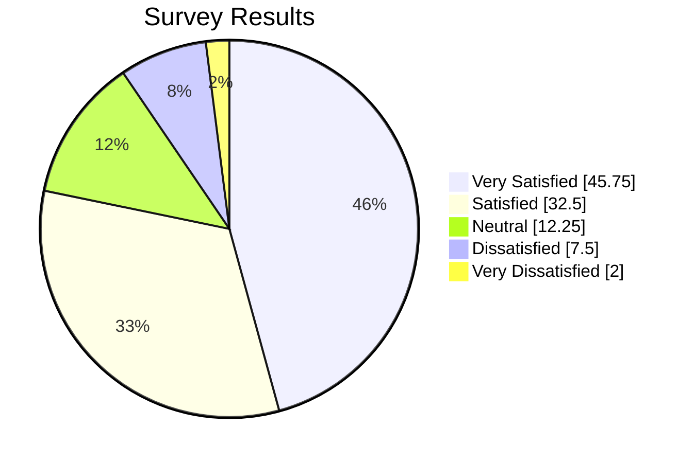
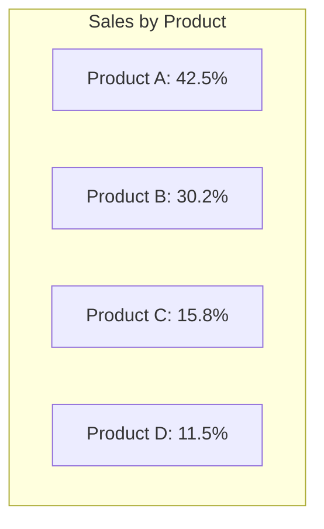

## Instructions

Pie charts display proportional data, showing how parts relate to a whole.

### Blueprint Styling

Pie charts have limited styling. Use `showData` for data clarity and concise labels.

### Syntax

- Use `pie` keyword to begin the diagram
- Show data: `showData` (optional) - renders the actual data values after the legend text
- Title: `title "Chart Title"` (optional) - gives a title to the pie chart
- Data format: `"Label" : Value` (quotes around label, colon separator, positive numeric value)
- Values: Must be positive numbers greater than zero (supported up to two decimal places)

Reference: [Mermaid Pie Chart Documentation](https://mermaid.ai/open-source/syntax/pie.html)

### Example (Basic Pie Chart)

### Example (Budget Allocation)

### Example (Market Share)

### Example (Team Distribution)

### Example (Revenue Sources)

### Example (With Decimal Values)

### Alternative (Flowchart - compatible with all Mermaid versions)

If pie charts are not supported, use this flowchart alternative:

