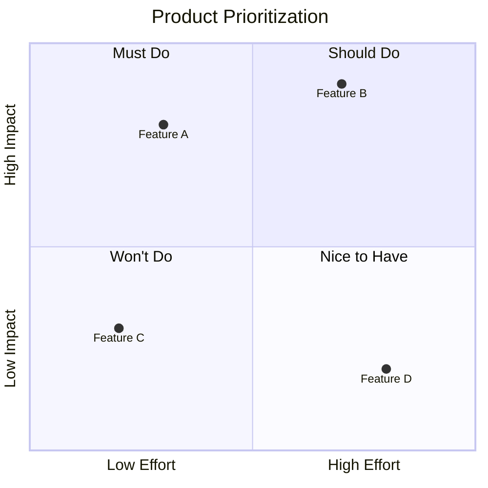
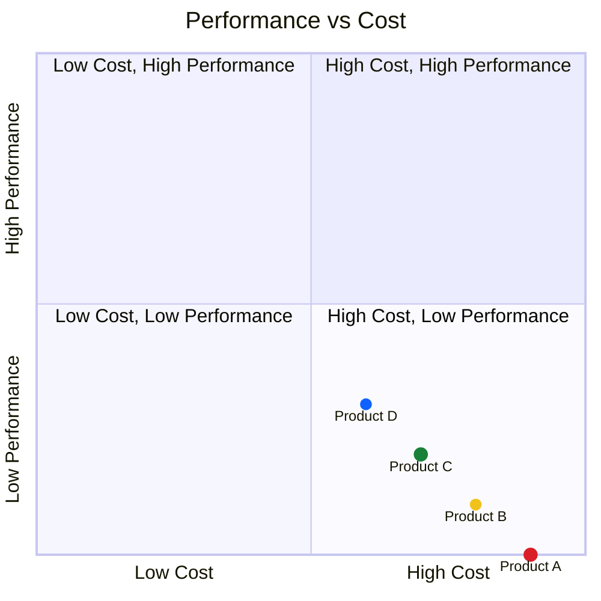
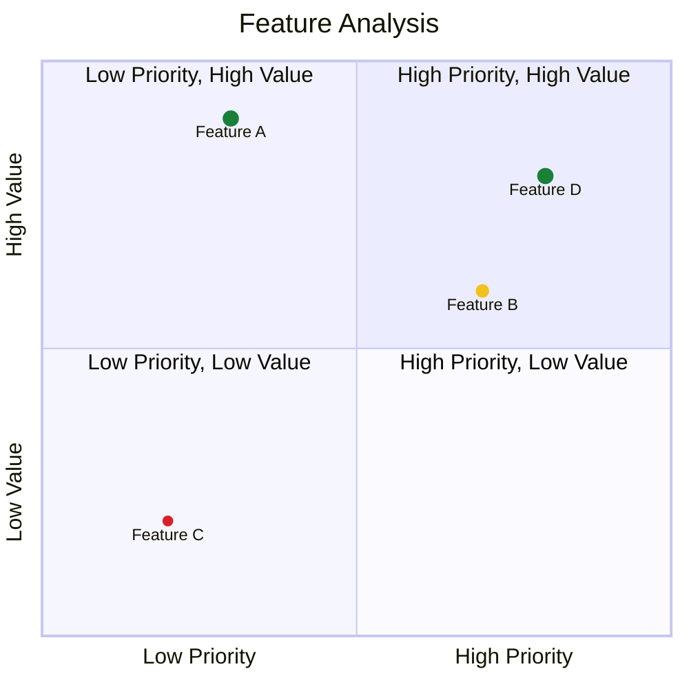
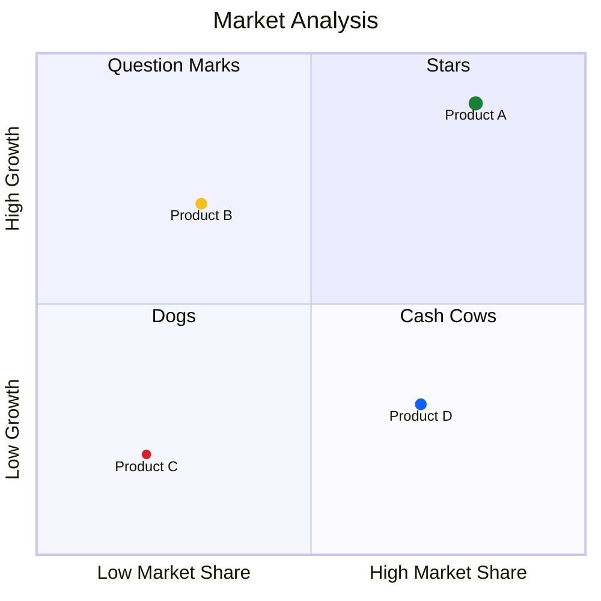
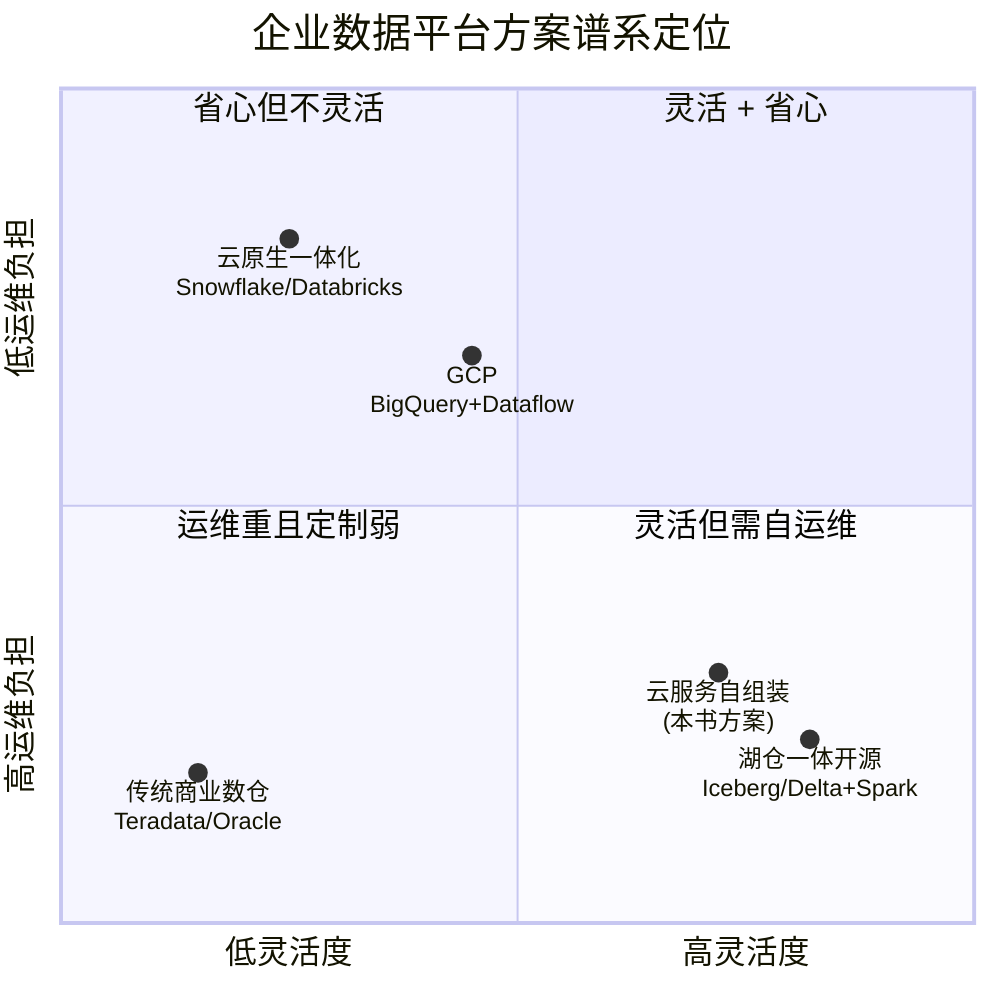
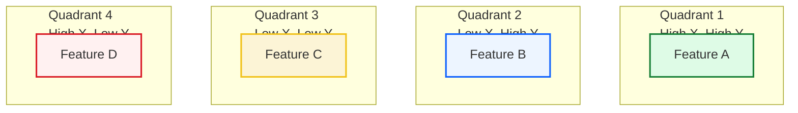

## Instructions

Quadrant charts display items in a 2x2 grid based on two criteria, useful for prioritization and analysis.

### Blueprint Styling

Quadrant charts support per-point `color`, `stroke-color`, `stroke-width`, and per-class styling. Use semantic colors: high-value = green, high-cost = red, medium = amber.

**Point Radius Rule**: All visible quadrant points MUST use a restrained radius of **4–6** (not larger than 6). The coordinate space is 0–1, so radii ≥ 10 produce disproportionately large circles that dominate the chart. Use `radius: 0` only for hidden-dot multi-line labels (see below). **Never** use `radius` values above 6 for data points.

### Syntax

- Use `quadrantChart` keyword
- Title: `title Chart Title` (optional)
- X-axis: `x-axis Left Label --> Right Label` or `x-axis Left Label` (only left)
- Y-axis: `y-axis Bottom Label --> Top Label` or `y-axis Bottom Label` (only bottom)
- Quadrants: `quadrant-1 Label`, `quadrant-2 Label`, `quadrant-3 Label`, `quadrant-4 Label`
  - `quadrant-1`: Top right quadrant
  - `quadrant-2`: Top left quadrant
  - `quadrant-3`: Bottom left quadrant
  - `quadrant-4`: Bottom right quadrant
- Points: `Point Name: [x, y]` where x and y values are in the range 0-1
- Point styling: `Point Name: [x, y] radius: 6, color: #da1e28, stroke-color: #0f62fe, stroke-width: 5px`
- Class styling: `Point Name:::className: [x, y]` with `classDef className color: #198038, radius: 6`
- **Multi-line data-point labels (hidden-dot overlay)**: `quadrantChart` natively does NOT support manual line breaks (`<br>`/`\n` are ignored in point labels). To split a point's text across multiple lines, stack additional points at the same X with the Y offset by a **fixed delta of `0.035`** and set their `radius: 0` (hides the dot) so only the text shows — visually faking a multi-line label.

```
"主标签 ": [x, y]
"副标签": [x, y - 0.035] radius: 0
```

> 固定高差使用 `0.035`（小于此值副标签会与主标签重叠；大于此值行距过宽）。主标签末尾留一个空格以与副标签对齐。

Reference: [Mermaid Quadrant Chart Documentation](https://mermaid.ai/open-source/syntax/quadrantChart.html)

### Example (Basic Quadrant Chart)



### Example (With Point Styling)



### Example (With Class Styling)



### Example (Business Strategy — BCG Matrix)



### Example (Multi-line Labels — Hidden-Dot Overlay)

`quadrantChart` does not support line breaks in point labels. Use the hidden-dot overlay technique: each副标签 is a second point at the same X, Y offset by `-0.035`, with `radius: 0` so only its text renders.



### Alternative (Flowchart - compatible with all Mermaid versions)

If quadrant charts are not supported, use this flowchart alternative:


