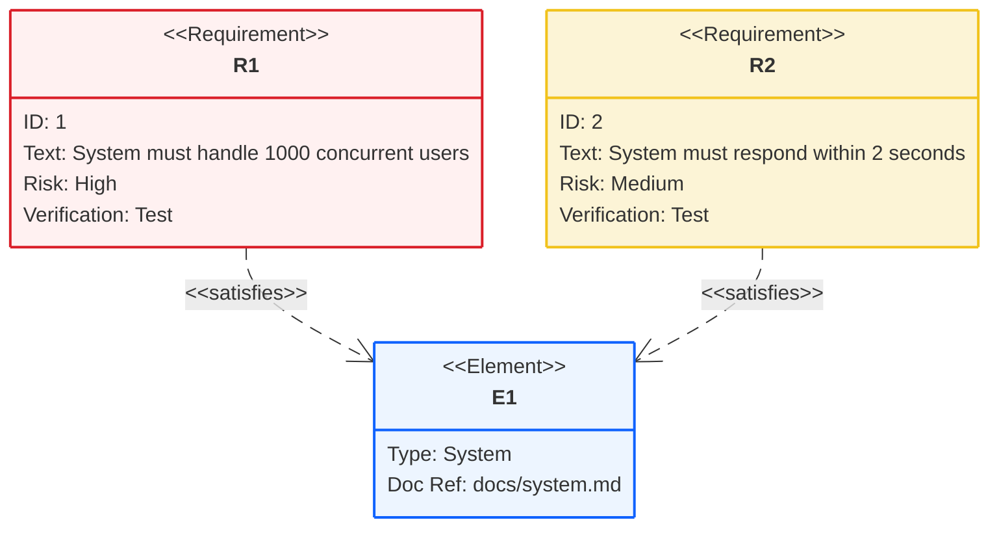
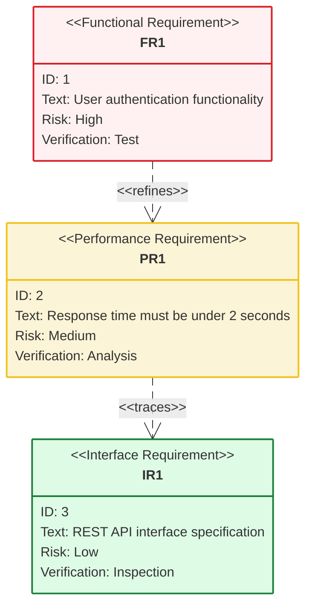
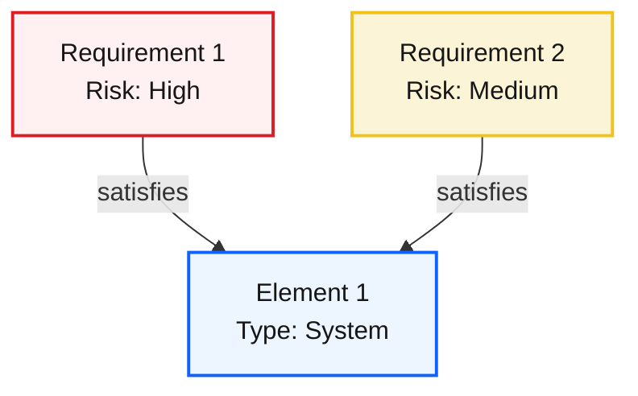

## Instructions

Requirement diagrams model system requirements and their relationships, showing how requirements relate to each other and to system elements. The modeling specs follow those defined by SysML v1.6.

### Blueprint Styling

Requirement diagrams use `style` and `classDef` + `class` for entity styling. Map risk levels to Blueprint colors:

- `High` risk → `#da1e28` (Error Red)
- `Medium` risk → `#f1c21b` (Warning Amber)
- `Low` risk → `#198038` (Success Green)

### Syntax

- Use `requirementDiagram` keyword
- Requirements: `<type> name { id: id, text: text, risk: risk, verifymethod: method }`
- Requirement types: `requirement`, `functionalRequirement`, `interfaceRequirement`, `performanceRequirement`, `physicalRequirement`, `designConstraint`
- Risk levels: `Low`, `Medium`, `High`
- Verification methods: `Analysis`, `Inspection`, `Test`, `Demonstration`
- Elements: `element name { type: type, docref: docref }`
- Relationships: Must use arrow syntax `Source - <relationship> -> Destination`
  - `contains` - Parent-child relationship
  - `copies` - Requirement copies another
  - `derives` - Requirement derives from another
  - `satisfies` - Requirement satisfies element
  - `verifies` - Element verifies requirement
  - `refines` - Requirement refines another
  - `traces` - Trace relationship
- Direction: `direction TB|BT|LR|RL` (default: TB)
- Styling: `style name fill:#color,stroke:#color` or `classDef className fill:#color`

Reference: [Mermaid Requirement Diagram Documentation](https://mermaid.ai/open-source/syntax/requirementDiagram.html)

### Example (Basic Requirement Diagram)



### Example (With Different Requirement Types)



### Example (With Relationships)

```mermaid
requirementDiagram
    requirement R1 {
        id: 1
        text: High-level system requirement
        risk: high
        verifymethod: test
    }
    requirement R2 {
        id: 2
        text: Detailed requirement
        risk: medium
        verifymethod: test
    }
    requirement R3 {
        id: 3
        text: Derived requirement
        risk: low
        verifymethod: analysis
    }

    element E1 {
        type: Component
        docref: docs/component.md
    }

    R1 - contains -> R2
    R2 - refines -> R1
    R3 - derives -> R1
    R2 - satisfies -> E1
    E1 - verifies -> R2

    classDef highRisk fill:#fff1f1,stroke:#da1e28,stroke-width:2px
    classDef mediumRisk fill:#fcf4d6,stroke:#f1c21b,stroke-width:2px
    classDef lowRisk fill:#defbe6,stroke:#198038,stroke-width:2px
    classDef element fill:#edf5ff,stroke:#0f62fe,stroke-width:2px

    class R1 highRisk
    class R2 mediumRisk
    class R3 lowRisk
    class E1 element
```

### Example (With Direction - Left to Right)

```mermaid
requirementDiagram
    direction LR

    requirement R1 {
        id: 1
        text: Requirement 1
        risk: high
        verifymethod: test
    }
    requirement R2 {
        id: 2
        text: Requirement 2
        risk: medium
        verifymethod: test
    }

    R1 - refines -> R2

    style R1 fill:#fff1f1,stroke:#da1e28,stroke-width:2px
    style R2 fill:#fcf4d6,stroke:#f1c21b,stroke-width:2px
```

### Alternative (Flowchart - compatible with all Mermaid versions)

If requirement diagrams are not supported, use this flowchart alternative:


