## Instructions

State diagrams show the different states of an object and the transitions between them, useful for modeling state machines.

### Blueprint Styling

State diagrams use `classDef` + `class` for semantic coloring:

```
classDef bpSuccess fill:#defbe6,stroke:#198038,stroke-width:2px,color:#161616
classDef bpError fill:#fff1f1,stroke:#da1e28,stroke-width:2px,color:#161616
classDef bpProcess fill:#edf5ff,stroke:#0f62fe,stroke-width:2px,color:#161616
classDef bpWarning fill:#fcf4d6,stroke:#f1c21b,stroke-width:2px,color:#161616
```

Apply to states by their ID: `class StateName bpProcess`

See `examples/design-system.md` for the canonical palette, classDef templates, and themeVariables.

### Syntax

- Use `stateDiagram-v2` (recommended) or `stateDiagram` keyword
- States: `[StateName]` or `state StateName` or `StateId : State Description`
- Initial state: `[*]` (start state)
- Final state: `[*]` (end state)
- Transitions: `State1 --> State2 : Event` or `State1 --> State2`
- Composite states: `state StateName { [State1] [State2] }`
- Choice: `<<choice>>` (decision point)
- Fork/Join: `<<fork>>` and `<<join>>`
- Notes: `note right of StateName : Note text` or `note left of StateName : Note text`
- Concurrency: `--` (parallel states)
- Direction: `direction TB|BT|LR|RL` (default: TB)
- Comments: `%% comment` (on separate line)
- Styling: `classDef className fill:#color,stroke:#color` and `class StateName className` or `StateName:::className`
- Spaces in state names: Define state with id first, then reference it

Reference: [Mermaid State Diagram Documentation](https://mermaid.ai/open-source/syntax/stateDiagram.html)

### Example (Basic State Diagram)

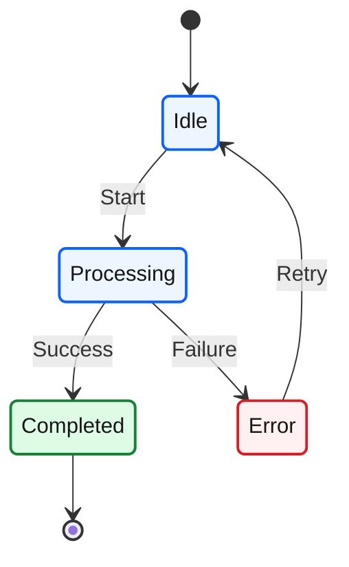

### Example (With State Descriptions)

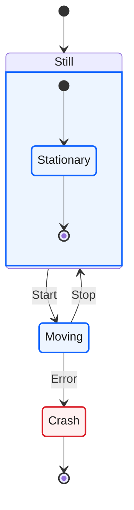

### Example (With Transitions and Labels)

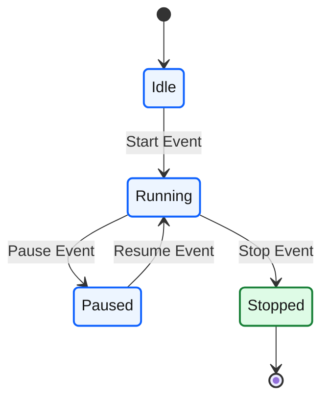

### Example (Composite States)

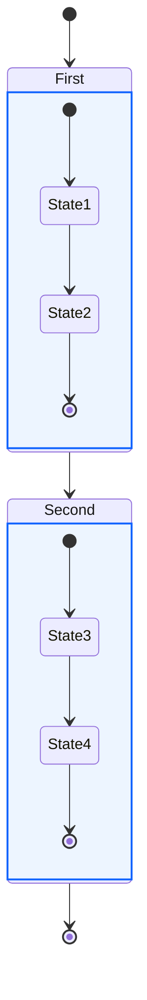

### Example (With Choice)

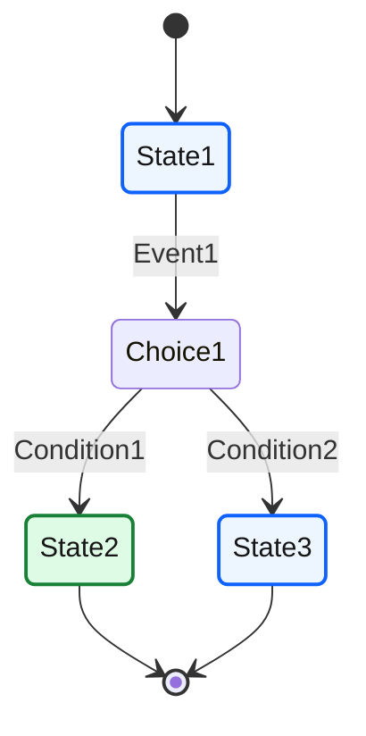

### Example (With Fork and Join)

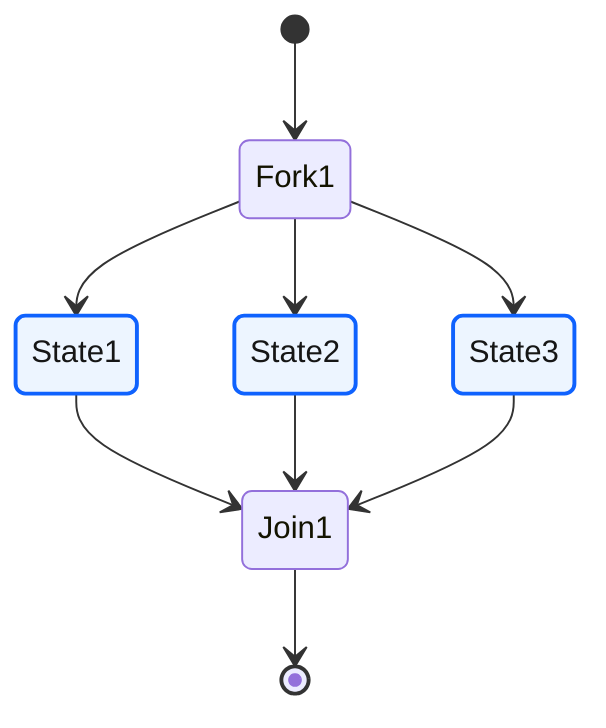

### Example (With Notes)

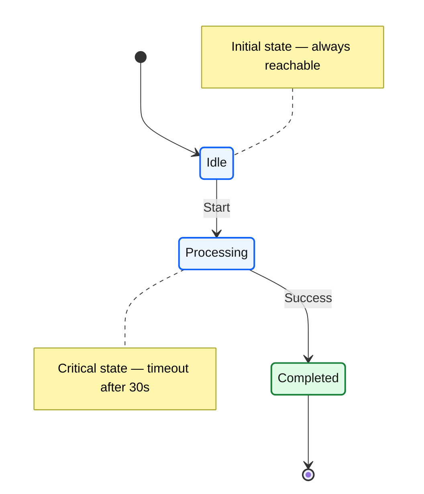

### Example (With Concurrency)

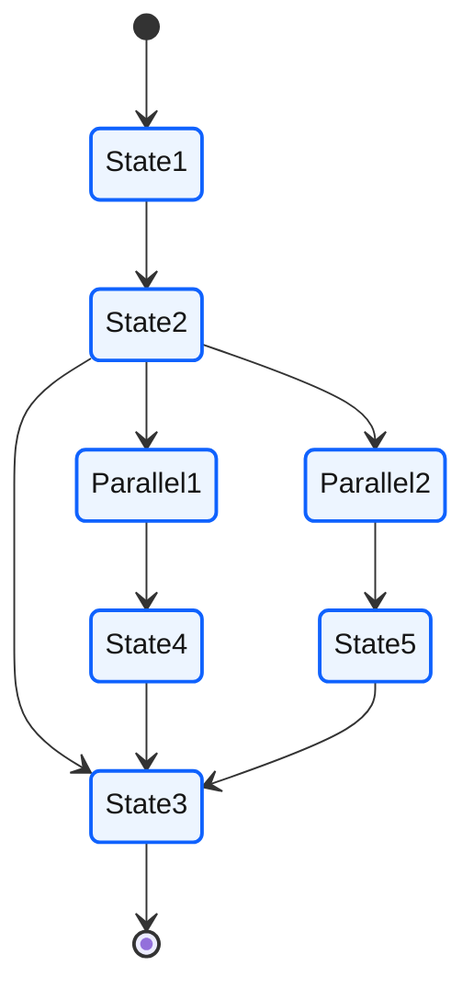

### Example (With Direction - Left to Right)

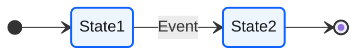

### Example (Order Lifecycle — Blueprint Style)

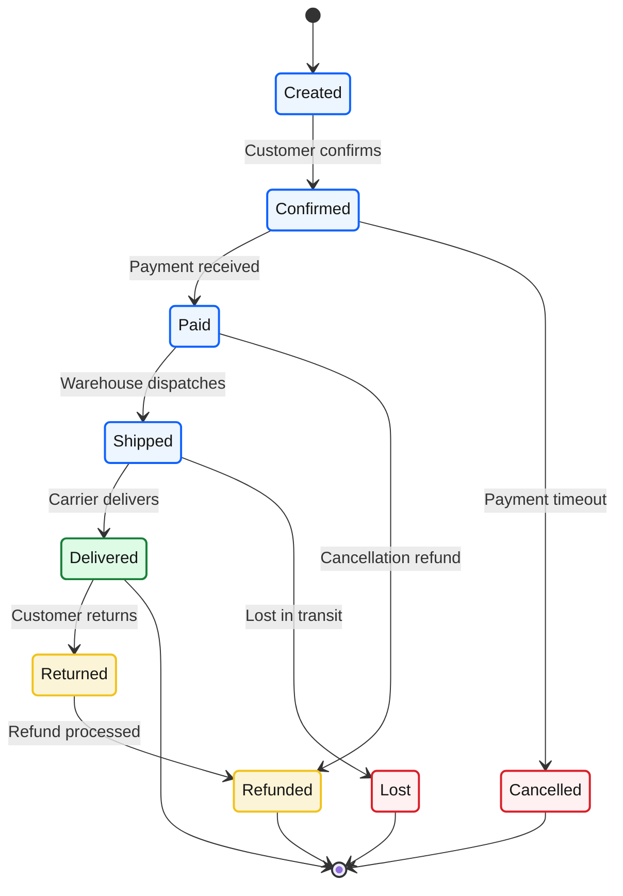

### Alternative (Flowchart - compatible with all Mermaid versions)

If state diagrams are not supported, use this flowchart alternative:

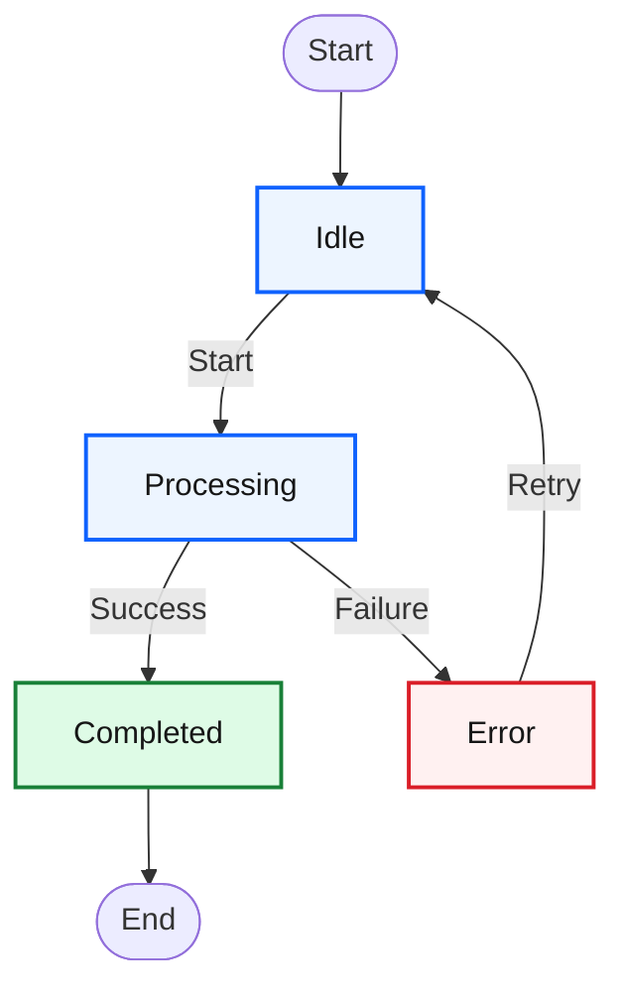
