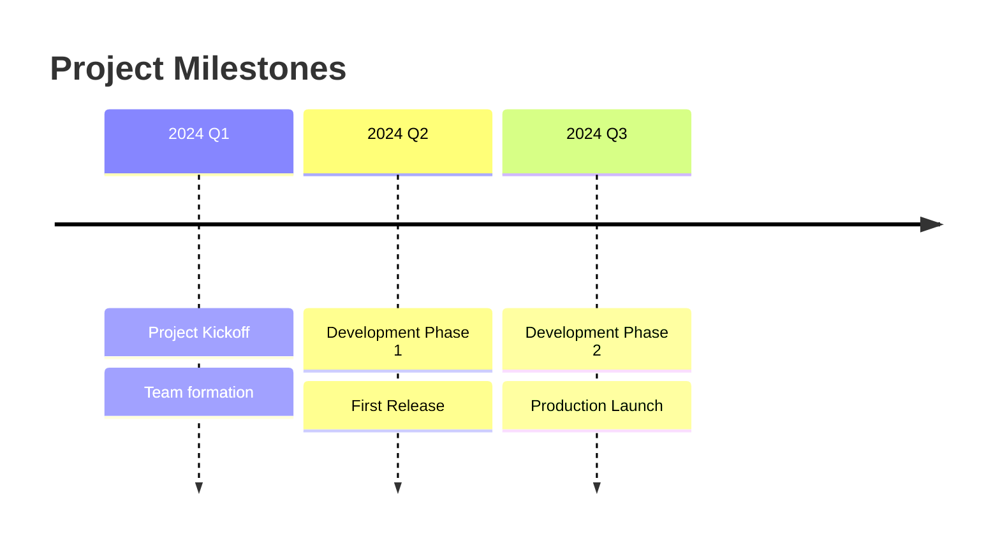
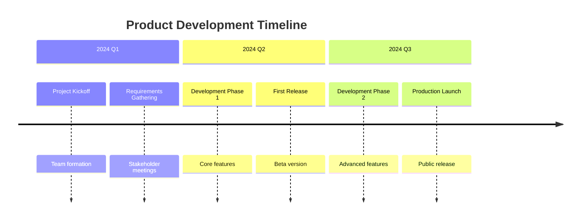
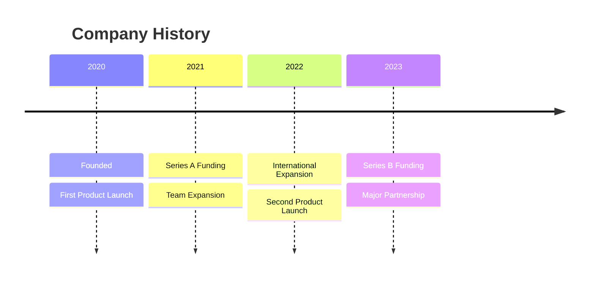
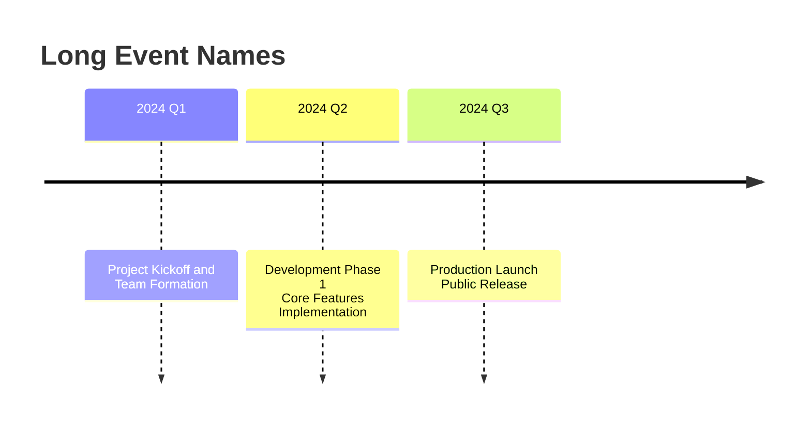
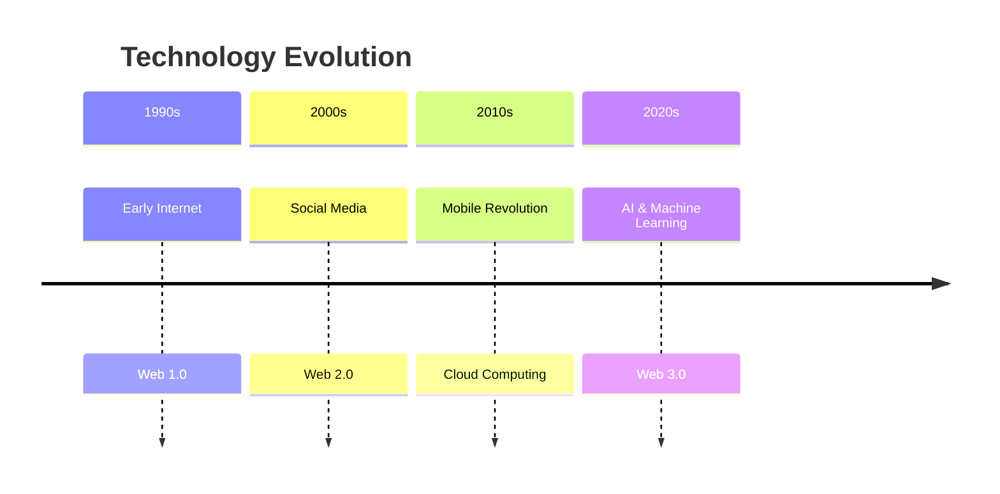
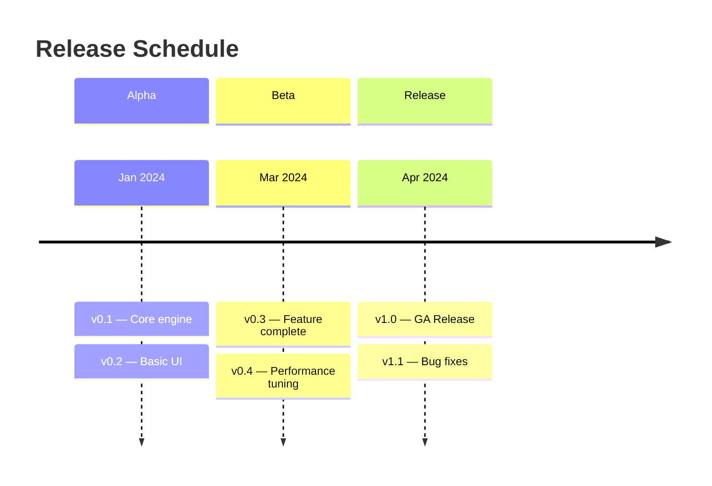
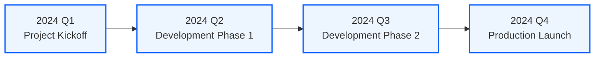

## Instructions

Timeline diagrams display events in chronological order, showing the sequence of events over time.

**Note**: This is an experimental diagram type. The syntax and properties can change in future releases. The syntax is stable except for the icon integration which is the experimental part.

### Blueprint Styling

Timeline diagrams have limited built-in styling. Structure events to convey semantic meaning through labeling conventions.

### Syntax

- Use `timeline` keyword
- Title: `title Timeline Title` (optional)
- Time period: `{time period} : {event}` or `{time period} : {event} : {event}` (multiple events per period)
- Sections: `section Section Name` (groups time periods in sections/ages)
- Text wrapping: Use ` ` to force line breaks
- Multiple events per period: Can be on same line with `:` separator or on separate lines

Reference: [Mermaid Timeline Diagram Documentation](https://mermaid.ai/open-source/syntax/timeline.html)

### Example (Basic Timeline)

### Example (With Sections)

### Example (Multiple Events per Period)

### Example (With Text Wrapping)

### Example (Historical Timeline)

### Example (Release Cycles)

### Alternative (Flowchart - compatible with all Mermaid versions)

If timeline diagrams are not supported, use this flowchart alternative:

